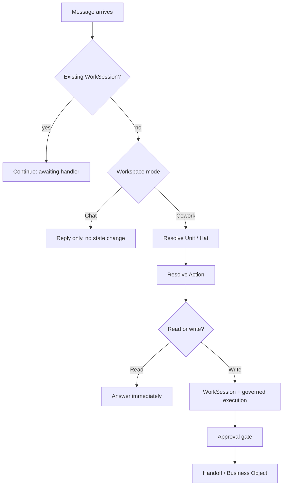

# ENIG Operating Model

As of 2026-09-24.

## Why this isn't a contradiction

Wanting chatbot-level ease and wanting controlled execution are not opposed -- they're different axes, and the current runtime already proves it in two of its eight Units. Input ergonomics (not hand-writing a persona/governance prompt every time) is solved by the Hat/Unit registry: once responsibility resolves, the right persona, evidence rules, and governance context are injected automatically. Output safety (approval before anything real happens) is a separate, deliberate choice -- the Handoff, Data Boundary, and Outbound Gate exist because letting an AI model act on real client identity or commit ENIG to something without sign-off was judged too risky. Marketing and Research & Intelligence already combine both: a plain sentence in, the system figures out what's meant, builds the right prompt automatically, and still stops at an approval gate before anything real happens.

What's actually missing is narrower: for Sales, Strategy, and Finance, the runtime doesn't get as far as applying persona + governance + approval, because it either forces text into the wrong shape (Sales assumes every message is a new client enquiry) or has no direct-entry code path to try at all (Strategy and Finance are Handoff-only). That's an intent-reading gap sitting *before* governance starts, not governance itself being the obstacle.

## Current state: entry-point shape per Unit

Traced every governed entry point in `session.ts` against each Unit's implementation, at the deployed HEAD. Only three of eight Units have any Cowork entry point at all.

| Unit | Cowork-wired | Fresh-entry function | Intent-driven? |
| --- | --- | --- | --- |
| Sales | Yes | `handleIncomingEnquiry` | No -- always assumes a new client enquiry, regardless of what's typed |
| Marketing | Yes | `handleMarketingIntake` | Yes -- AI-classifies which of 5 Hats and what kind of task from raw text |
| Research & Intelligence | Yes | `handleDirectRequest` | Yes -- takes the text directly as the research question |
| Strategy | No | none exists | N/A -- only `handlePickup` (Handoff-triggered) plus continuation-only handlers |
| Finance | No | none exists | N/A -- only `handlePickup` (Handoff-triggered) plus continuation-only handlers |
| Business Development | No | no unit code exists | N/A |
| Creative & Design | No | no unit code exists | N/A |
| Operations | No | not a governed Unit -- a Telegram stream only | N/A |

A second gap inside Sales: `Lead Generation Specialist` is a real, tested, intent-driven action (on-demand discovery in `leadGenerationDiscovery.ts`), but `dispatchCowork`'s Sales branch calls `handleIncomingEnquiry` unconditionally regardless of which Hat resolved -- so even an explicit `Lead Generation Specialist: find me 3 leads` is misrouted into enquiry-extraction.

## The OS metaphor

The existing pieces already map cleanly onto an operating system; the redesign below extends the pattern rather than replacing it.

| Runtime concept | OS equivalent |
| --- | --- |
| Unit | Subsystem / daemon |
| Hat | Process within a subsystem |
| Action (new, below) | Syscall |
| Handoff | Inter-process communication (IPC) |
| Approval gate | The permission prompt, only for privileged syscalls |
| Data Boundary / Outbound Gate | The sandbox / capability security model |
| Chat | A read-only REPL over the same subsystems |

Resolving Unit/Hat stays exactly as built (deterministic addressing, no AI). What's new is the step right after it: resolving *which action*, and branching on whether that action reads or writes.

## The Action Registry

Every Unit/Hat declares a small, finite list of named actions -- the same idea `ALL_HATS` already applies to Unit/Hat discovery, one level down. Marketing already does this informally: its Stage 1 intake (`marketing.intake_classification`) reads raw text and picks a Hat; a second, already-existing task (`marketing.hat_action_decision`) then picks what to do within that Hat. Generalizing this removes the need for each Unit to invent its own intent-reading:

1. Deterministic addressing resolves Unit/Hat (unchanged -- `resolveAddressee`, no AI).
2. One scoped, registered AI task -- the same governed shape as `marketing.hat_action_decision` -- reads the message against *that Unit's own declared action list* and picks one, or asks a clarifying question if none fit. Never a free-form action invented on the spot; always one of the Unit's own registered verbs.
3. The picked action's own handler runs -- which may be the existing fixed function (Sales's `handleIncomingEnquiry` becomes the handler for the `new_enquiry` action specifically, not the only path), or a new one.

Illustrative starting action lists (final lists are a product decision, not an engineering one):

| Unit | Candidate actions |
| --- | --- |
| Sales | `new_enquiry`, `status_check`, `follow_up`, `revise_draft` |
| Lead Generation Specialist (Sales) | `discover_opportunities` (already built, currently orphaned) |
| Strategy | `diagnose`, `refine_diagnosis` |
| Finance | `price_intervention`, `re_price` |

Adding a capability becomes "register an action + its handler" rather than hand-wiring a new branch into `dispatchCowork` -- closer to installing a program than patching the kernel.

## Read vs. write

This is the actual resolution to the chatbot-vs-control question. Today, everything inside Cowork gets the same heavy treatment: a fresh WorkSession, the full approval pipeline, a Handoff where relevant -- regardless of whether the request changes anything. That's disproportionate for a question like "what's the status of MAT-20" or "explain our pricing model," which have no side effects at all.

Each registered action declares its own consequence level:

- **Read** -- no side effects (a status check, an explanation, a lookup). Runs immediately, Unit/Hat-persona-aware, no WorkSession created, no approval gate -- the same low friction as Chat, just scoped to the right context.
- **Write** -- creates or mutates governed state (drafts a proposal, sets a price, creates a Handoff, contacts a client). Goes through the existing full pipeline, unchanged: WorkSession, governed execution, approval gate.

This is what lets "my own GPT" ease coexist with real control: low-consequence actions get low friction, high-consequence actions get proportionate friction -- the split is on what the action *does*, not on which Unit it belongs to.

## Strategy and Finance: direct entry without bypassing the discipline

Strategy and Finance are Handoff-only by deliberate design -- confirmed directly in code: `strategyAnalyst.ts` and `valueBasedPricingAssessor.ts` each export only `handlePickup` (fires off an incoming Handoff) plus continuation-only handlers. Nothing lets Martin originate fresh work in either Unit today.

The fix is not to let a direct request skip the discipline a Handoff enforces -- entity/matter tokenization, sanitized context, a defined required category. It's to let Martin *originate* that same shape of context directly, instead of only ever receiving it from another Unit:

- A direct `Strategy, diagnose this` constructs a Martin-originated context equivalent to a Handoff's `HandoffContextContract` (opaque tokens, sanitized text, explicit category) rather than a real Handoff record from another Unit.
- `entryType` already anticipates exactly this shape of change -- it's typed as `"inbound_enquiry" | "outbound_outreach"` with a doc comment noting `outbound_outreach` exists for future origination paths but nothing produces it yet. A third value (e.g. `"direct_request"`) is the natural extension.
- Every existing check downstream (Data Boundary, Outbound Gate, token-safety detectors) stays exactly as it is -- it already operates on the context shape, not on who originated it.

## Migration path

None of this requires touching Marketing, Research & Intelligence, or the WorkSession/Handoff/approval/Data Boundary machinery -- they already fit the target shape or are the foundation everything else builds on.

1. ~~**Sales dispatch fix.**~~ Done -- `Lead Generation Specialist` is wired into `dispatchCowork`'s Sales branch and no longer forced through `handleIncomingEnquiry`.
2. ~~**Formalize the Action Registry pattern.**~~ Done -- Marketing's Stage 1/2 classification mechanics are extracted into `resolveCandidateRelationships`/`selectAmbiguityReasonCode` (`src/hats/relationships.ts`) and `classifyCandidateHats`/`buildStage1SystemPrompt` (`src/hats/intakeClassification.ts`), generic over any Unit's own Hat/relationship types; Marketing's own functions are now thin wrappers over them.
3. ~~**Read/write split.**~~ Mechanism built -- `ConsequenceLevel`/`ActionDefinition`/`dispatchAction` in `src/hats/actionRegistry.ts` resolve a registered action's declared read/write consequence: read runs immediately with no WorkSession/approval gate, write hands back a dispatch signal for the existing pipeline, unchanged. Proven only against a toy action set -- no real Unit is wired to it yet, since that requires first deciding a Unit's actual action list (see Open questions below).
4. ~~**Strategy/Finance direct entry.**~~ Done for both. `strategy.handleDirectRequest` (`src/units/strategy/strategyAnalyst.ts`) and `finance.handleDirectRequest` (`src/units/finance/valueBasedPricingAssessor.ts`) let Martin start a fresh diagnosis/pricing assessment directly from Cowork chat by naming an existing Matter's token (e.g. "MAT-20") -- resolved deterministically via the shared `resolveMatterFromText` (`src/identityResolution.ts`), never AI-guessed, failing closed with a clarifying question if no token is given or it doesn't resolve to a real Matter. Strategy joins the same `runDiagnosis` a Handoff pickup already uses; Finance joins the same `judgeQuote` (made Handoff-agnostic: its `updateHandoff` calls are now guarded on `state.handoffId` existing). Two disclosed, pre-existing consequences of having no upstream Handoff, neither a bug: (1) a Strategy diagnosis that reaches a recommended direction still correctly holds at the existing known-identity gate (`checkStrategyProposalForKnownIdentity`), since direct-entry work has no Sales-sourced source-boundary attestation; (2) a direct-entry Finance quote completes standalone on approval -- no Strategy boundary block to carry forward, no Finance -> Sales Handoff created -- and its Redo loop isn't supported yet (fails closed with a clear message instead).
5. **New Units (Business Development, Creative & Design, Operations), built on the Unit Registry (below).** A new Unit is a self-contained manifest + handlers registered in one place, not hand-wired branches in `dispatchCowork` -- see the next section for the shape and rollout order.

Each step is independently shippable and testable, the same discipline used for the Chat/Cowork rollout itself.

## The Unit Registry: from hand-wired branches to a plug-in shape

Today, adding a Unit means learning and editing hand-wired, per-Unit code in three separate places, not one:

1. **`dispatchCowork`** (`src/router.ts`) -- a hand-written `if (decision.unit === "Sales") {...}` / `if (decision.unit === "Marketing") {...}` chain, one branch per Unit, each inlining that Unit's session-stub wiring (`stub.init`, `stub.handle*Request`) and any Unit-specific special case (Sales's `Lead Generation Specialist` bypass, `SALES_EXECUTIVE_PAUSED`, Strategy's `direct_request` known-identity gate, Finance's Handoff-agnostic `updateHandoff` guard).
2. **`WorkSession`** (`src/session.ts`), the Durable Object every Unit's work runs inside -- it also carries one method per Unit (`handleIncomingEnquiry`, `handleMarketingRequest`, `handleResearchRequest`, `handleStrategyRequest`, `handleFinanceRequest`), each a thin wrapper calling `this.execute((state) => unit.handleDirectRequest(this.env, state, text))`.
3. **`handleTextReply`'s `switch (state.awaiting)`** (`src/session.ts`) -- the largest and messiest of the three. This is where every Unit's multi-turn "Martin replies to a pending question" state actually lives: roughly ten continuation states (`call_notes`, `intervention`, `value_context_more`, `quote_redo_reason`, `matter_redo_reason`, `entity_redo_reason`, `proposal_feedback`, `sales_proposal_revision`, `marketing_feedback`, and more) spanning every Unit, in one global switch keyed only on the string in `state.awaiting` -- not on which Unit is running.

That's the actual "building forever" risk: every new Unit requires understanding and safely extending shared code that four other Units already depend on, in three different places.

The fix is not new machinery -- the Action Registry, Handoff enforcement, and Data Boundary already operate generically, on context shape and declared consequence rather than on which Unit produced them (see "The Action Registry" and "Read vs. write" above). What's missing is a way for a Unit to hand the runtime everything it needs *as one declared object*, instead of three different chokepoints reaching into each Unit's internals by hand.

**Unit Manifest.** Each Unit exports one object describing everything those three chokepoints currently hard-code for it:

* its Hats (the existing `Hat` typing per Unit, unchanged)
* its `ActionDefinition<A>[]` -- the same shape `actionRegistry.ts` already defines, declaring each action's read/write consequence
* its read handler -- run immediately by `dispatchAction`, no WorkSession, no approval gate
* its entry handler -- the `handleDirectRequest`/`handlePickup`/`handleIncomingEnquiry`-shaped function that starts a WorkSession for write actions, the same pattern Strategy and Finance already established
* its `awaiting`-state handler map -- each continuation state the Unit can leave a WorkSession paused on (its own equivalent of `call_notes`/`intervention`/`quote_redo_reason`/etc.), so `handleTextReply` can dispatch generically off `state.unit` + `state.awaiting` instead of one global switch
* any Unit-specific dispatch special case, expressed as part of the manifest rather than a `dispatchCowork` exception (e.g. Sales's Lead Generation Specialist routing becomes a second action/handler pair inside Sales's own manifest, not a carve-out the router has to know about)

**Unit Registry.** One file (e.g. `src/units/registry.ts`) statically imports every Unit's manifest into a `Record<Unit, UnitManifest>`. Cloudflare Workers has no runtime filesystem, so this cannot be literal auto-discovery (no scanning a directory at request time) -- this registry file is the one place that changes when a Unit is added or removed: one import, one entry.

**All three chokepoints become lookups, not chains.** `dispatchCowork` resolves `registry[decision.unit]` and calls its manifest's dispatch entry point. `WorkSession` gains one generic `handleUnitRequest(text)` that looks up the Unit's entry handler from the manifest instead of one method per Unit. `handleTextReply` resolves `registry[state.unit].awaitingHandlers[state.awaiting]` instead of one global switch. All three still route into the same session-stub/Handoff/approval machinery every Unit already shares today -- only the *lookup*, not the underlying execution, changes.

### The hard invariant

The generic layer may become more capable as migration exposes legitimate requirements, but it must never acquire knowledge of a specific Unit. If migrating an existing Unit ever seems to require `if (unit === "sales") ...` inside `dispatchCowork`, `WorkSession`, or `handleTextReply`, the abstraction has failed at that point -- the fix belongs in one of: a new manifest capability, a handler contract, a lifecycle contract, a shared primitive, or an explicitly generic extension point. Never a Unit-name check in shared code.

This cuts the other way too: the manifest declares Unit-specific *facts* ("Business Development has a `develop_opportunity` action"; "Business Development has a reply state called `awaiting_opportunity_scope`"). The kernel owns universal *behaviour* ("a write action enters the approval pipeline"; "waiting states are persisted and resumed against the current WorkSession"). A Unit's manifest cannot override kernel semantics like approval requirements just because it has a custom field -- that boundary is what keeps this an OS model rather than eight Units each running their own miniature operating system (their own bespoke routing/approvals/Handoff/data-boundary handling inside the manifest). If a manifest starts accumulating fields like `routing`, `approvals`, `handoffs`, `dataBoundary` with real logic inside them rather than plain declared facts, that is the same failure in the other direction.

### Don't design the final manifest schema up front

The manifest schema in "Unit Manifest" above is a starting sketch, not a spec to build BD against and then declare final. The correct order is: build BD entirely through the contract as currently understood, exercise it with real actions, find where the generic machinery is insufficient, strengthen the contract, *then* migrate one existing Unit. Defining a theoretical plugin schema before any real Unit has exercised it risks discovering months later that production Units don't actually fit it.

### Business Development as conformance test, not just the first example

BD is the Unit chosen to prove this pattern (see Open questions below), and it needs to deliberately exercise the hard parts of the manifest, not the easy ones -- otherwise nothing is actually proven. Its three Hats (Growth & Market Development, Partnership Development, Opportunity Development) are useful precisely because they give room to do this: at least one Hat's actions must require a genuine multi-turn `awaiting`-state flow (proving a Unit can declare waiting-state -> handler behaviour, not just a list of synchronous actions), and at least one write action must go through the real approval/Handoff machinery end to end (routing -> Hat resolution -> Action resolution -> read/write consequence -> handler -> WorkSession -> approval -> state mutation/Handoff -> continuation). If that whole path works without touching any existing Unit's execution code, the pattern is demonstrated; if BD only proves synchronous read actions, it hasn't proven the pattern.

### Fail-closed manifest completeness

Manifest completeness is a hard invariant, not a nice-to-have: the kernel must never silently fall back to generic/default behaviour when a Unit's manifest is incomplete. Concretely -- an action referenced but missing from the registry, an action with no handler, a write action with no write-entry handler, or an `awaiting` state with no handler in the map -- must all fail closed (an explicit error, never a silent default or a fall-through to legacy behaviour). A registry that quietly papers over gaps will hide real defects during migration instead of surfacing them.

### Definition of "proven"

The manifest pattern is not proven merely because BD works end to end. It is proven only once BD demonstrates all of the following:

* **Unit discovery** -- the registry locates BD without any hard-coded dispatcher knowledge of it.
* **Hat resolution** -- BD exposes multiple Hats without shared code knowing their identities.
* **Action resolution** -- BD's action list comes entirely from its manifest, nowhere else.
* **Read/write semantics** -- the generic dispatcher treats both correctly with no BD-specific branching.
* **Write governance** -- a BD write action goes through the existing approval pipeline with no custom approval code.
* **Multi-turn continuation** -- a BD-specific waiting state resumes correctly through the generic `handleTextReply` lookup.
* **Special routing without contamination** -- BD can have something genuinely Unit-specific (its own equivalent of Sales's Lead Generation Specialist routing) without that logic leaking into shared dispatch code.
* **Failure semantics** -- an ambiguous or unregistered BD action fails closed rather than falling through to any legacy behaviour.
* **No regression** -- Sales, Marketing, Strategy, Finance, and R&I remain untouched and continue operating exactly as they do today.

**Rollout order (deliberately staged to avoid re-testing working Units before the pattern is proven):**

1. Design and land the `UnitManifest`/registry types and the (still-empty) registry lookups in all three chokepoints, with Sales/Marketing/Strategy/Finance/R&I continuing to run through their existing hand-written branches, methods, and switch cases, untouched, alongside it.
2. Build Business Development entirely on the manifest/registry pattern, deliberately exercising the hard parts per "Business Development as conformance test" above. Zero regression risk -- there is no existing behavior to break, since the Unit doesn't exist yet. Do not consider the pattern proven until it satisfies every point in "Definition of 'proven'" above, not merely "BD responds to messages."
3. Once proven against that full checklist, migrate Sales, Marketing, Strategy, and Finance into the manifest shape one at a time, each its own shippable step. The correct migration shape per Unit is: extract its actual current behaviour, express that behaviour through the manifest contract, **delete** the old Unit-specific dispatcher path (the `dispatchCowork` branch, the `WorkSession` method, the `handleTextReply` switch cases), then run its regression suite (`salesExecutive.test.ts`, `strategyAnalyst.test.ts`, `valueBasedPricingAssessor.test.ts`, Marketing's and `leadDiscovery.test.ts`) plus a manual smoke pass through its real entry flow. Wrapping a Unit's existing code in a manifest object while leaving its old dispatcher path in place is not migration -- it gives the appearance of one while preserving the old architecture underneath, and must not be treated as "migrated." Watch specifically for legacy and manifest Units quietly acquiring different semantics for the same kernel concern (WorkSession creation, waiting-state persistence, reply routing, Handoff creation, approval, failure/stop conditions, audit logging, data-boundary enforcement, outbound AI gating) -- that is two kernels wearing one name, not one. Expect the `handleTextReply` awaiting-state migration to be the riskiest and most careful part of this step, since it is the largest hand-written surface of the three and the one carrying the most existing, live conversational state.
4. Build the remaining new Units (Creative & Design, Operations) on the now-proven pattern.

This intentionally does not migrate working Units up front: it proves the plug-in shape once, cheaply, on a Unit with nothing to lose, before spending verification effort re-proving Units that already work.

## Open questions

- [x] What is Sales's real action list beyond `new_enquiry`? One real answer is now built and validated end-to-end: `call_notes` -- the isolated Sales Executive project hands off de-identified call notes via a Handoff, and the Runtime Sales Executive runs commercial-value-evidence-extraction + qualification against them (`handleCallNotesHandoffPickup`). `status_check`, `follow_up`, `revise_draft` remain unconfirmed guesses.
- [x] Should Strategy/Finance direct requests be gated any differently than Handoff-originated ones? Resolved: yes -- Martin must always name an existing Matter explicitly (its token); there is no "identity-free general question" path. Applied to Strategy in `handleDirectRequest`; Finance direct entry still needs to apply the same rule when built.
- [ ] Does a "read" action ever need any lightweight audit trail (a log entry, no WorkSession), or is truly zero record acceptable for pure lookups?
- [x] Which Unit proves the Unit Registry pattern first, and what should it actually *do*? Resolved: Business Development, structured as three Hats (Growth & Market Development, Partnership Development, Opportunity Development) -- see "The Unit Registry" above. Creative & Design and Operations remain undefined; built on the pattern once proven by BD, per the rollout order above.
