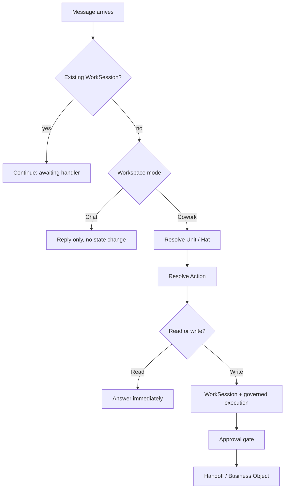

# ENIG Operating Model

As of 2026-09-24.

## Why this isn't a contradiction

Wanting chatbot-level ease and wanting controlled execution are not opposed -- they're different axes, and the current runtime already proves it in two of its eight Units. Input ergonomics (not hand-writing a persona/governance prompt every time) is solved by the Hat/Unit registry: once responsibility resolves, the right persona, evidence rules, and governance context are injected automatically. Output safety (approval before anything real happens) is a separate, deliberate choice -- the Handoff, Data Boundary, and Outbound Gate exist because letting an AI model act on real client identity or commit ENIG to something without sign-off was judged too risky. Marketing and Research & Intelligence already combine both: a plain sentence in, the system figures out what's meant, builds the right prompt automatically, and still stops at an approval gate before anything real happens.

What's actually missing is narrower: for Sales, Strategy, and Finance, the runtime doesn't get as far as applying persona + governance + approval, because it either forces text into the wrong shape (Sales assumes every message is a new client enquiry) or has no direct-entry code path to try at all (Strategy and Finance are Handoff-only). That's an intent-reading gap sitting *before* governance starts, not governance itself being the obstacle.

## Current state: entry-point shape per Unit

Traced every governed entry point in `session.ts` against each Unit's implementation, at the deployed HEAD. Only three of eight Units have any Cowork entry point at all.

| Unit | Cowork-wired | Fresh-entry function | Intent-driven? |
| --- | --- | --- | --- |
| Sales | Yes | `handleIncomingEnquiry` | No -- always assumes a new client enquiry, regardless of what's typed |
| Marketing | Yes | `handleMarketingIntake` | Yes -- AI-classifies which of 5 Hats and what kind of task from raw text |
| Research & Intelligence | Yes | `handleDirectRequest` | Yes -- takes the text directly as the research question |
| Strategy | No | none exists | N/A -- only `handlePickup` (Handoff-triggered) plus continuation-only handlers |
| Finance | No | none exists | N/A -- only `handlePickup` (Handoff-triggered) plus continuation-only handlers |
| Business Development | No | no unit code exists | N/A |
| Creative & Design | No | no unit code exists | N/A |
| Operations | No | not a governed Unit -- a Telegram stream only | N/A |

A second gap inside Sales: `Lead Generation Specialist` is a real, tested, intent-driven action (on-demand discovery in `leadGenerationDiscovery.ts`), but `dispatchCowork`'s Sales branch calls `handleIncomingEnquiry` unconditionally regardless of which Hat resolved -- so even an explicit `Lead Generation Specialist: find me 3 leads` is misrouted into enquiry-extraction.

## The OS metaphor

The existing pieces already map cleanly onto an operating system; the redesign below extends the pattern rather than replacing it.

| Runtime concept | OS equivalent |
| --- | --- |
| Unit | Subsystem / daemon |
| Hat | Process within a subsystem |
| Action (new, below) | Syscall |
| Handoff | Inter-process communication (IPC) |
| Approval gate | The permission prompt, only for privileged syscalls |
| Data Boundary / Outbound Gate | The sandbox / capability security model |
| Chat | A read-only REPL over the same subsystems |

Resolving Unit/Hat stays exactly as built (deterministic addressing, no AI). What's new is the step right after it: resolving *which action*, and branching on whether that action reads or writes.

## The Action Registry

Every Unit/Hat declares a small, finite list of named actions -- the same idea `ALL_HATS` already applies to Unit/Hat discovery, one level down. Marketing already does this informally: its Stage 1 intake (`marketing.intake_classification`) reads raw text and picks a Hat; a second, already-existing task (`marketing.hat_action_decision`) then picks what to do within that Hat. Generalizing this removes the need for each Unit to invent its own intent-reading:

1. Deterministic addressing resolves Unit/Hat (unchanged -- `resolveAddressee`, no AI).
2. One scoped, registered AI task -- the same governed shape as `marketing.hat_action_decision` -- reads the message against *that Unit's own declared action list* and picks one, or asks a clarifying question if none fit. Never a free-form action invented on the spot; always one of the Unit's own registered verbs.
3. The picked action's own handler runs -- which may be the existing fixed function (Sales's `handleIncomingEnquiry` becomes the handler for the `new_enquiry` action specifically, not the only path), or a new one.

Illustrative starting action lists (final lists are a product decision, not an engineering one):

| Unit | Candidate actions |
| --- | --- |
| Sales | `new_enquiry`, `status_check`, `follow_up`, `revise_draft` |
| Lead Generation Specialist (Sales) | `discover_opportunities` (already built, currently orphaned) |
| Strategy | `diagnose`, `refine_diagnosis` |
| Finance | `price_intervention`, `re_price` |

Adding a capability becomes "register an action + its handler" rather than hand-wiring a new branch into `dispatchCowork` -- closer to installing a program than patching the kernel.

## Read vs. write

This is the actual resolution to the chatbot-vs-control question. Today, everything inside Cowork gets the same heavy treatment: a fresh WorkSession, the full approval pipeline, a Handoff where relevant -- regardless of whether the request changes anything. That's disproportionate for a question like "what's the status of MAT-20" or "explain our pricing model," which have no side effects at all.

Each registered action declares its own consequence level:

- **Read** -- no side effects (a status check, an explanation, a lookup). Runs immediately, Unit/Hat-persona-aware, no WorkSession created, no approval gate -- the same low friction as Chat, just scoped to the right context.
- **Write** -- creates or mutates governed state (drafts a proposal, sets a price, creates a Handoff, contacts a client). Goes through the existing full pipeline, unchanged: WorkSession, governed execution, approval gate.

This is what lets "my own GPT" ease coexist with real control: low-consequence actions get low friction, high-consequence actions get proportionate friction -- the split is on what the action *does*, not on which Unit it belongs to.

## Strategy and Finance: direct entry without bypassing the discipline

Strategy and Finance are Handoff-only by deliberate design -- confirmed directly in code: `strategyAnalyst.ts` and `valueBasedPricingAssessor.ts` each export only `handlePickup` (fires off an incoming Handoff) plus continuation-only handlers. Nothing lets Martin originate fresh work in either Unit today.

The fix is not to let a direct request skip the discipline a Handoff enforces -- entity/matter tokenization, sanitized context, a defined required category. It's to let Martin *originate* that same shape of context directly, instead of only ever receiving it from another Unit:

- A direct `Strategy, diagnose this` constructs a Martin-originated context equivalent to a Handoff's `HandoffContextContract` (opaque tokens, sanitized text, explicit category) rather than a real Handoff record from another Unit.
- `entryType` already anticipates exactly this shape of change -- it's typed as `"inbound_enquiry" | "outbound_outreach"` with a doc comment noting `outbound_outreach` exists for future origination paths but nothing produces it yet. A third value (e.g. `"direct_request"`) is the natural extension.
- Every existing check downstream (Data Boundary, Outbound Gate, token-safety detectors) stays exactly as it is -- it already operates on the context shape, not on who originated it.

## Migration path

None of this requires touching Marketing, Research & Intelligence, or the WorkSession/Handoff/approval/Data Boundary machinery -- they already fit the target shape or are the foundation everything else builds on.

1. ~~**Sales dispatch fix.**~~ Done -- `Lead Generation Specialist` is wired into `dispatchCowork`'s Sales branch and no longer forced through `handleIncomingEnquiry`.
2. ~~**Formalize the Action Registry pattern.**~~ Done -- Marketing's Stage 1/2 classification mechanics are extracted into `resolveCandidateRelationships`/`selectAmbiguityReasonCode` (`src/hats/relationships.ts`) and `classifyCandidateHats`/`buildStage1SystemPrompt` (`src/hats/intakeClassification.ts`), generic over any Unit's own Hat/relationship types; Marketing's own functions are now thin wrappers over them.
3. ~~**Read/write split.**~~ Mechanism built -- `ConsequenceLevel`/`ActionDefinition`/`dispatchAction` in `src/hats/actionRegistry.ts` resolve a registered action's declared read/write consequence: read runs immediately with no WorkSession/approval gate, write hands back a dispatch signal for the existing pipeline, unchanged. Proven only against a toy action set -- no real Unit is wired to it yet, since that requires first deciding a Unit's actual action list (see Open questions below).
4. ~~**Strategy/Finance direct entry.**~~ Strategy done -- `strategy.handleDirectRequest` (`src/units/strategy/strategyAnalyst.ts`) lets Martin start a fresh diagnosis directly from Cowork chat by naming an existing Matter's token (e.g. "MAT-20"); resolves it deterministically (never AI-guessed) and fails closed with a clarifying question if no token is given or it doesn't resolve to a real Matter, then joins the same `runDiagnosis` a Handoff pickup already uses. A diagnosis that reaches a recommended direction still correctly holds at the existing known-identity gate (`checkStrategyProposalForKnownIdentity`), since direct-entry work has no Sales-sourced source-boundary attestation -- a disclosed, pre-existing consequence, not something this step resolves. Finance direct entry not yet started.
5. **New Units (Business Development, Creative & Design, Operations).** Built from scratch against the by-then-standard pattern, once (1)-(4) prove it out on Units that already have most of the pieces.

Each step is independently shippable and testable, the same discipline used for the Chat/Cowork rollout itself.

## Open questions

- [x] What is Sales's real action list beyond `new_enquiry`? One real answer is now built and validated end-to-end: `call_notes` -- the isolated Sales Executive project hands off de-identified call notes via a Handoff, and the Runtime Sales Executive runs commercial-value-evidence-extraction + qualification against them (`handleCallNotesHandoffPickup`). `status_check`, `follow_up`, `revise_draft` remain unconfirmed guesses.
- [x] Should Strategy/Finance direct requests be gated any differently than Handoff-originated ones? Resolved: yes -- Martin must always name an existing Matter explicitly (its token); there is no "identity-free general question" path. Applied to Strategy in `handleDirectRequest`; Finance direct entry still needs to apply the same rule when built.
- [ ] Does a "read" action ever need any lightweight audit trail (a log entry, no WorkSession), or is truly zero record acceptable for pure lookups?
- [ ] What should Business Development, Creative & Design, and Operations actually *do* -- none of the three have any defined Hat/capability yet, so this is a product question before it's an engineering one
