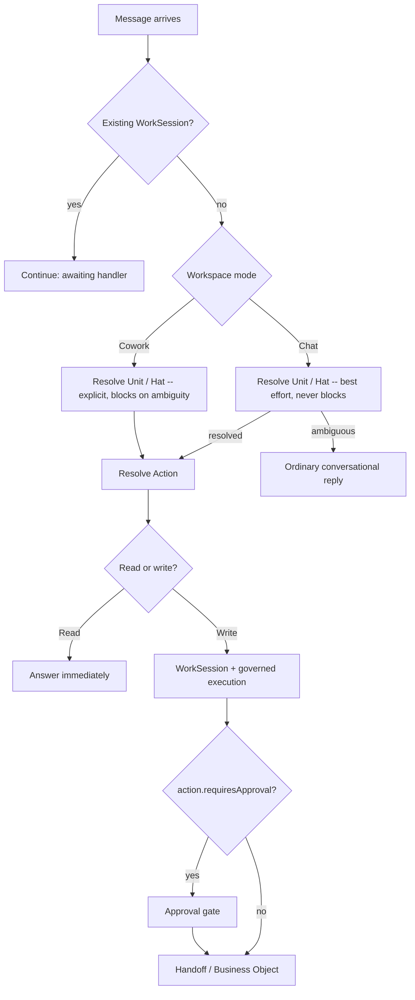

# ENIG Operating Model

As of 2026-09-24. Extended 2026-09-28 (Chat is action-capable; Platform layer confirmed as target architecture -- primitives, registries, skill-driven pipelines). Refined 2026-09-28, second pass (fresh per-call authority/eligibility resolution as a hard invariant; cross-Hat reuse folded into the primary build-order proof step rather than deferred to a later one). **Superseded 2026-09-28, third pass: the "Platform layer" (six primitives + three registries) is retired as the target architecture, replaced by "The Runtime architecture: Kernel, Applications, Capabilities, Runtime Services" below.** That replacement follows a direct implementation inspection (four rounds: Skills/fetchSkill, generate/AiPolicyExecutor, a repo-native Skill contract, and a full Kernel-enforcement map) which found the six-primitive/three-registry model was never adopted by real traffic -- see that section for the evidence. Nothing about Units, Hats, the Action Registry, Handoff enforcement, or the AI execution/Data Boundary chain changes; those were independently confirmed as real, current architecture by the same inspection.

## Binding, not aspirational

This document is the authoritative description of ENIG Runtime's architecture -- not a proposal, not a suggestion a session is free to skip under time pressure. `AGENTS.md` points every session here before touching Units/Hats/Actions/routing/dispatch, precisely because a `docs/` file only gets read if someone happens to open it; this line is what makes that pointer mean something.

Two rules that follow directly from that:

* **The code must match this document.** A discrepancy between them is a bug in one of the two, not a shrug -- fix the code, or fix the doc, but never build around the mismatch as if it were acceptable. Left alone, drift here teaches every future session that this document is optional, which is the actual failure mode: not any single wrong decision, but the document quietly stopping being true.
* **Any change that alters what this document describes updates the document in the same change**, not "someday" -- resolve or add to "Open questions" below, the same way the 2026-09-28 decisions were recorded here before being implemented.

### Known drift (confirmed 2026-09-28 audit -- fix opportunistically, never treat as acceptable long-term)

* **Business Development's manifest hardcodes most of its persona/instruction content.** `businessDevelopmentManifest.ts` embeds most of its Hats' prompts directly in code instead of using `getGovernance`'s live-Notion-fetch pattern (`src/governance.ts`) -- the pattern six other Units (Sales, Finance, R&I, Marketing, Strategy x2) already follow. Substantially addressed for Opportunity Development 2026-09-28: `discover_opportunity`/`research_opportunity`/`assess_opportunity` (three consumers of the shared `research-signal` Skill), `qualify_opportunity` (`opportunity-qualification-gate` Skill), and `develop_opportunity` (`opportunity-forward-planning` Skill) all now fetch their methodology live from Notion instead of restating it inline -- five of Opportunity Development's six AI-driven actions. Still hardcoded and open: Opportunity Development's Hat responsibility framing (one sentence, deliberately deferred -- see "Open questions"), `determine_next_move`'s `draftNextMove` (shared, Hat-agnostic plumbing across all three BD Hats -- out of scope for the established "Opportunity Development only" migration boundary, a natural consumer of `opportunity-forward-planning` once that boundary is revisited), and all of Partnership Development/Growth & Market Development's own prompts. Note (2026-09-28, third pass): these three Skills currently live in Notion via `fetchSkill`, which remains accurate as a description of today's code; "The Runtime architecture" section below records the separate decision that Skills' *target* home is repo-native, not Notion -- that target is not yet built, and this drift item's facts are unaffected by it.
* ~~`src/actions/registry.ts`'s `ActionCapability`/`routeWorkspaceCapabilityAction` mechanism is dead code.~~ **Resolved 2026-09-28 -- removed outright**, in the same pass as the `research-signal` Skill proof. It had zero production call sites (confirmed by grep before removal); `GoogleDocCreationCapability`/`GoogleSheetCreationCapability` (googleOAuth.ts) and `LeadOpportunityDiscoveryCapability` (leadGenerationDiscovery.ts) keep their own object shape and are still invoked directly where they always actually ran from, just without the dead registry wrapping them.

## Why this isn't a contradiction

Wanting chatbot-level ease and wanting controlled execution are not opposed -- they're different axes, and the current runtime already proves it in two of its eight Units. Input ergonomics (not hand-writing a persona/governance prompt every time) is solved by the Hat/Unit registry: once responsibility resolves, the right persona, evidence rules, and governance context are injected automatically. Output safety (approval before anything real happens) is a separate, deliberate choice -- the Handoff, Data Boundary, and Outbound Gate exist because letting an AI model act on real client identity or commit ENIG to something without sign-off was judged too risky. Marketing and Research & Intelligence already combine both: a plain sentence in, the system figures out what's meant, builds the right prompt automatically, and still stops at an approval gate before anything real happens.

What's actually missing is narrower: for Sales, Strategy, and Finance, the runtime doesn't get as far as applying persona + governance + approval, because it either forces text into the wrong shape (Sales assumes every message is a new client enquiry) or has no direct-entry code path to try at all (Strategy and Finance are Handoff-only). That's an intent-reading gap sitting *before* governance starts, not governance itself being the obstacle.

## Current state: entry-point shape per Unit

Traced every governed entry point in `session.ts` against each Unit's implementation, at the deployed HEAD. Only three of eight Units have any Cowork entry point at all.

| Unit | Cowork-wired | Fresh-entry function | Intent-driven? |
| --- | --- | --- | --- |
| Sales | Yes | `handleIncomingEnquiry` | No -- always assumes a new client enquiry, regardless of what's typed |
| Marketing | Yes | `handleMarketingIntake` | Yes -- AI-classifies which of 5 Hats and what kind of task from raw text |
| Research & Intelligence | Yes | `handleDirectRequest` | Yes -- takes the text directly as the research question |
| Strategy | No | none exists | N/A -- only `handlePickup` (Handoff-triggered) plus continuation-only handlers |
| Finance | No | none exists | N/A -- only `handlePickup` (Handoff-triggered) plus continuation-only handlers |
| Business Development | No | no unit code exists | N/A |
| Creative & Design | No | no unit code exists | N/A |
| Operations | No | not a governed Unit -- a Telegram stream only | N/A |

A second gap inside Sales: `Lead Generation Specialist` is a real, tested, intent-driven action (on-demand discovery in `leadGenerationDiscovery.ts`), but `dispatchCowork`'s Sales branch calls `handleIncomingEnquiry` unconditionally regardless of which Hat resolved -- so even an explicit `Lead Generation Specialist: find me 3 leads` is misrouted into enquiry-extraction.

## The OS metaphor

The existing pieces already map cleanly onto an operating system; the redesign below extends the pattern rather than replacing it.

| Runtime concept | OS equivalent |
| --- | --- |
| Unit | Subsystem / daemon |
| Hat | Process within a subsystem |
| Action (new, below) | Syscall |
| Handoff | Inter-process communication (IPC) |
| Approval gate | The permission prompt, only for privileged syscalls |
| Data Boundary / Outbound Gate | The sandbox / capability security model |
| Chat | A REPL over the same subsystems -- can invoke any syscall directly (2026-09-28 decision, see "Chat is action-capable" below), not read-only |


```mermaid
flowchart TD
    A[Message arrives] --> B{Existing WorkSession?}
    B -- yes --> C[Continue: awaiting handler]
    B -- no --> D{Workspace mode}
    D -- Chat --> E[Resolve Unit / Hat -- best effort, never blocks]
    D -- Cowork --> F[Resolve Unit / Hat -- explicit, blocks on ambiguity]
    E -- resolved --> G[Resolve Action]
    E -- ambiguous --> M[Ordinary conversational reply]
    F --> G
    G --> H{Read or write?}
    H -- Read --> I[Answer immediately]
    H -- Write --> J[WorkSession + governed execution]
    J --> K{action.requiresApproval?}
    K -- yes --> N[Approval gate]
    K -- no --> L[Handoff / Business Object]
    N --> L
```

Resolving Unit/Hat stays exactly as built (deterministic addressing, no AI). What's new is the step right after it: resolving *which action*, and branching on whether that action reads or writes.

## Chat is action-capable, not read-only (2026-09-28 decision)

Martin's ruling, superseding this doc's original "Chat | A read-only REPL" framing: Chat mode should feel like an ordinary assistant (Claude, ChatGPT) that can actually do things mid-conversation, not just answer questions about state someone else changed. Cowork is not "the only mode where actions happen" -- it's specifically where Martin is *explicitly* directing a Unit/Hat and, when the work spans more than one Unit, where a Handoff coordinates the handoff itself. The distinction is about explicitness of addressing and cross-Unit coordination, not about which mode is allowed to touch governed state.

Concretely:

* **Same dispatch mechanism, both modes.** Chat resolves Unit/Hat/Action and calls `dispatchAction` through the exact same Action Registry Cowork already uses (`src/hats/actionRegistry.ts`, `src/units/dispatch.ts`) -- no second, Chat-specific action mechanism, no generic/open-ended tool-calling either. An action is still never invented on the spot; it is always one of a Unit's own registered, finite verbs, consistent with this doc's original Action Registry section.
* **The approval gate is a property of the action, not of the mode.** `requiresApproval` on a write action fires identically whether the action was reached through Chat or Cowork (confirmed directly with Martin -- the alternative, Chat being fully autonomous even for privileged actions, was explicitly rejected). Nothing about being "just chatting" ever bypasses a privileged write's sign-off.
* **Ambiguity is handled oppositely by design, not by oversight.** Cowork's whole point is explicit direction, so an unresolved Unit/Hat still blocks with the existing clarification question -- forcing ambiguity to resolve is correct there. Chat's whole point is low-friction conversation, so an unresolved Unit/Hat (no confident addressee, no confident action) must never block; it falls through to an ordinary conversational reply instead (the existing `generalChatReply`/`generalDmReply`), exactly as today. Chat fails open to conversation; Cowork fails closed to a clarifying question. Same underlying resolution step, opposite fallback.
* **Read actions answer immediately in both modes** -- this was already true for Cowork and doesn't change; Chat gains it for the first time.

### What this does not change

* The Data Boundary, Outbound Gate, WorkSession, and Handoff machinery are untouched -- this is purely about which mode is allowed to *reach* the Action Registry, not a new execution path.
* A Unit with no manifest yet (everything except Business Development, and Sales for `discover_leads` only, as of this decision) gains nothing from this immediately -- Chat has no actions to resolve against for an unmigrated Unit, the same way Cowork doesn't today. This decision's benefit compounds as more Units migrate onto the manifest pattern (see "Migration path" -- migrating a Unit now unlocks Chat-mode action dispatch for it for free, no Chat-specific work required per Unit).
* `dataLookup.ts` (the six-source "what's in this database" conversational capability, shipped 2026-09-27) is a known, temporary exception to "actions are always Unit/Hat-scoped" -- Handoffs and the Activity & Decision Log are inherently cross-Unit records that don't fit cleanly into any single Unit's manifest. Left as-is for now rather than forced into a shape that doesn't fit; how (or whether) to fold it into the Action Registry, versus keeping it as a deliberate cross-subsystem exception, is still an open question below.

## The Action Registry

**Current, verified architecture (confirmed 2026-09-28, third pass)** -- an earlier version of this doc marked this section superseded by a "Platform layer" of shared primitives that would let Hats stop declaring their own private `ActionDefinition[]`. That replacement was never built: a direct implementation inspection (see "The Runtime architecture" below) confirmed `hats/actionRegistry.ts`'s per-Hat `ActionDefinition[]`/`dispatchAction`, exactly as this section describes, remains the real, current, and only mechanism actually resolving and dispatching actions in production. This section is restored as accurate, not historical.

Every Unit/Hat declares a small, finite list of named actions -- the same idea `ALL_HATS` already applies to Unit/Hat discovery, one level down. Marketing already does this informally: its Stage 1 intake (`marketing.intake_classification`) reads raw text and picks a Hat; a second, already-existing task (`marketing.hat_action_decision`) then picks what to do within that Hat. Generalizing this removes the need for each Unit to invent its own intent-reading:

1. Deterministic addressing resolves Unit/Hat (unchanged -- `resolveAddressee`, no AI).
2. One scoped, registered AI task -- the same governed shape as `marketing.hat_action_decision` -- reads the message against *that Unit's own declared action list* and picks one, or asks a clarifying question if none fit. Never a free-form action invented on the spot; always one of the Unit's own registered verbs.
3. The picked action's own handler runs -- which may be the existing fixed function (Sales's `handleIncomingEnquiry` becomes the handler for the `new_enquiry` action specifically, not the only path), or a new one.

Illustrative starting action lists (final lists are a product decision, not an engineering one):

| Unit | Candidate actions |
| --- | --- |
| Sales | `new_enquiry`, `status_check`, `follow_up`, `revise_draft` |
| Lead Generation Specialist (Sales) | `discover_opportunities` (already built, currently orphaned) |
| Strategy | `diagnose`, `refine_diagnosis` |
| Finance | `price_intervention`, `re_price` |

Adding a capability becomes "register an action + its handler" rather than hand-wiring a new branch into `dispatchCowork` -- closer to installing a program than patching the kernel.

## Read vs. write

This is the actual resolution to the chatbot-vs-control question. Today, everything inside Cowork gets the same heavy treatment: a fresh WorkSession, the full approval pipeline, a Handoff where relevant -- regardless of whether the request changes anything. That's disproportionate for a question like "what's the status of MAT-20" or "explain our pricing model," which have no side effects at all.

Each registered action declares its own consequence level:

- **Read** -- no side effects (a status check, an explanation, a lookup). Runs immediately, Unit/Hat-persona-aware, no WorkSession created, no approval gate -- the same low friction as Chat, just scoped to the right context.
- **Write** -- creates or mutates governed state (drafts a proposal, sets a price, creates a Handoff, contacts a client). Goes through the existing full pipeline, unchanged: WorkSession, governed execution, approval gate.

This is what lets "my own GPT" ease coexist with real control: low-consequence actions get low friction, high-consequence actions get proportionate friction -- the split is on what the action *does*, not on which Unit it belongs to.

**Current enforcement gap (confirmed 2026-09-28, third pass, via direct trace of every consumer of a `dispatchAction` result):** `requiresApproval` is declared on `ActionDefinition` and computed into `dispatchAction`'s return value, but is not read or checked by any shared code after that -- `dispatch.ts`, `router.ts`, and `session.ts`'s `handleUnitAction` all branch only on read-vs-continuable, never on `.requiresApproval`. Every write action built so far (Business Development, Marketing, Strategy) presents an approval gate anyway, but by each Hat's own hand-written propose/approve pair -- a followed convention, not something the Kernel currently checks or would notice the absence of. See "The Runtime architecture" below, "Kernel" subsection, for the full evidence and for what would make this a genuine Kernel enforcement boundary rather than a convention.

## Strategy and Finance: direct entry without bypassing the discipline

Strategy and Finance are Handoff-only by deliberate design -- confirmed directly in code: `strategyAnalyst.ts` and `valueBasedPricingAssessor.ts` each export only `handlePickup` (fires off an incoming Handoff) plus continuation-only handlers. Nothing lets Martin originate fresh work in either Unit today.

The fix is not to let a direct request skip the discipline a Handoff enforces -- entity/matter tokenization, sanitized context, a defined required category. It's to let Martin *originate* that same shape of context directly, instead of only ever receiving it from another Unit:

- A direct `Strategy, diagnose this` constructs a Martin-originated context equivalent to a Handoff's `HandoffContextContract` (opaque tokens, sanitized text, explicit category) rather than a real Handoff record from another Unit.
- `entryType` already anticipates exactly this shape of change -- it's typed as `"inbound_enquiry" | "outbound_outreach"` with a doc comment noting `outbound_outreach` exists for future origination paths but nothing produces it yet. A third value (e.g. `"direct_request"`) is the natural extension.
- Every existing check downstream (Data Boundary, Outbound Gate, token-safety detectors) stays exactly as it is -- it already operates on the context shape, not on who originated it.

## Migration path

None of this requires touching Marketing, Research & Intelligence, or the WorkSession/Handoff/approval/Data Boundary machinery -- they already fit the target shape or are the foundation everything else builds on.

1. ~~**Sales dispatch fix.**~~ Done -- `Lead Generation Specialist` is wired into `dispatchCowork`'s Sales branch and no longer forced through `handleIncomingEnquiry`.
2. ~~**Formalize the Action Registry pattern.**~~ Done -- Marketing's Stage 1/2 classification mechanics are extracted into `resolveCandidateRelationships`/`selectAmbiguityReasonCode` (`src/hats/relationships.ts`) and `classifyCandidateHats`/`buildStage1SystemPrompt` (`src/hats/intakeClassification.ts`), generic over any Unit's own Hat/relationship types; Marketing's own functions are now thin wrappers over them.
3. ~~**Read/write split.**~~ Mechanism built -- `ConsequenceLevel`/`ActionDefinition`/`dispatchAction` in `src/hats/actionRegistry.ts` resolve a registered action's declared read/write consequence: read runs immediately with no WorkSession/approval gate, write hands back a dispatch signal for the existing pipeline, unchanged. Proven only against a toy action set -- no real Unit is wired to it yet, since that requires first deciding a Unit's actual action list (see Open questions below).
4. ~~**Strategy/Finance direct entry.**~~ Done for both. `strategy.handleDirectRequest` (`src/units/strategy/strategyAnalyst.ts`) and `finance.handleDirectRequest` (`src/units/finance/valueBasedPricingAssessor.ts`) let Martin start a fresh diagnosis/pricing assessment directly from Cowork chat by naming an existing Matter's token (e.g. "MAT-20") -- resolved deterministically via the shared `resolveMatterFromText` (`src/identityResolution.ts`), never AI-guessed, failing closed with a clarifying question if no token is given or it doesn't resolve to a real Matter. Strategy joins the same `runDiagnosis` a Handoff pickup already uses; Finance joins the same `judgeQuote` (made Handoff-agnostic: its `updateHandoff` calls are now guarded on `state.handoffId` existing). Two disclosed, pre-existing consequences of having no upstream Handoff, neither a bug: (1) a Strategy diagnosis that reaches a recommended direction still correctly holds at the existing known-identity gate (`checkStrategyProposalForKnownIdentity`), since direct-entry work has no Sales-sourced source-boundary attestation; (2) a direct-entry Finance quote completes standalone on approval -- no Strategy boundary block to carry forward, no Finance -> Sales Handoff created -- and its Redo loop isn't supported yet (fails closed with a clear message instead).
5. **New Units (Business Development, Creative & Design, Operations), built on the Unit Registry (below).** A new Unit is a self-contained manifest + handlers registered in one place, not hand-wired branches in `dispatchCowork` -- see the next section for the shape and rollout order.

Each step is independently shippable and testable, the same discipline used for the Chat/Cowork rollout itself.

## The Unit Registry: from hand-wired branches to a plug-in shape

Today, adding a Unit means learning and editing hand-wired, per-Unit code in three separate places, not one:

1. **`dispatchCowork`** (`src/router.ts`) -- a hand-written `if (decision.unit === "Sales") {...}` / `if (decision.unit === "Marketing") {...}` chain, one branch per Unit, each inlining that Unit's session-stub wiring (`stub.init`, `stub.handle*Request`) and any Unit-specific special case (Sales's `Lead Generation Specialist` bypass, `SALES_EXECUTIVE_PAUSED`, Strategy's `direct_request` known-identity gate, Finance's Handoff-agnostic `updateHandoff` guard).
2. **`WorkSession`** (`src/session.ts`), the Durable Object every Unit's work runs inside -- it also carries one method per Unit (`handleIncomingEnquiry`, `handleMarketingRequest`, `handleResearchRequest`, `handleStrategyRequest`, `handleFinanceRequest`), each a thin wrapper calling `this.execute((state) => unit.handleDirectRequest(this.env, state, text))`.
3. **`handleTextReply`'s `switch (state.awaiting)`** (`src/session.ts`) -- the largest and messiest of the three. This is where every Unit's multi-turn "Martin replies to a pending question" state actually lives: roughly ten continuation states (`call_notes`, `intervention`, `value_context_more`, `quote_redo_reason`, `matter_redo_reason`, `entity_redo_reason`, `proposal_feedback`, `sales_proposal_revision`, `marketing_feedback`, and more) spanning every Unit, in one global switch keyed only on the string in `state.awaiting` -- not on which Unit is running.

That's the actual "building forever" risk: every new Unit requires understanding and safely extending shared code that four other Units already depend on, in three different places.

The fix is not new machinery -- the Action Registry, Handoff enforcement, and Data Boundary already operate generically, on context shape and declared consequence rather than on which Unit produced them (see "The Action Registry" and "Read vs. write" above). What's missing is a way for a Unit to hand the runtime everything it needs *as one declared object*, instead of three different chokepoints reaching into each Unit's internals by hand.

**Unit Manifest.** Each Unit exports one object describing everything those three chokepoints currently hard-code for it:

* its Hats (the existing `Hat` typing per Unit, unchanged)
* its `ActionDefinition<A>[]` -- the same shape `actionRegistry.ts` already defines, declaring each action's read/write consequence
* its read handler -- run immediately by `dispatchAction`, no WorkSession, no approval gate
* its entry handler -- the `handleDirectRequest`/`handlePickup`/`handleIncomingEnquiry`-shaped function that starts a WorkSession for write actions, the same pattern Strategy and Finance already established
* its `awaiting`-state handler map -- each continuation state the Unit can leave a WorkSession paused on (its own equivalent of `call_notes`/`intervention`/`quote_redo_reason`/etc.), so `handleTextReply` can dispatch generically off `state.unit` + `state.awaiting` instead of one global switch
* any Unit-specific dispatch special case, expressed as part of the manifest rather than a `dispatchCowork` exception (e.g. Sales's Lead Generation Specialist routing becomes a second action/handler pair inside Sales's own manifest, not a carve-out the router has to know about)

**Unit Registry.** One file (e.g. `src/units/registry.ts`) statically imports every Unit's manifest into a `Record<Unit, UnitManifest>`. Cloudflare Workers has no runtime filesystem, so this cannot be literal auto-discovery (no scanning a directory at request time) -- this registry file is the one place that changes when a Unit is added or removed: one import, one entry.

**All three chokepoints become lookups, not chains.** `dispatchCowork` resolves `registry[decision.unit]` and calls its manifest's dispatch entry point. `WorkSession` gains one generic `handleUnitRequest(text)` that looks up the Unit's entry handler from the manifest instead of one method per Unit. `handleTextReply` resolves `registry[state.unit].awaitingHandlers[state.awaiting]` instead of one global switch. All three still route into the same session-stub/Handoff/approval machinery every Unit already shares today -- only the *lookup*, not the underlying execution, changes.

### The hard invariant

The generic layer may become more capable as migration exposes legitimate requirements, but it must never acquire knowledge of a specific Unit. If migrating an existing Unit ever seems to require `if (unit === "sales") ...` inside `dispatchCowork`, `WorkSession`, or `handleTextReply`, the abstraction has failed at that point -- the fix belongs in one of: a new manifest capability, a handler contract, a lifecycle contract, a shared primitive, or an explicitly generic extension point. Never a Unit-name check in shared code.

This cuts the other way too: the manifest declares Unit-specific *facts* ("Business Development has a `develop_opportunity` action"; "Business Development has a reply state called `awaiting_opportunity_scope`"). The kernel owns universal *behaviour* ("a write action enters the approval pipeline"; "waiting states are persisted and resumed against the current WorkSession"). A Unit's manifest cannot override kernel semantics like approval requirements just because it has a custom field -- that boundary is what keeps this an OS model rather than eight Units each running their own miniature operating system (their own bespoke routing/approvals/Handoff/data-boundary handling inside the manifest). If a manifest starts accumulating fields like `routing`, `approvals`, `handoffs`, `dataBoundary` with real logic inside them rather than plain declared facts, that is the same failure in the other direction.

### Don't design the final manifest schema up front

The manifest schema in "Unit Manifest" above is a starting sketch, not a spec to build BD against and then declare final. The correct order is: build BD entirely through the contract as currently understood, exercise it with real actions, find where the generic machinery is insufficient, strengthen the contract, *then* migrate one existing Unit. Defining a theoretical plugin schema before any real Unit has exercised it risks discovering months later that production Units don't actually fit it.

### Business Development as conformance test, not just the first example

BD is the Unit chosen to prove this pattern (see Open questions below), and it needs to deliberately exercise the hard parts of the manifest, not the easy ones -- otherwise nothing is actually proven. Its three Hats (Growth & Market Development, Partnership Development, Opportunity Development) are useful precisely because they give room to do this: at least one Hat's actions must require a genuine multi-turn `awaiting`-state flow (proving a Unit can declare waiting-state -> handler behaviour, not just a list of synchronous actions), and at least one write action must go through the real approval/Handoff machinery end to end (routing -> Hat resolution -> Action resolution -> read/write consequence -> handler -> WorkSession -> approval -> state mutation/Handoff -> continuation). If that whole path works without touching any existing Unit's execution code, the pattern is demonstrated; if BD only proves synchronous read actions, it hasn't proven the pattern.

### Fail-closed manifest completeness

Manifest completeness is a hard invariant, not a nice-to-have: the kernel must never silently fall back to generic/default behaviour when a Unit's manifest is incomplete. Concretely -- an action referenced but missing from the registry, an action with no handler, a write action with no write-entry handler, or an `awaiting` state with no handler in the map -- must all fail closed (an explicit error, never a silent default or a fall-through to legacy behaviour). A registry that quietly papers over gaps will hide real defects during migration instead of surfacing them.

### Definition of "proven"

The manifest pattern is not proven merely because BD works end to end. It is proven only once BD demonstrates all of the following:

* **Unit discovery** -- the registry locates BD without any hard-coded dispatcher knowledge of it.
* **Hat resolution** -- BD exposes multiple Hats without shared code knowing their identities.
* **Action resolution** -- BD's action list comes entirely from its manifest, nowhere else.
* **Read/write semantics** -- the generic dispatcher treats both correctly with no BD-specific branching.
* **Write governance** -- a BD write action goes through the existing approval pipeline with no custom approval code.
* **Multi-turn continuation** -- a BD-specific waiting state resumes correctly through the generic `handleTextReply` lookup.
* **Special routing without contamination** -- BD can have something genuinely Unit-specific (its own equivalent of Sales's Lead Generation Specialist routing) without that logic leaking into shared dispatch code.
* **Failure semantics** -- an ambiguous or unregistered BD action fails closed rather than falling through to any legacy behaviour.
* **No regression** -- Sales, Marketing, Strategy, Finance, and R&I remain untouched and continue operating exactly as they do today.

**Rollout order (deliberately staged to avoid re-testing working Units before the pattern is proven):**

1. Design and land the `UnitManifest`/registry types and the (still-empty) registry lookups in all three chokepoints, with Sales/Marketing/Strategy/Finance/R&I continuing to run through their existing hand-written branches, methods, and switch cases, untouched, alongside it.
2. Build Business Development entirely on the manifest/registry pattern, deliberately exercising the hard parts per "Business Development as conformance test" above. Zero regression risk -- there is no existing behavior to break, since the Unit doesn't exist yet. Do not consider the pattern proven until it satisfies every point in "Definition of 'proven'" above, not merely "BD responds to messages."
3. Once proven against that full checklist, migrate Sales, Marketing, Strategy, and Finance into the manifest shape one at a time, each its own shippable step. The correct migration shape per Unit is: extract its actual current behaviour, express that behaviour through the manifest contract, **delete** the old Unit-specific dispatcher path (the `dispatchCowork` branch, the `WorkSession` method, the `handleTextReply` switch cases), then run its regression suite (`salesExecutive.test.ts`, `strategyAnalyst.test.ts`, `valueBasedPricingAssessor.test.ts`, Marketing's and `leadDiscovery.test.ts`) plus a manual smoke pass through its real entry flow. Wrapping a Unit's existing code in a manifest object while leaving its old dispatcher path in place is not migration -- it gives the appearance of one while preserving the old architecture underneath, and must not be treated as "migrated." Watch specifically for legacy and manifest Units quietly acquiring different semantics for the same kernel concern (WorkSession creation, waiting-state persistence, reply routing, Handoff creation, approval, failure/stop conditions, audit logging, data-boundary enforcement, outbound AI gating) -- that is two kernels wearing one name, not one. Expect the `handleTextReply` awaiting-state migration to be the riskiest and most careful part of this step, since it is the largest hand-written surface of the three and the one carrying the most existing, live conversational state.
4. Build the remaining new Units (Creative & Design, Operations) on the now-proven pattern.

This intentionally does not migrate working Units up front: it proves the plug-in shape once, cheaply, on a Unit with nothing to lose, before spending verification effort re-proving Units that already work.

## The Runtime architecture: Kernel, Applications, Capabilities, Runtime Services (confirmed 2026-09-28, third pass)

**Supersedes the "Platform layer" model above outright.** That model (six shared primitives + three registries, composed by Hat pipeline functions) was pressure-tested against the actual, deployed implementation across four rounds of direct inspection -- tracing every production caller of `fetchSkill`, `generate`, `readRecord`, `writeRecord`, `search`, `requestApproval`, `connectorRegistry.ts`, and `dataSourceRegistry.ts`, plus every path from a Hat to an external effect (AI generation, Notion read/write, Handoff write, Telegram, web search, Google Docs/Sheets). The finding, stated plainly: real production traffic never adopted the primitive/registry layer. Two of six primitives (`fetchSkill`, `generate`) have a handful of production callers and are thin convenience wrappers around mechanisms that already existed and that most of the codebase still calls directly; the other four have zero production callers; both non-Skill registries have zero production callers. Meanwhile, exactly two mechanisms in the whole Runtime are both genuinely universal and genuinely enforced today: the AI execution chain, and the Handoff identity boundary -- neither of which needed the primitive/registry layer to be true, and both of which the primitive/registry layer's own doc language already deferred to rather than reimplemented.

This section replaces the Platform layer with a model derived from that evidence, not from preference:

```
ENIG Runtime
│
├── Kernel
│   └── Universal execution rules and enforcement
│
├── Applications
│   └── Units
│       └── Specializations
│           └── Hats
│               └── Responsibilities → Outputs
│
├── Capabilities
│   └── Skills
│
└── Runtime Services
    ├── AI Execution
    ├── Notion
    ├── Web Search
    ├── Telegram
    └── Google Workspace
```

Providers sit beneath the relevant Runtime Service -- they are the external implementation a Service uses, never the architectural abstraction itself:

```
AI Execution
    ↓
Provider Policy / Selection
    ↓
Eligible AI Provider   (e.g. Workers AI / Gemini / Groq / OpenRouter / Cerebras / Sambanova / NVIDIA-NIM)

Web Search      → Tavily
Notion          → Notion API
Telegram        → Telegram API
Google Workspace → Google APIs
```

### Kernel

The Kernel is universal execution rules and enforcement -- mechanisms every relevant execution actually passes through, verified by trace, not mechanisms merely intended as governance. A mechanism does not become Kernel by being under `src/platform/`, by having "governance" in a doc comment, or by being architecturally desirable; it becomes Kernel only where the trace shows every relevant path actually goes through it and nothing bypasses it in production.

**Current, verified Kernel enforcement:**

- **AI provider eligibility and fallback policy** -- `AiPolicyExecutor.executeTask` (`src/ai/policy.ts`). Every production AI call (whether reached via `generate()` or directly via `aiJson`/`aiChat`/`aiText` in `src/ai.ts`) passes through this; confirmed by trace that no production code calls a provider adapter or `executeTask` directly.
- **AI Data Boundary enforcement** -- `DataBoundaryEvaluator.evaluate` (`src/dataBoundary/policy.ts`), invoked unconditionally inside `executeTask` for every provider attempt.
- **Identity redaction and leftover-identity verification** -- `redactIdentityTerms`/`findLeftoverBannedTerms` (`src/ai/identityRedaction.ts`), invoked unconditionally inside `executeTask`, with a hard stop (the call is not sent) if verification finds a leftover term.
- **AI Outbound Data Gate** -- `OutboundDataGateEvaluator.evaluate` (`src/ai/outboundGate.ts`), invoked unconditionally inside `executeTask`, on the exact post-redaction payload, per provider attempt.
- **Handoff identity/token boundary** -- `validateHandoffProperties`/`assertTokensPresent` (`src/handoffWriter.ts`), invoked by every Handoff creation/update in the codebase; confirmed by trace that no production code writes to the Handoffs Data Source (`HANDOFFS_DATA_SOURCE_ID`) any other way.
- **Routing/consequence handling, where currently enforced** -- `dispatchAction`/`ConsequenceLevel` (`src/hats/actionRegistry.ts`), invoked by `resolveUnitRequest`/`tryResolveUnitAction` (`src/units/dispatch.ts`) for every manifest-registered Unit (Sales, Marketing, Strategy, Business Development as of this writing) to decide read-vs-continuable. This is real and enforced for those Units specifically -- Units without a registered manifest (Finance, R&I, Creative & Design, Operations) don't route through it at all, which is a coverage gap, not a bypass of an otherwise-universal rule.

**Explicitly not yet universal Kernel enforcement, despite being declared or intended as governance** -- stated here so this document never claims more than the trace supports:

- **`requiresApproval`** is declared per action (`ActionDefinition.requiresApproval`, `src/hats/actionRegistry.ts`) and computed into `dispatchAction`'s result, but is not read or checked by any shared code downstream of that computation -- confirmed by tracing every consumer (`dispatch.ts`, `router.ts`, `session.ts`'s `handleUnitAction`). Every write action built so far presents an approval gate anyway, through each Hat's own hand-written propose/approve function pair (e.g. `proposeBDDevelopment`/`handleBDDevelopApproval` in `businessDevelopmentManifest.ts`) -- a followed convention across every Hat built to date, not something the Kernel currently checks, would notice the absence of, or could reject a non-conforming Hat for. Making this genuinely Kernel-enforced (e.g. `handleUnitAction` refusing to finalize a declared-`requiresApproval` write without a recorded approval) is a real, identified, not-yet-built enforcement point -- target architecture, explicitly not current fact.
- **`logActivity`** (`src/log.ts`) is caller-dependent: ~150+ call sites across the codebase, each inserted individually by that file's own author at a point they judged an entry was warranted. No dispatch/entry/write path calls it automatically on a Hat's behalf. A Hat can structurally perform a material action without an Activity & Decision Log entry being written -- nothing currently prevents or detects that. In every Hat built so far, the entry is in fact written, by convention, not enforcement.

### Applications

Applications are the business execution layer:

```
Unit
 → Specialization
  → Hat
   → Responsibility
    → Output
```

A **Unit** is an organizational/business execution area (Sales, Marketing, Strategy, Finance, Research & Intelligence, Business Development, Creative & Design, Operations). A **Hat** is the governed responsibility that performs work within a Unit -- never described as an integration, a Skill, a primitive, or a provider; those are separate concepts entirely (see below). Runtime resolves the appropriate Application/Hat for a request according to the governed operating model already described above ("The OS metaphor," "The Action Registry," "Read vs. write," "The Unit Registry") -- none of that changes here. Runtime does not contain one hardcoded universal business workflow; which Unit/Hat/action a request resolves to, and what that Hat's own pipeline does, is declared per Unit/Hat, not fixed centrally.

### Capabilities: Skills

A Skill is a reusable capability/methodology used by an Application. It answers **how should this type of work be performed**, never *who* is performing it (that's the Hat) or *what mechanism* carries it out (that's a Runtime Service). A Skill is not a Unit, a Hat, a provider, an integration, or a Kernel enforcement mechanism -- confirmed by direct inspection that no `SkillDefinition` field is ever consulted by any governance/enforcement code (`DataBoundaryEvaluator` resolves sensitivity from `SemanticTaskId`, never from a Skill's own declared `sensitivity` field). Skills may be shared across Units/Hats where the underlying methodology is genuinely the same -- `research_signal` (shared today between Business Development's Opportunity Development and Sales's Lead Generation Specialist) is the one proven instance.

**Target, not yet built:** Skills should be repo-native -- ordinary TypeScript modules/constants holding methodology content, resolved by an ordinary `import`, not fetched over the network from Notion at runtime. This doc no longer preserves the assumption that a Skill must be fetched from Notion to exist. This section does not invent a new Skill Registry architecture, a resource-loading mechanism, or any other new abstraction for repo-native Skills -- that is a separate, deliberate design pass, not a decision made here.

**Current fact, unchanged by the above:** as of this writing, `research_signal`, `opportunity_qualification_gate`, and `opportunity_forward_planning` (Business Development/Sales) are live Notion pages, fetched via `fetchSkill`/`getGovernance` at runtime. This is accurate today; it is the thing the repo-native target eventually replaces, not something already replaced.

`fetch_skill` is no longer presented as a foundational Runtime primitive -- see "The Action Catalog is retired" below.

### Runtime Services

Runtime Services are the concrete capabilities Runtime exposes to Applications for carrying out work against internal or external systems: **AI Execution, Notion, Web Search, Telegram, Google Workspace**. An Application (a Hat's own pipeline code) invokes the Runtime Service appropriate to its responsibility. Runtime Services are not required to implement one generic `execute()` interface -- a Notion query and a Telegram send are nothing alike, and forcing a uniform shape across them was already tried (`connectorRegistry.ts`'s `ConnectorDefinition`) and never adopted by real traffic (see "The Connector/Data Source Registries are retired as active architecture" below). Multiple Runtime Services existing is not, by itself, a reason to introduce a universal abstraction over them.

```
Application / Hat
    ↓
Skill, where applicable
    ↓
Runtime Service
    ↓
External system / provider
```

**AI is a special Runtime Service**, because it is also the execution mechanism a Hat uses to perform reasoning/generation, and it is the one Runtime Service with genuine, verified, universal Kernel enforcement underneath it. AI's path is not flattened into an ordinary provider call:

```
Application
 → AI execution
  → AiPolicyExecutor
   → Data Boundary / identity controls / Outbound Gate
    → eligible provider
```

Every other Runtime Service (Notion, Web Search, Telegram, Google Workspace) is invoked today by ordinary application code calling that Service's own concrete client directly (`src/notion.ts`, `src/units/research/webSearch.ts`, `src/telegram.ts`, `src/googleOAuth.ts`) -- confirmed by trace to be the actual, dominant, production pattern, not a bypass of some other intended path. Handoff writes specifically route through `src/handoffWriter.ts` first, which is where that Service's one real Kernel-enforced rule (the identity/token boundary) actually lives.

### The Action Catalog is retired

The prior "Action Catalog" (six primitives: `read_record`, `fetch_skill`, `search`, `generate`, `request_approval`, `write_record`) is no longer presented as a mandatory, universal architectural layer that every request passes through. It never was one, verified by trace:

- **`fetchSkill`** (`src/platform/primitives.ts`) is a real convenience mechanism, currently used by 6 call sites across 2 files -- a thin wrapper around `getGovernance` (`src/governance.ts`), which 7 other files call directly, unmediated, for the same kind of governance content.
- **`generate`** (`src/platform/primitives.ts`) is a convenience wrapper around AI execution -- prompt-string assembly plus a typed call into `aiJson`/`aiChat`/`aiText`, used by the same 6 call sites. Roughly 34 other production call sites call `aiJson`/`aiChat`/`aiText` directly and reach the identical Kernel-enforced path (see "Kernel" above) without it.
- **`readRecord`, `writeRecord`, `search`, and `requestApproval`** have no production callers, confirmed by direct grep across the codebase (referenced only by their own test files).

None of this is a claim that these functions must be deleted, or that using them today is wrong -- `src/platform/primitives.ts` is unchanged by this document, and `fetchSkill`/`generate` remain in active use exactly where they already are. The claim is narrower and evidence-based: they are not a required layer every request must pass through, and this document no longer describes them as one.

### The Connector/Data Source Registries are retired as active architecture

`src/platform/connectorRegistry.ts` and `src/platform/dataSourceRegistry.ts` are not described here as active universal Runtime architecture. Confirmed by trace:

- **Connector Registry** has no production invocation path -- `isConnectorEligible`/`getConnector`/`CONNECTOR_REGISTRY` are referenced only from within `src/platform/` itself. `ConnectorDefinition` also has no `execute()`/invocation method at all, by its own original design choice, which means it could not have served as an invocation layer even if something called it.
- **Data Source Registry** has no production invocation path -- `canRead`/`canWrite`/`getDataSource` are referenced only from within `src/platform/` itself. No real Notion read or write anywhere in the codebase consults it.
- Actual Notion, Telegram, Web Search, and Google operations use their concrete Service/client implementations directly, as described under "Runtime Services" above.
- Handoff writes have their real, enforced identity boundary in `src/handoffWriter.ts` -- not in the Data Source Registry, which was never wired to it.

As with the primitives, this is not an instruction to delete either registry file -- both remain in the codebase, correctly implemented, unmodified by this document. The claim is that neither should continue to be described here as required, universally-enforced Runtime architecture, since neither is.

### Request execution: a conceptual model, not a fixed sequence

```
Request
  ↓
Runtime resolves governed next action
  ↓
Appropriate Unit / Hat
  ↓
Relevant Skill(s), where needed
  ↓
Hat performs responsibility
  ↓
Runtime Service(s), where needed
  ↓
Kernel enforcement at applicable boundaries
  ↓
Output / Handoff / Approval / State transition
  ↓
Runtime resolves the next governed action
```

This describes how execution is organized conceptually, not a hardcoded universal sequence every request must literally traverse in this order. Concretely, and already true today:

- Some work is deterministic code with no AI step at all (e.g. `findDuplicateLeads`'s mechanical Notion query).
- Some work uses AI once, or several times, depending on the Hat's own pipeline (e.g. R&I's diagnosis pipeline makes multiple sequential `aiJson` calls; a single classification makes one).
- Some work invokes an external Runtime Service directly with no Skill involved (e.g. `searchWeb` inside Lead Generation Specialist's discovery loop).
- Some work requires human approval before a state transition is final; some (declared "read", or "internal" with no `requiresApproval`) does not.

Runtime must not be read as requiring AI for every request -- confirmed false by trace: `readRecord`-shaped Notion lookups, Handoff routing decisions already made by a prior AI step, and plenty of ordinary application logic (duplicate checks, token resolution, formatting) run with no AI call in their own path.

## Open questions

- [x] What is Sales's real action list beyond `new_enquiry`? One real answer is now built and validated end-to-end: `call_notes` -- the isolated Sales Executive project hands off de-identified call notes via a Handoff, and the Runtime Sales Executive runs commercial-value-evidence-extraction + qualification against them (`handleCallNotesHandoffPickup`). `status_check`, `follow_up`, `revise_draft` remain unconfirmed guesses.
- [x] Should Strategy/Finance direct requests be gated any differently than Handoff-originated ones? Resolved: yes -- Martin must always name an existing Matter explicitly (its token); there is no "identity-free general question" path. Applied to Strategy in `handleDirectRequest`; Finance direct entry still needs to apply the same rule when built.
- [ ] Does a "read" action ever need any lightweight audit trail (a log entry, no WorkSession), or is truly zero record acceptable for pure lookups?
- [x] Which Unit proves the Unit Registry pattern first, and what should it actually *do*? Resolved: Business Development, structured as three Hats (Growth & Market Development, Partnership Development, Opportunity Development) -- see "The Unit Registry" above. Creative & Design and Operations remain undefined; built on the pattern once proven by BD, per the rollout order above.
- [x] Is Chat mode allowed to invoke actions (read and write), or read-only? Resolved 2026-09-28: action-capable, same dispatch and approval-gate semantics as Cowork -- see "Chat is action-capable, not read-only" above.
- [x] `dataLookup.ts`'s six sources (Matters, Entity, Handoffs, Proposals, Leads, Activity) don't fit cleanly into any single Unit's manifest -- Handoffs and Activity are inherently cross-Unit. **Superseded 2026-09-28, third pass:** the Data Source Registry this was resolved toward was never adopted by production traffic (zero callers, confirmed by inspection) and is no longer presented as active architecture -- see "The Connector/Data Source Registries are retired as active architecture" above. `dataLookup.ts`'s own cross-Unit-source handling remains exactly as it is today; this question is open again in the sense that no replacement has been decided, not resolved.
- [x] Is the Platform layer worth building, and in what shape? **Superseded 2026-09-28, third pass:** no -- a direct implementation inspection found it was never adopted by production traffic. Replaced by "The Runtime architecture: Kernel, Applications, Capabilities, Runtime Services" above.
- [x] Should `ActionCapability`/`routeWorkspaceCapabilityAction` (`src/actions/registry.ts`) be retired outright, or re-homed? Resolved 2026-09-28: retired outright -- unaffected by the Platform layer's own retirement above; this decision and the removed code stand on their own (the mechanism had zero production call sites regardless of what replaced or didn't replace the Platform layer).
- [ ] **Superseded 2026-09-28, third pass, by a narrower open question:** not "exact typed signatures for the six primitives," since they are no longer a foundational layer this document commits to building out. The real open design question is what a repo-native Skill's minimum contract should be (an id + methodology content/module, per "Capabilities: Skills" above) -- not yet decided in this document, deliberately, per this pass's own scope (documentation restructuring only, no new abstraction introduced).
- [ ] **Superseded 2026-09-28, third pass:** fresh per-call Data Source/authority resolution (no caching across Hats) was a hard invariant *for the Platform layer specifically*, which is retired. The underlying principle -- a shared Skill/resource must never become a bridge that leaks one Hat's access into another's -- should still hold for whatever formalizes Kernel-enforced Data Source/Skill access next, but that mechanism doesn't exist yet (see "The Connector/Data Source Registries are retired" above), so there is nothing currently enforcing this to re-confirm as resolved.
- [ ] **Superseded 2026-09-28, third pass:** cross-Hat Skill reuse being proven in the same build step (not deferred) was a Platform-layer build-order rule. `research_signal`'s real, already-proven cross-Hat reuse (Business Development + Sales, `src/platform/researchSignal.crossHat.test.ts`) stands on its own regardless of the Platform layer's retirement -- that evidence doesn't change. Whether a *future* Skill build should follow the same discipline is an open question again, since there's no longer a "Build order" section committing to it.
- [ ] Should `HatManifest.responsibility` (currently a plain hardcoded string) become a live-fetched or repo-native Skill? Still open, unaffected by this pass -- see "Capabilities: Skills" above for the current repo-native-target direction this would need to follow if pursued.
- [ ] `determine_next_move`'s `draftNextMove` and all of Partnership Development/Growth & Market Development's own prompts remain hardcoded -- still open, unaffected by this pass. `draftNextMove` remains a natural second consumer of `opportunity-forward-planning`'s methodology whenever it moves off Notion/hardcoding, whatever mechanism ends up fetching or importing it.
- [ ] **New 2026-09-28, third pass:** should `requiresApproval` become genuinely Kernel-enforced (e.g. `handleUnitAction` refusing to finalize a declared-`requiresApproval` write without a recorded approval), rather than a followed convention? See "Kernel" above for the full evidence. Not decided here -- this pass is documentation restructuring only, no new enforcement code introduced.
- [ ] **New 2026-09-28, third pass:** should material-action logging (`logActivity`) become mandatory/automatic at the dispatch or entry-handler boundary, rather than caller-dependent? See "Kernel" above. Not decided here, for the same reason.
- [ ] **New 2026-09-28, third pass:** should Notion/Telegram/Web Search/Google Workspace gain a genuine Kernel-enforced boundary analogous to the AI execution chain (e.g. a real Data Source eligibility check actually consulted by `notion.ts` calls), or is direct application-level invocation, as already practiced everywhere, the intended permanent shape for those Runtime Services? Not decided here.
