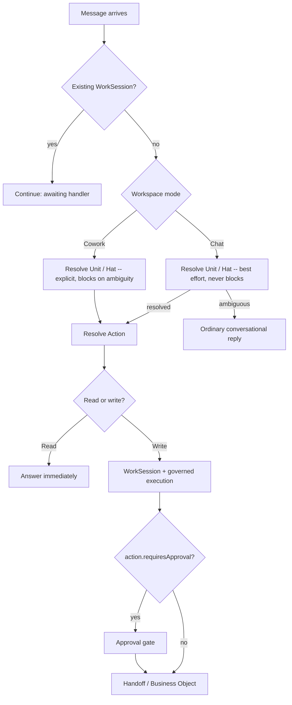

# ENIG Operating Model

As of 2026-09-24. Extended 2026-09-28 (Chat is action-capable; Platform layer confirmed as target architecture -- primitives, registries, skill-driven pipelines). Refined 2026-09-28, second pass (fresh per-call authority/eligibility resolution as a hard invariant; cross-Hat reuse folded into the primary build-order proof step rather than deferred to a later one).

## Binding, not aspirational

This document is the authoritative description of ENIG Runtime's architecture -- not a proposal, not a suggestion a session is free to skip under time pressure. `AGENTS.md` points every session here before touching Units/Hats/Actions/routing/dispatch, precisely because a `docs/` file only gets read if someone happens to open it; this line is what makes that pointer mean something.

Two rules that follow directly from that:

* **The code must match this document.** A discrepancy between them is a bug in one of the two, not a shrug -- fix the code, or fix the doc, but never build around the mismatch as if it were acceptable. Left alone, drift here teaches every future session that this document is optional, which is the actual failure mode: not any single wrong decision, but the document quietly stopping being true.
* **Any change that alters what this document describes updates the document in the same change**, not "someday" -- resolve or add to "Open questions" below, the same way the 2026-09-28 decisions were recorded here before being implemented.

### Known drift (confirmed 2026-09-28 audit -- fix opportunistically, never treat as acceptable long-term)

* **Business Development's manifest hardcodes most of its persona/instruction content.** `businessDevelopmentManifest.ts` embeds most of its Hats' prompts directly in code instead of using `getGovernance`'s live-Notion-fetch pattern (`src/governance.ts`) -- the pattern six other Units (Sales, Finance, R&I, Marketing, Strategy x2) already follow. Partially addressed 2026-09-28: Opportunity Development's `discover_opportunity`/`research_opportunity` now fetch the shared `research-signal` Skill's evidence discipline live (see "Platform layer" below) instead of restating it inline -- the first real instance of BD moving off this drift, not the whole fix. The rest of BD's persona/instruction content (Hat responsibility framing, `assess_opportunity`/`qualify_opportunity`/`develop_*`/`determine_next_move` prompts, and all of Partnership Development/Growth & Market Development) remains hardcoded; still open.
* ~~`src/actions/registry.ts`'s `ActionCapability`/`routeWorkspaceCapabilityAction` mechanism is dead code.~~ **Resolved 2026-09-28 -- removed outright**, in the same pass as the `research-signal` Skill proof (Build order Step 2/3 below). It had zero production call sites (confirmed by grep before removal); `GoogleDocCreationCapability`/`GoogleSheetCreationCapability` (googleOAuth.ts) and `LeadOpportunityDiscoveryCapability` (leadGenerationDiscovery.ts) keep their own object shape and are still invoked directly where they always actually ran from, just without the dead registry wrapping them.

## Why this isn't a contradiction

Wanting chatbot-level ease and wanting controlled execution are not opposed -- they're different axes, and the current runtime already proves it in two of its eight Units. Input ergonomics (not hand-writing a persona/governance prompt every time) is solved by the Hat/Unit registry: once responsibility resolves, the right persona, evidence rules, and governance context are injected automatically. Output safety (approval before anything real happens) is a separate, deliberate choice -- the Handoff, Data Boundary, and Outbound Gate exist because letting an AI model act on real client identity or commit ENIG to something without sign-off was judged too risky. Marketing and Research & Intelligence already combine both: a plain sentence in, the system figures out what's meant, builds the right prompt automatically, and still stops at an approval gate before anything real happens.

What's actually missing is narrower: for Sales, Strategy, and Finance, the runtime doesn't get as far as applying persona + governance + approval, because it either forces text into the wrong shape (Sales assumes every message is a new client enquiry) or has no direct-entry code path to try at all (Strategy and Finance are Handoff-only). That's an intent-reading gap sitting *before* governance starts, not governance itself being the obstacle.

## Current state: entry-point shape per Unit

Traced every governed entry point in `session.ts` against each Unit's implementation, at the deployed HEAD. Only three of eight Units have any Cowork entry point at all.

| Unit | Cowork-wired | Fresh-entry function | Intent-driven? |
| --- | --- | --- | --- |
| Sales | Yes | `handleIncomingEnquiry` | No -- always assumes a new client enquiry, regardless of what's typed |
| Marketing | Yes | `handleMarketingIntake` | Yes -- AI-classifies which of 5 Hats and what kind of task from raw text |
| Research & Intelligence | Yes | `handleDirectRequest` | Yes -- takes the text directly as the research question |
| Strategy | No | none exists | N/A -- only `handlePickup` (Handoff-triggered) plus continuation-only handlers |
| Finance | No | none exists | N/A -- only `handlePickup` (Handoff-triggered) plus continuation-only handlers |
| Business Development | No | no unit code exists | N/A |
| Creative & Design | No | no unit code exists | N/A |
| Operations | No | not a governed Unit -- a Telegram stream only | N/A |

A second gap inside Sales: `Lead Generation Specialist` is a real, tested, intent-driven action (on-demand discovery in `leadGenerationDiscovery.ts`), but `dispatchCowork`'s Sales branch calls `handleIncomingEnquiry` unconditionally regardless of which Hat resolved -- so even an explicit `Lead Generation Specialist: find me 3 leads` is misrouted into enquiry-extraction.

## The OS metaphor

The existing pieces already map cleanly onto an operating system; the redesign below extends the pattern rather than replacing it.

| Runtime concept | OS equivalent |
| --- | --- |
| Unit | Subsystem / daemon |
| Hat | Process within a subsystem |
| Action (new, below) | Syscall |
| Handoff | Inter-process communication (IPC) |
| Approval gate | The permission prompt, only for privileged syscalls |
| Data Boundary / Outbound Gate | The sandbox / capability security model |
| Chat | A REPL over the same subsystems -- can invoke any syscall directly (2026-09-28 decision, see "Chat is action-capable" below), not read-only |

```mermaid
flowchart TD
    A[Message arrives] --> B{Existing WorkSession?}
    B -- yes --> C[Continue: awaiting handler]
    B -- no --> D{Workspace mode}
    D -- Chat --> E[Resolve Unit / Hat -- best effort, never blocks]
    D -- Cowork --> F[Resolve Unit / Hat -- explicit, blocks on ambiguity]
    E -- resolved --> G[Resolve Action]
    E -- ambiguous --> M[Ordinary conversational reply]
    F --> G
    G --> H{Read or write?}
    H -- Read --> I[Answer immediately]
    H -- Write --> J[WorkSession + governed execution]
    J --> K{action.requiresApproval?}
    K -- yes --> N[Approval gate]
    K -- no --> L[Handoff / Business Object]
    N --> L
```

Resolving Unit/Hat stays exactly as built (deterministic addressing, no AI). What's new is the step right after it: resolving *which action*, and branching on whether that action reads or writes.

## Chat is action-capable, not read-only (2026-09-28 decision)

Martin's ruling, superseding this doc's original "Chat | A read-only REPL" framing: Chat mode should feel like an ordinary assistant (Claude, ChatGPT) that can actually do things mid-conversation, not just answer questions about state someone else changed. Cowork is not "the only mode where actions happen" -- it's specifically where Martin is *explicitly* directing a Unit/Hat and, when the work spans more than one Unit, where a Handoff coordinates the handoff itself. The distinction is about explicitness of addressing and cross-Unit coordination, not about which mode is allowed to touch governed state.

Concretely:

* **Same dispatch mechanism, both modes.** Chat resolves Unit/Hat/Action and calls `dispatchAction` through the exact same Action Registry Cowork already uses (`src/hats/actionRegistry.ts`, `src/units/dispatch.ts`) -- no second, Chat-specific action mechanism, no generic/open-ended tool-calling either. An action is still never invented on the spot; it is always one of a Unit's own registered, finite verbs, consistent with this doc's original Action Registry section.
* **The approval gate is a property of the action, not of the mode.** `requiresApproval` on a write action fires identically whether the action was reached through Chat or Cowork (confirmed directly with Martin -- the alternative, Chat being fully autonomous even for privileged actions, was explicitly rejected). Nothing about being "just chatting" ever bypasses a privileged write's sign-off.
* **Ambiguity is handled oppositely by design, not by oversight.** Cowork's whole point is explicit direction, so an unresolved Unit/Hat still blocks with the existing clarification question -- forcing ambiguity to resolve is correct there. Chat's whole point is low-friction conversation, so an unresolved Unit/Hat (no confident addressee, no confident action) must never block; it falls through to an ordinary conversational reply instead (the existing `generalChatReply`/`generalDmReply`), exactly as today. Chat fails open to conversation; Cowork fails closed to a clarifying question. Same underlying resolution step, opposite fallback.
* **Read actions answer immediately in both modes** -- this was already true for Cowork and doesn't change; Chat gains it for the first time.

### What this does not change

* The Data Boundary, Outbound Gate, WorkSession, and Handoff machinery are untouched -- this is purely about which mode is allowed to *reach* the Action Registry, not a new execution path.
* A Unit with no manifest yet (everything except Business Development, and Sales for `discover_leads` only, as of this decision) gains nothing from this immediately -- Chat has no actions to resolve against for an unmigrated Unit, the same way Cowork doesn't today. This decision's benefit compounds as more Units migrate onto the manifest pattern (see "Migration path" -- migrating a Unit now unlocks Chat-mode action dispatch for it for free, no Chat-specific work required per Unit).
* `dataLookup.ts` (the six-source "what's in this database" conversational capability, shipped 2026-09-27) is a known, temporary exception to "actions are always Unit/Hat-scoped" -- Handoffs and the Activity & Decision Log are inherently cross-Unit records that don't fit cleanly into any single Unit's manifest. Left as-is for now rather than forced into a shape that doesn't fit; how (or whether) to fold it into the Action Registry, versus keeping it as a deliberate cross-subsystem exception, is still an open question below.

## The Action Registry

**Superseded by "Platform layer: primitives, registries, and skill-driven pipelines" below (confirmed 2026-09-28)** -- this section's per-Unit `ActionDefinition[]` shape (each Hat declaring and owning its own private, often-duplicated action list) is being replaced by a small set of shared primitives any Hat composes. Left in place as historical record of the reasoning that got the system this far (the consequence/approval split in "Read vs. write" below still holds exactly, just attached to primitives now instead of per-Unit actions) -- not because the mechanism it describes is still the target.

Every Unit/Hat declares a small, finite list of named actions -- the same idea `ALL_HATS` already applies to Unit/Hat discovery, one level down. Marketing already does this informally: its Stage 1 intake (`marketing.intake_classification`) reads raw text and picks a Hat; a second, already-existing task (`marketing.hat_action_decision`) then picks what to do within that Hat. Generalizing this removes the need for each Unit to invent its own intent-reading:

1. Deterministic addressing resolves Unit/Hat (unchanged -- `resolveAddressee`, no AI).
2. One scoped, registered AI task -- the same governed shape as `marketing.hat_action_decision` -- reads the message against *that Unit's own declared action list* and picks one, or asks a clarifying question if none fit. Never a free-form action invented on the spot; always one of the Unit's own registered verbs.
3. The picked action's own handler runs -- which may be the existing fixed function (Sales's `handleIncomingEnquiry` becomes the handler for the `new_enquiry` action specifically, not the only path), or a new one.

Illustrative starting action lists (final lists are a product decision, not an engineering one):

| Unit | Candidate actions |
| --- | --- |
| Sales | `new_enquiry`, `status_check`, `follow_up`, `revise_draft` |
| Lead Generation Specialist (Sales) | `discover_opportunities` (already built, currently orphaned) |
| Strategy | `diagnose`, `refine_diagnosis` |
| Finance | `price_intervention`, `re_price` |

Adding a capability becomes "register an action + its handler" rather than hand-wiring a new branch into `dispatchCowork` -- closer to installing a program than patching the kernel.

## Read vs. write

This is the actual resolution to the chatbot-vs-control question. Today, everything inside Cowork gets the same heavy treatment: a fresh WorkSession, the full approval pipeline, a Handoff where relevant -- regardless of whether the request changes anything. That's disproportionate for a question like "what's the status of MAT-20" or "explain our pricing model," which have no side effects at all.

Each registered action declares its own consequence level:

- **Read** -- no side effects (a status check, an explanation, a lookup). Runs immediately, Unit/Hat-persona-aware, no WorkSession created, no approval gate -- the same low friction as Chat, just scoped to the right context.
- **Write** -- creates or mutates governed state (drafts a proposal, sets a price, creates a Handoff, contacts a client). Goes through the existing full pipeline, unchanged: WorkSession, governed execution, approval gate.

This is what lets "my own GPT" ease coexist with real control: low-consequence actions get low friction, high-consequence actions get proportionate friction -- the split is on what the action *does*, not on which Unit it belongs to.

## Strategy and Finance: direct entry without bypassing the discipline

Strategy and Finance are Handoff-only by deliberate design -- confirmed directly in code: `strategyAnalyst.ts` and `valueBasedPricingAssessor.ts` each export only `handlePickup` (fires off an incoming Handoff) plus continuation-only handlers. Nothing lets Martin originate fresh work in either Unit today.

The fix is not to let a direct request skip the discipline a Handoff enforces -- entity/matter tokenization, sanitized context, a defined required category. It's to let Martin *originate* that same shape of context directly, instead of only ever receiving it from another Unit:

- A direct `Strategy, diagnose this` constructs a Martin-originated context equivalent to a Handoff's `HandoffContextContract` (opaque tokens, sanitized text, explicit category) rather than a real Handoff record from another Unit.
- `entryType` already anticipates exactly this shape of change -- it's typed as `"inbound_enquiry" | "outbound_outreach"` with a doc comment noting `outbound_outreach` exists for future origination paths but nothing produces it yet. A third value (e.g. `"direct_request"`) is the natural extension.
- Every existing check downstream (Data Boundary, Outbound Gate, token-safety detectors) stays exactly as it is -- it already operates on the context shape, not on who originated it.

## Migration path

None of this requires touching Marketing, Research & Intelligence, or the WorkSession/Handoff/approval/Data Boundary machinery -- they already fit the target shape or are the foundation everything else builds on.

1. ~~**Sales dispatch fix.**~~ Done -- `Lead Generation Specialist` is wired into `dispatchCowork`'s Sales branch and no longer forced through `handleIncomingEnquiry`.
2. ~~**Formalize the Action Registry pattern.**~~ Done -- Marketing's Stage 1/2 classification mechanics are extracted into `resolveCandidateRelationships`/`selectAmbiguityReasonCode` (`src/hats/relationships.ts`) and `classifyCandidateHats`/`buildStage1SystemPrompt` (`src/hats/intakeClassification.ts`), generic over any Unit's own Hat/relationship types; Marketing's own functions are now thin wrappers over them.
3. ~~**Read/write split.**~~ Mechanism built -- `ConsequenceLevel`/`ActionDefinition`/`dispatchAction` in `src/hats/actionRegistry.ts` resolve a registered action's declared read/write consequence: read runs immediately with no WorkSession/approval gate, write hands back a dispatch signal for the existing pipeline, unchanged. Proven only against a toy action set -- no real Unit is wired to it yet, since that requires first deciding a Unit's actual action list (see Open questions below).
4. ~~**Strategy/Finance direct entry.**~~ Done for both. `strategy.handleDirectRequest` (`src/units/strategy/strategyAnalyst.ts`) and `finance.handleDirectRequest` (`src/units/finance/valueBasedPricingAssessor.ts`) let Martin start a fresh diagnosis/pricing assessment directly from Cowork chat by naming an existing Matter's token (e.g. "MAT-20") -- resolved deterministically via the shared `resolveMatterFromText` (`src/identityResolution.ts`), never AI-guessed, failing closed with a clarifying question if no token is given or it doesn't resolve to a real Matter. Strategy joins the same `runDiagnosis` a Handoff pickup already uses; Finance joins the same `judgeQuote` (made Handoff-agnostic: its `updateHandoff` calls are now guarded on `state.handoffId` existing). Two disclosed, pre-existing consequences of having no upstream Handoff, neither a bug: (1) a Strategy diagnosis that reaches a recommended direction still correctly holds at the existing known-identity gate (`checkStrategyProposalForKnownIdentity`), since direct-entry work has no Sales-sourced source-boundary attestation; (2) a direct-entry Finance quote completes standalone on approval -- no Strategy boundary block to carry forward, no Finance -> Sales Handoff created -- and its Redo loop isn't supported yet (fails closed with a clear message instead).
5. **New Units (Business Development, Creative & Design, Operations), built on the Unit Registry (below).** A new Unit is a self-contained manifest + handlers registered in one place, not hand-wired branches in `dispatchCowork` -- see the next section for the shape and rollout order.

Each step is independently shippable and testable, the same discipline used for the Chat/Cowork rollout itself.

## The Unit Registry: from hand-wired branches to a plug-in shape

Today, adding a Unit means learning and editing hand-wired, per-Unit code in three separate places, not one:

1. **`dispatchCowork`** (`src/router.ts`) -- a hand-written `if (decision.unit === "Sales") {...}` / `if (decision.unit === "Marketing") {...}` chain, one branch per Unit, each inlining that Unit's session-stub wiring (`stub.init`, `stub.handle*Request`) and any Unit-specific special case (Sales's `Lead Generation Specialist` bypass, `SALES_EXECUTIVE_PAUSED`, Strategy's `direct_request` known-identity gate, Finance's Handoff-agnostic `updateHandoff` guard).
2. **`WorkSession`** (`src/session.ts`), the Durable Object every Unit's work runs inside -- it also carries one method per Unit (`handleIncomingEnquiry`, `handleMarketingRequest`, `handleResearchRequest`, `handleStrategyRequest`, `handleFinanceRequest`), each a thin wrapper calling `this.execute((state) => unit.handleDirectRequest(this.env, state, text))`.
3. **`handleTextReply`'s `switch (state.awaiting)`** (`src/session.ts`) -- the largest and messiest of the three. This is where every Unit's multi-turn "Martin replies to a pending question" state actually lives: roughly ten continuation states (`call_notes`, `intervention`, `value_context_more`, `quote_redo_reason`, `matter_redo_reason`, `entity_redo_reason`, `proposal_feedback`, `sales_proposal_revision`, `marketing_feedback`, and more) spanning every Unit, in one global switch keyed only on the string in `state.awaiting` -- not on which Unit is running.

That's the actual "building forever" risk: every new Unit requires understanding and safely extending shared code that four other Units already depend on, in three different places.

The fix is not new machinery -- the Action Registry, Handoff enforcement, and Data Boundary already operate generically, on context shape and declared consequence rather than on which Unit produced them (see "The Action Registry" and "Read vs. write" above). What's missing is a way for a Unit to hand the runtime everything it needs *as one declared object*, instead of three different chokepoints reaching into each Unit's internals by hand.

**Unit Manifest.** Each Unit exports one object describing everything those three chokepoints currently hard-code for it:

* its Hats (the existing `Hat` typing per Unit, unchanged)
* its `ActionDefinition<A>[]` -- the same shape `actionRegistry.ts` already defines, declaring each action's read/write consequence
* its read handler -- run immediately by `dispatchAction`, no WorkSession, no approval gate
* its entry handler -- the `handleDirectRequest`/`handlePickup`/`handleIncomingEnquiry`-shaped function that starts a WorkSession for write actions, the same pattern Strategy and Finance already established
* its `awaiting`-state handler map -- each continuation state the Unit can leave a WorkSession paused on (its own equivalent of `call_notes`/`intervention`/`quote_redo_reason`/etc.), so `handleTextReply` can dispatch generically off `state.unit` + `state.awaiting` instead of one global switch
* any Unit-specific dispatch special case, expressed as part of the manifest rather than a `dispatchCowork` exception (e.g. Sales's Lead Generation Specialist routing becomes a second action/handler pair inside Sales's own manifest, not a carve-out the router has to know about)

**Unit Registry.** One file (e.g. `src/units/registry.ts`) statically imports every Unit's manifest into a `Record<Unit, UnitManifest>`. Cloudflare Workers has no runtime filesystem, so this cannot be literal auto-discovery (no scanning a directory at request time) -- this registry file is the one place that changes when a Unit is added or removed: one import, one entry.

**All three chokepoints become lookups, not chains.** `dispatchCowork` resolves `registry[decision.unit]` and calls its manifest's dispatch entry point. `WorkSession` gains one generic `handleUnitRequest(text)` that looks up the Unit's entry handler from the manifest instead of one method per Unit. `handleTextReply` resolves `registry[state.unit].awaitingHandlers[state.awaiting]` instead of one global switch. All three still route into the same session-stub/Handoff/approval machinery every Unit already shares today -- only the *lookup*, not the underlying execution, changes.

### The hard invariant

The generic layer may become more capable as migration exposes legitimate requirements, but it must never acquire knowledge of a specific Unit. If migrating an existing Unit ever seems to require `if (unit === "sales") ...` inside `dispatchCowork`, `WorkSession`, or `handleTextReply`, the abstraction has failed at that point -- the fix belongs in one of: a new manifest capability, a handler contract, a lifecycle contract, a shared primitive, or an explicitly generic extension point. Never a Unit-name check in shared code.

This cuts the other way too: the manifest declares Unit-specific *facts* ("Business Development has a `develop_opportunity` action"; "Business Development has a reply state called `awaiting_opportunity_scope`"). The kernel owns universal *behaviour* ("a write action enters the approval pipeline"; "waiting states are persisted and resumed against the current WorkSession"). A Unit's manifest cannot override kernel semantics like approval requirements just because it has a custom field -- that boundary is what keeps this an OS model rather than eight Units each running their own miniature operating system (their own bespoke routing/approvals/Handoff/data-boundary handling inside the manifest). If a manifest starts accumulating fields like `routing`, `approvals`, `handoffs`, `dataBoundary` with real logic inside them rather than plain declared facts, that is the same failure in the other direction.

### Don't design the final manifest schema up front

The manifest schema in "Unit Manifest" above is a starting sketch, not a spec to build BD against and then declare final. The correct order is: build BD entirely through the contract as currently understood, exercise it with real actions, find where the generic machinery is insufficient, strengthen the contract, *then* migrate one existing Unit. Defining a theoretical plugin schema before any real Unit has exercised it risks discovering months later that production Units don't actually fit it.

### Business Development as conformance test, not just the first example

BD is the Unit chosen to prove this pattern (see Open questions below), and it needs to deliberately exercise the hard parts of the manifest, not the easy ones -- otherwise nothing is actually proven. Its three Hats (Growth & Market Development, Partnership Development, Opportunity Development) are useful precisely because they give room to do this: at least one Hat's actions must require a genuine multi-turn `awaiting`-state flow (proving a Unit can declare waiting-state -> handler behaviour, not just a list of synchronous actions), and at least one write action must go through the real approval/Handoff machinery end to end (routing -> Hat resolution -> Action resolution -> read/write consequence -> handler -> WorkSession -> approval -> state mutation/Handoff -> continuation). If that whole path works without touching any existing Unit's execution code, the pattern is demonstrated; if BD only proves synchronous read actions, it hasn't proven the pattern.

### Fail-closed manifest completeness

Manifest completeness is a hard invariant, not a nice-to-have: the kernel must never silently fall back to generic/default behaviour when a Unit's manifest is incomplete. Concretely -- an action referenced but missing from the registry, an action with no handler, a write action with no write-entry handler, or an `awaiting` state with no handler in the map -- must all fail closed (an explicit error, never a silent default or a fall-through to legacy behaviour). A registry that quietly papers over gaps will hide real defects during migration instead of surfacing them.

### Definition of "proven"

The manifest pattern is not proven merely because BD works end to end. It is proven only once BD demonstrates all of the following:

* **Unit discovery** -- the registry locates BD without any hard-coded dispatcher knowledge of it.
* **Hat resolution** -- BD exposes multiple Hats without shared code knowing their identities.
* **Action resolution** -- BD's action list comes entirely from its manifest, nowhere else.
* **Read/write semantics** -- the generic dispatcher treats both correctly with no BD-specific branching.
* **Write governance** -- a BD write action goes through the existing approval pipeline with no custom approval code.
* **Multi-turn continuation** -- a BD-specific waiting state resumes correctly through the generic `handleTextReply` lookup.
* **Special routing without contamination** -- BD can have something genuinely Unit-specific (its own equivalent of Sales's Lead Generation Specialist routing) without that logic leaking into shared dispatch code.
* **Failure semantics** -- an ambiguous or unregistered BD action fails closed rather than falling through to any legacy behaviour.
* **No regression** -- Sales, Marketing, Strategy, Finance, and R&I remain untouched and continue operating exactly as they do today.

**Rollout order (deliberately staged to avoid re-testing working Units before the pattern is proven):**

1. Design and land the `UnitManifest`/registry types and the (still-empty) registry lookups in all three chokepoints, with Sales/Marketing/Strategy/Finance/R&I continuing to run through their existing hand-written branches, methods, and switch cases, untouched, alongside it.
2. Build Business Development entirely on the manifest/registry pattern, deliberately exercising the hard parts per "Business Development as conformance test" above. Zero regression risk -- there is no existing behavior to break, since the Unit doesn't exist yet. Do not consider the pattern proven until it satisfies every point in "Definition of 'proven'" above, not merely "BD responds to messages."
3. Once proven against that full checklist, migrate Sales, Marketing, Strategy, and Finance into the manifest shape one at a time, each its own shippable step. The correct migration shape per Unit is: extract its actual current behaviour, express that behaviour through the manifest contract, **delete** the old Unit-specific dispatcher path (the `dispatchCowork` branch, the `WorkSession` method, the `handleTextReply` switch cases), then run its regression suite (`salesExecutive.test.ts`, `strategyAnalyst.test.ts`, `valueBasedPricingAssessor.test.ts`, Marketing's and `leadDiscovery.test.ts`) plus a manual smoke pass through its real entry flow. Wrapping a Unit's existing code in a manifest object while leaving its old dispatcher path in place is not migration -- it gives the appearance of one while preserving the old architecture underneath, and must not be treated as "migrated." Watch specifically for legacy and manifest Units quietly acquiring different semantics for the same kernel concern (WorkSession creation, waiting-state persistence, reply routing, Handoff creation, approval, failure/stop conditions, audit logging, data-boundary enforcement, outbound AI gating) -- that is two kernels wearing one name, not one. Expect the `handleTextReply` awaiting-state migration to be the riskiest and most careful part of this step, since it is the largest hand-written surface of the three and the one carrying the most existing, live conversational state.
4. Build the remaining new Units (Creative & Design, Operations) on the now-proven pattern.

This intentionally does not migrate working Units up front: it proves the plug-in shape once, cheaply, on a Unit with nothing to lose, before spending verification effort re-proving Units that already work.

## Platform layer: primitives, registries, and skill-driven pipelines (confirmed 2026-09-28)

Triggered by comparing ENIG Runtime to Claude Cowork's skills/plugins/connectors model, then pressure-tested across several rounds directly with Martin. This supersedes the same-day "proposed, NOT yet decided" version of this section after that discussion went further -- **this is now the confirmed target architecture**, not a proposal. It is a substantial rework of `hats/actionRegistry.ts`, `units/unitManifest.ts`, and `units/dispatch.ts`; build it staged (see "Build order" below), never as one large rewrite, per this doc's own "don't design the final schema up front" discipline.

**Core principle, unchanged from the original proposal**: separate *what a resource is* from *who currently needs it*. Today, access is a side effect of file layout -- a Unit's code directly imports its own client, hardcodes its own Notion page ID, and declares its own private, often-duplicated action list (BD's own doc comment admits `determine_next_move`/`handoff_to_sales`/`handoff_to_strategy` are each declared three times, once per Hat, despite being identical). The fix: register every resource and every action *once*, generically; a Hat *declares* which it draws on, resolved at dispatch time. Not a new idea for this codebase -- `ai/policy.ts`'s `AiProvider` (`isEligible`/`execute`, a shared pool no Unit owns, resolved per task through the same Data Boundary evaluator regardless of caller) already proves the pattern. This generalizes it, including to actions themselves, which the original proposal hadn't gone as far as.

### The Action Catalog: a small set of primitives, not per-Unit verbs

Actions stop being Unit-owned entirely. A small, fixed set of primitives is registered once and composed by any Hat that needs them:

- **`read_record`** (read) -- fetch a record from a registered Data Source (a Handoff, a Matter, an Entity, a Proposal), parametrized by source and id.
- **`fetch_skill`** (read) -- load a registered governance/methodology/format resource by id, through the existing `getGovernance` live-Notion pattern. Kept distinct from `read_record` because Skills are Architect-authored governance content with different outbound-leak-detector treatment (`governance.ts`'s `GOVERNANCE_CONTENT_START`/`END` wrapping) than ordinary business data -- collapsing the two would blur a distinction the system needs.
- **`search`** (read) -- external or internal search (web, Notion). Kept distinct from `read_record` because the trust/provider-eligibility profile genuinely differs (an untrusted external source vs. our own governed, tokenized data) -- not because it "feels" different.
- **`generate`** (internal or write, depending on what it produces) -- call the model with assembled context (see "How `generate` assembles a prompt" below), get output back. One primitive regardless of whether the output is JSON-shaped (a classification) or free text (a draft) -- both get identical Data Boundary/Outbound Gate treatment, so splitting them would be atomizing without a governance reason.
- **`request_approval`** (the gate itself, explicit and composable) -- present output, pause, wait for Martin's Approve/Refine/Reject. Deliberately not folded into `write_record` as an implicit side effect: decoupling lets a pipeline request approval once and then write several records, or draft-then-approve before ever attempting a write, and it makes the privileged step directly testable in isolation rather than buried inside a bigger verb.
- **`write_record`** (write) -- persist an outcome: create or update a record. Not split into "create" vs. "update" at this level -- where a resource has its own extra rule (Handoff's Entity_Token/Matter_Token-only enforcement, `handoffWriter.ts`), that rule lives on the *resource* in the Data Source Registry, not as a different action.

**The test for whether something needs a new primitive, rather than becoming a parameter on an existing one: does the governance/boundary treatment genuinely differ, not does it feel conceptually different.** `search` earns its own primitive because its trust profile differs from `read_record`'s; `generate` does not split by output shape because the boundary treatment is identical either way; `write_record` does not split into create/update because the safety-critical check applies to both identically, and the one place a real distinction exists (Handoffs) is captured as a resource-level rule, not a new verb. Applying this test is exactly what keeps the catalog from either re-fragmenting into per-Unit verbs or over-atomizing into primitives with no real reason to be separate.

### Considered and rejected: a live, dynamic reasoning loop

The first draft of this section proposed a Hat's own model deciding, step by step at runtime, which primitive to call next (a ReAct-style agent loop). Rejected after further thought, for reasons specific to this system, not agent loops in general:

- **Cloudflare Workers has real execution-time limits.** A loop chaining several sequential AI calls, each waiting on the last, is exactly the shape that risks a wall-clock ceiling this design doesn't get to ignore.
- **Reliability compounds across steps.** This session already needed few-shot examples and a model switch to make one single classification step (`dataLookup.ts`'s request classifier) reliable. A loop where the model decides the *sequence itself* multiplies that same unreliability at every step, not once.
- **It would break the one thing this codebase is actually good at.** Every existing mechanism here is deterministic except the one narrow judgment call that genuinely needs AI (classify, draft, assess) -- fail-closed, testable, auditable, matching the discipline behind the existing 664-test suite. A live loop makes the *sequence itself* non-deterministic, so a Hat's behavior could no longer be pinned down by a test the way everything else here can be.

### The confirmed shape instead: primitives as a shared function library, pipelines as ordinary code

The five/six primitives above are implemented once as callable functions, each resolving against the registries below and the existing Data Boundary evaluator. A Hat's actual task is **ordinary, deterministic TypeScript code -- a pipeline function -- built by composing these primitives**, written once at build time by whoever builds that Hat, not improvised live by a model. This is not a new shape for this codebase: Strategy's `handleDirectRequest` already *is* a fixed pipeline (diagnose -> causation-discipline check -> branch to develop-or-route -> completeness check -> Approve/Refine/Reject) -- the change is that such a pipeline gets built from shared primitive functions instead of bespoke duplicated implementations per Unit. Composition ("many actions chained for one task, as needed") happens exactly as much as any Hat's task requires; it just happens in code, at build time, exactly as testable as every other function in this codebase, rather than as a live, unpredictable loop.

### Three registries

1. **Data Source Registry** -- Matters, Entity, Handoffs, Proposals, Leads, Activity Log, each declaring which Units/sensitivity tiers may read/write it (Matters: Sales/Strategy/Finance; Activity Log: everyone; Leads: Sales only) -- the honest resolution to `dataLookup.ts`'s cross-Unit sources, instead of a pseudo-Unit. Handoff's token-only identity boundary is a rule declared *here*, on the resource, not re-implemented per Unit that happens to write one.
2. **Skill Registry** -- skill id -> Notion page id -> eligible sensitivity tier, loaded through the existing `getGovernance`. A pipeline calls `fetch_skill` by id; shared skills (a pricing methodology both Sales and Finance use) stop needing duplicate copies.
3. **Connector Registry** -- generalizes `AiProvider`'s shape beyond AI calls to Notion/Google/Telegram/future integrations. A pipeline calls a needed capability, not a specific client import; the registry resolves whichever connector is eligible and configured. Every call still carries a real `SemanticTaskId` through the same Data Boundary evaluator -- connectors never get a governance-free shortcut a hand-rolled client wouldn't have had either.

### Unit Manifest's new shape: declaration only

A Hat's manifest no longer declares a private `ActionDefinition[]` with its own handlers. It declares: its name, its responsibility (loaded as a Skill via `fetch_skill`, never hardcoded -- closing the BD drift item above as a side effect of this migration, not separate cleanup), which Data Sources/Skills/Connectors it's granted, its own registered `SemanticTaskId`(s) for the `generate` calls its pipeline makes, and its pipeline function. That is the entire surface a new Hat needs to supply.

### How `generate` assembles a prompt

`generate`'s job is to assemble the same structure a well-written prompt always needs, automatically, from the declared pieces, so nobody hand-writes it per Hat:

- **Role** -> the Hat's persona (its own voice/authority framing)
- **Context** -> whatever this pipeline's `read_record`/`search` calls actually pulled in for this specific task
- **Instruction** -> the fetched Skill's methodology/format content
- **Behavior** -> cross-cutting rules that apply to every persona regardless of Unit (the Universal Role Contract, the evidence/no-invention rule) -- injected the same way for everyone, not re-pasted per Hat
- **Situation** -> the incoming request plus wherever the pipeline currently is
- **Example** -> can live inside a Skill's own content, the same way few-shot examples were added to `dataLookup.ts`'s classifier this session when plain instruction alone wasn't reliable

`chat.ts` already does a hand-concatenated version of exactly this (`REAL_STRUCTURE_FACTS + persona + EVIDENCE_RULE + NO_ACTIONS_RULE`) -- this generalizes that pattern so updating "what every persona must follow" or "how a proposal should be formatted" happens once, not by re-editing every Hat's own hardcoded prompt.

### What never changes

- `SemanticTaskId` sensitivity/outbound-policy classification, resolved per actual `generate` call (not once per action name) -- fails closed exactly as today if unregistered.
- The Handoff token-only identity boundary, enforced in `handoffWriter.ts`, now anchored to the Handoffs resource entry rather than duplicated per Unit.
- `requiresApproval` as the sole authority on what needs Martin's sign-off -- now an explicit, directly-testable `request_approval` step rather than an implicit side effect, but no less strict.
- **Data Source eligibility (`canRead`/`canWrite`) and a Hat's own authority/persona framing are resolved fresh on every single primitive call, keyed to whichever Hat is actually invoking it that turn -- never cached or reused across Hats, even for the same registered resource or skill within the same request cycle.** A shared Skill/resource must never become a bridge that leaks one Hat's access into another's context; re-resolving on every call (not once per Skill, not once per session) is what keeps that true by construction rather than by convention. Two different Hats calling the same `fetch_skill`/`read_record` moments apart get two entirely independent resolutions, with no shared execution state carried over from one to the other.

### What "plug and play" means once this exists

Adding a new subsystem (Creative & Design, Operations, or anything beyond) becomes: write a manifest (Hats, responsibility skill pages, resource grants), create the Notion skill pages, and write each Hat's pipeline function from the shared primitive library. Zero changes to the kernel, `router.ts`, `session.ts`, or the registries themselves.

### Build order

Staged to prove the design on real, already-identified complexity rather than a big-bang rewrite:

1. Build the kernel primitives (as callable functions) and the three registries as new infrastructure, alongside the existing system, touching no live Unit's behavior yet.
2. ~~Prove it on Business Development~~ -- **first slice done 2026-09-28.** `research-signal` (Notion: ENIG HQ / 4. Skills / research-signal) is the first Skill built, and this step's own requirement -- that reuse be proven in the same step, not deferred -- is satisfied: BD's Opportunity Development `discover_opportunity`/`research_opportunity` (businessDevelopmentManifest.ts) and Sales's Lead Generation Specialist `evaluateCandidates` (leadGenerationDiscovery.ts) both fetch the identical Skill content, under materially different Persona (BD's own discover/research framing vs. Lead Generation Specialist's live-fetched Hat Definition), Data Source (Martin's own request text vs. public web search results), and consequence/approval shape (a standalone "read" action with no approval vs. a step feeding an eventual approval-gated Lead-creation write) -- proven directly in `src/platform/researchSignal.crossHat.test.ts`. Still open: BD's remaining hardcoded content (see "Known drift" above), and the rest of BD onto the full primitives+registries shape (only two functions have migrated so far).
3. ~~Retire `ActionCapability`/`routeWorkspaceCapabilityAction`~~ -- **Done 2026-09-28**, in the same pass as the `research-signal` proof above (see "Known drift").
4. Once BD runs clean with zero regressions, migrate Sales, Marketing, Strategy, and Finance one at a time, each deleting its old hand-wired path as it goes -- the existing "Migration path" discipline above, aimed at the new kernel instead of the old per-Unit-`ActionDefinition[]` shape.
5. Build Creative & Design and Operations directly on the finished pattern -- the first genuine test of "plug and play" against a subsystem that didn't exist before.

## Open questions

- [x] What is Sales's real action list beyond `new_enquiry`? One real answer is now built and validated end-to-end: `call_notes` -- the isolated Sales Executive project hands off de-identified call notes via a Handoff, and the Runtime Sales Executive runs commercial-value-evidence-extraction + qualification against them (`handleCallNotesHandoffPickup`). `status_check`, `follow_up`, `revise_draft` remain unconfirmed guesses.
- [x] Should Strategy/Finance direct requests be gated any differently than Handoff-originated ones? Resolved: yes -- Martin must always name an existing Matter explicitly (its token); there is no "identity-free general question" path. Applied to Strategy in `handleDirectRequest`; Finance direct entry still needs to apply the same rule when built.
- [ ] Does a "read" action ever need any lightweight audit trail (a log entry, no WorkSession), or is truly zero record acceptable for pure lookups?
- [x] Which Unit proves the Unit Registry pattern first, and what should it actually *do*? Resolved: Business Development, structured as three Hats (Growth & Market Development, Partnership Development, Opportunity Development) -- see "The Unit Registry" above. Creative & Design and Operations remain undefined; built on the pattern once proven by BD, per the rollout order above.
- [x] Is Chat mode allowed to invoke actions (read and write), or read-only? Resolved 2026-09-28: action-capable, same dispatch and approval-gate semantics as Cowork -- see "Chat is action-capable, not read-only" above.
- [x] `dataLookup.ts`'s six sources (Matters, Entity, Handoffs, Proposals, Leads, Activity) don't fit cleanly into any single Unit's manifest -- Handoffs and Activity are inherently cross-Unit. Resolved 2026-09-28: a Data Source Registry (see "Platform layer" above), not a pseudo-Unit -- confirmed target, not yet built.
- [x] Is the Platform layer worth building, and in what shape? Resolved 2026-09-28 after several rounds of direct discussion: confirmed as primitives (a shared function library, not a live agentic loop) + three registries (Data Source, Skill, Connector) + manifests reduced to declaration -- see "Platform layer: primitives, registries, and skill-driven pipelines" above. Not yet built; staged build order recorded there.
- [x] Should `ActionCapability`/`routeWorkspaceCapabilityAction` (`src/actions/registry.ts`) be retired outright, or re-homed? Resolved 2026-09-28: retired, in the same pass as Business Development's migration to the Platform layer (see its "Build order" above) -- not carried forward into the new model.
- [ ] Exact typed signatures for the six primitive functions (`read_record`, `fetch_skill`, `search`, `generate`, `request_approval`, `write_record`) and the three registries' interfaces -- an implementation detail to work out during Platform layer Build order step 1, not a design question still open.
- [x] Should Data Source/authority resolution ever be cached or reused across Hats within one request cycle, for a shared Skill/resource? Resolved 2026-09-28: no -- resolved fresh on every primitive call, keyed to the actual invoking Hat, never cached across Hats or Personas. See "What never changes" above.
- [x] Should cross-Hat Skill reuse be proven in the same build-order step as the first Hat, or as a later, separate step? Resolved 2026-09-28: the same step -- Build order step 2 now requires wiring a second Hat to any shared Skill built there, not deferring reuse to step 4. See "Build order" above.
