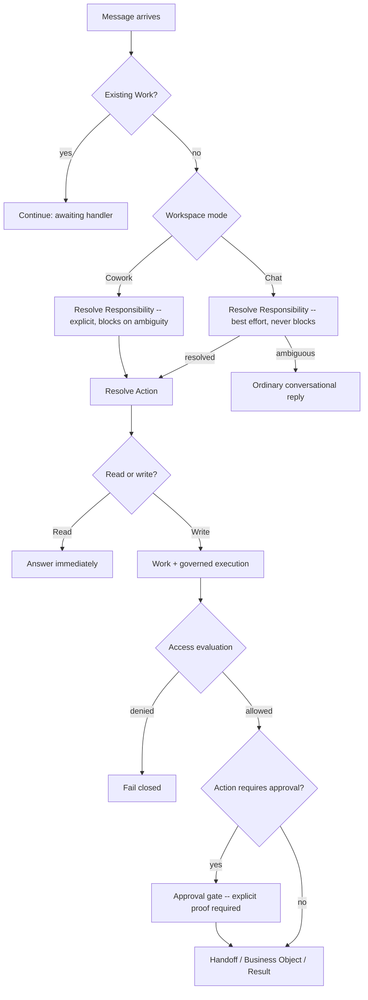

# ENIG Operating Model

As of 2026-09-24. Extended 2026-09-28 (Chat is action-capable). Refined twice the same day (the "Platform layer" of six primitives + three registries; then the third-pass "Kernel, Applications, Capabilities, Runtime Services" model).

**Reconciled 2026-09-30 against the current ENIG HQ architecture in Notion, which is authoritative.** The third-pass model ("Kernel / Applications / Capabilities / Runtime Services") is *historical*. It is retained below, explicitly marked, because it records real decisions and real implementation history -- but it is no longer the current architecture and must not be read as one. The current model is:

```
KERNEL
  ↓
WORK
ORGANIZATION
SKILLS
ACCESS
DATA
TOOLS
  ↓
WORKER
  ↓
RESULT
```

Every section below describes that model. Where a section describes this repository's implementation, it is subordinate to the model and labelled as implementation. Where a section describes something the architecture has since retired, it is labelled historical.

## Binding, not aspirational

This document is the authoritative description of ENIG's architecture and governance model -- not a proposal, not a suggestion a session is free to skip under time pressure. `AGENTS.md` points every session here before touching Units/Hats/Actions/routing/dispatch, precisely because a `docs/` file only gets read if someone happens to open it; this line is what makes that pointer mean something.

Two rules follow directly:

* **The code must match this document.** A discrepancy between them is a bug in one of the two, not a shrug -- fix the code, or fix the doc, but never build around the mismatch as if it were acceptable. Left alone, drift here teaches every future session that this document is optional, which is the actual failure mode: not any single wrong decision, but the document quietly stopping being true.
* **Any change that alters what this document describes updates the document in the same change**, not "someday" -- resolve it, or add it to "Open questions" below, the way the 2026-09-28 and 2026-09-29 decisions were recorded here before being implemented.

## The current model, in one view

| Element | What it is | What it is not |
| --- | --- | --- |
| **Kernel** | Invariant governance: authority, approvals, identity and data boundaries, outbound policy, fail-closed behaviour, system-wide invariants | A repository for business-specific execution logic |
| **Work** | The controlled lifecycle and runtime state of work -- identity, context, task, state, routing, handoff, continuation, result, failure, closure | An organizational owner, an access grantor, a tool authorizer |
| **Organization** | Business Function → Unit → optional Specialization → Hat → Responsibility | A methodology catalogue |
| **Skills** | Optional, reusable methodology used to perform a Responsibility | An actor, an owner, a router, an authority |
| **Access** | Whether a Worker may retrieve information or perform an operation in the current execution context | A router, an organizational assigner, a Skill selector |
| **Data** | Controlled information and persistence: Entity, Lead, Matter, Proposal, Handoff, token-safe relationships/context, Work records | An authorizer -- existence is not permission |
| **Tools** | Executable mechanisms available to the Worker (search, Notion, Telegram, email, document generation, external APIs) | A permission source |
| **Worker** | The generic execution actor | A Unit-specific branch |
| **Result** | The outcome, recorded against Work | A separate top-level actor or module |

**Infrastructure** sits *underneath* the runtime implementation and is not part of this list. It is the Cloudflare Worker, Durable Objects, KV, Telegram, the Notion API, provider APIs, queues, deployment, and external integrations. See "Infrastructure".

### Generic runtime

```
Work
 → Responsibility Resolution
 → applicable Skill resolution, when required
 → Access evaluation
 → permitted Data / Tool operations
 → Worker execution
 → Result
 → verification / approval / closure as applicable
```

This is the generic shape. It is deliberately *not* a fixed sequence every request must literally traverse, and it is deliberately free of `if research -> …` / `if sales -> …` / `if finance -> …` branches. The runtime stays generic wherever the architecture permits.

Concretely, and already true today:

* Some work is deterministic code with no AI step at all (for example `findDuplicateLeads`'s mechanical Notion query, token resolution, formatting).
* Some work uses AI once; some uses it several times, depending on the Hat's own pipeline (a single classification makes one `aiJson` call; the research pipeline makes several sequential ones).
* Some work invokes a Tool directly with no Skill involved (for example `searchWeb` inside Lead Generation Specialist's discovery loop).
* Some work requires human approval before a state transition is final; some (declared read, or internal with no approval requirement) does not.
* The next governed action can differ by Work state and context -- the action following a held qualification is not the action following a qualified result.

**The runtime must not be read as requiring AI for every request.** Confirmed false by trace: Notion lookups, Handoff routing decisions already made by a prior AI step, and plenty of ordinary application logic all run with no AI call in their own path.

---

## Kernel

The Kernel contains **invariant governance**. It governs:

* **authority** -- who may decide what, and on whose behalf;
* **approvals** -- what requires Martin's explicit sign-off, and what an approval does and does not authorize;
* **identity and data boundaries** -- what information may cross an identity boundary;
* **outbound policy** -- what may leave the system, to whom, and under what conditions;
* **fail-closed behaviour** -- missing authorization, ambiguity, invalid state, identity-boundary violation, and a missing required Skill all deny rather than default;
* **system-wide invariants** -- rules that hold regardless of which Unit, Hat, or Skill is involved.

The Kernel must not become a repository for business-specific execution logic. A mechanism does not become Kernel because it is important, or because it is under `src/platform/`, or because it has "governance" in a doc comment. It is Kernel because it is an invariant that every relevant path actually passes through and nothing bypasses in production.

**What is genuinely Kernel-enforced in this repository today** (confirmed by trace, not by intent):

* **AI provider eligibility and fallback policy** -- `AiPolicyExecutor.executeTask` (`src/ai/policy.ts`). Every production AI call, whether via `generate()` or directly via `aiJson`/`aiChat`/`aiText`, passes through this.
* **AI Data Boundary enforcement** -- `DataBoundaryEvaluator.evaluate` (`src/dataBoundary/policy.ts`), invoked unconditionally inside `executeTask` for every provider attempt.
* **Identity redaction and leftover-identity verification** -- `redactIdentityTerms`/`findLeftoverBannedTerms` (`src/ai/identityRedaction.ts`), invoked unconditionally inside `executeTask`, with a hard stop if verification finds a leftover term.
* **AI Outbound Data Gate** -- `OutboundDataGateEvaluator.evaluate` (`src/ai/outboundGate.ts`), invoked unconditionally inside `executeTask`, on the exact post-redaction payload, per provider attempt.
* **Handoff identity/token boundary** -- `validateHandoffProperties`/`assertTokensPresent` (`src/handoffWriter.ts`), invoked by every Handoff creation and update; no production code writes to the Handoffs data source any other way.
* **Routing and consequence handling** -- `dispatchAction`/`ConsequenceLevel` (`src/hats/actionRegistry.ts`), invoked by `resolveUnitRequest`/`tryResolveUnitAction` (`src/units/dispatch.ts`) for every manifest-registered Unit, to decide read-vs-continuable. This is a *routing* enforcement point: it decides where a request goes and how much ceremony it gets.
* **Operation authorization for Data and Tool access** -- `evaluateAccess` (`src/access.ts`), invoked by `src/notion.ts` immediately before **every** governed read and **every** governed mutation, and by `src/units/research/webSearch.ts` before an outbound request to a third-party provider. This is the *authorization* enforcement point: it decides whether the operation is permitted, by resolving the Work's own recorded Action and checking its declared consequence and approval requirement. The Access and Approval sections below describe it in full.

**What the architecture requires but the committed runtime does not implement** is recorded as a known gap in "Known gaps and drift", not presented as current fact.

---

## Work

Work owns the **controlled lifecycle and runtime state of work**:

* work identity
* context
* task
* state
* routing
* handoff
* continuation
* result
* failure
* closure

**Naming.** "Work" is the architectural element. In this repository its runtime implementation is the `WorkSession` Durable Object (`src/session.ts`), which holds the work identity, context, task, state, and continuation that the element describes. Throughout this document, "Work" in prose means the architectural element; `WorkSession` names the code.

### Work lifecycle

```
work_creation
 → task_definition
 → responsibility_resolution
 → execution
 → review_or_approval_when_required
 → verification
 → result_recording
 → closure
```

### Work records the Unit Action it is performing

A Work item's execution state includes **which registered Action it is currently performing** (`WorkState.actionName`). This is not bookkeeping -- it is the record Access reads to resolve the Work's authority on every governed operation, and the reason Access does not need to be told by a call site.

`recordWorkAction(state, actionName)` in `src/units/dispatch.ts` is the **only** sanctioned way to set it. It validates the new name against the Work's own manifest before recording, so a Work cannot be steered onto an Action its Hat does not declare, and the code that owns a lifecycle transition is the code that records it. A Work that has picked up a Handoff, an inbound user request, or a callback is initialized with the Action it was created to perform.

Recording an Action transition is **legitimate lifecycle advancement**, not an authority grant: recording that a Work is now performing `proposal_draft` does not approve anything, and the approval for its next effect is still minted separately and bound to it.

### Handoff is a Business Object, not a routing subsystem

A **Handoff** is a Business Object representing controlled transfer of Work between organizational capabilities. It carries a contract (opaque tokens, sanitized context, required next action, expected output, acceptance criteria) and it is governed by the Kernel's identity/token boundary.

It is *not* a separate routing subsystem. It does not decide who does what, resolve Responsibilities, or grant authority. The receiving capability picks it up through the same ordinary Work mechanism any other Work uses.

### Result is part of Work

Result is part of Work. A **Skill may define result requirements** for the methodology it describes -- that is a legitimate part of a Skill's role. The **Worker produces** the Result. **Work records and evaluates** the Result against acceptance and completion requirements. Result is not a separate top-level runtime actor or module, and it is not a place where organizational authority is re-decided.

### Work must not

* assign organizational ownership
* grant access
* authorize tools
* override Kernel rules
* invent missing state

---

## Organization

Canonical hierarchy:

```
Business Function
 → Unit
  → optional Specialization
   → Hat
    → Responsibility
```

Organization determines **who owns a duty, and under what organizational context**.

**Responsibility means an owned duty.** That is the whole of it. Responsibility is *not* methodology, *not* procedure, *not* technique, and *not* a class of work. "This Hat owns the duty of pricing an approved intervention" is correct Organization language. "This Hat's responsibility is value-based pricing methodology" is not -- that sentence describes a Skill, and mislabelling it is how a Skill quietly becomes an organizational construct.

**Organization is not Skills.** A Skill must never become a Hat, a Responsibility, an organizational owner, a routing mechanism, or an authority mechanism. See "Skills" below.

### Implementation: Units and Hats in this repository

`src/types.ts` defines the Unit union: Sales, Marketing, Business Development, Finance, Strategy, Research & Intelligence, Creative & Design, Operations. `src/hats/registry.ts` declares the Hat identities that exist, each carrying its Unit and, where the model uses one, its Specialization -- for example Sales Executive (Sales / Sales Progression), Lead Generation Specialist (Sales / Lead Discovery), Value-Based Pricing Assessor (Finance), Strategy Analyst (Strategy / Strategic Assessment & Synthesis), and the three Business Development Hats.

Creative & Design and Operations are in the Unit union but have no manifest and no Hat implementations. Whether each is a real organizational Unit with real Responsibilities is genuinely unresolved, and is recorded in "Open questions". **Operations in particular must not be treated as an organizational Unit merely because it is a Telegram stream** -- a stream is Infrastructure, not Organization.

---

## Skills

A **Skill** is reusable, specialized **methodology** that may be used to perform an owned Responsibility.

A Skill answers *how should this type of work be performed*. It never answers *who* is performing it (that is Organization) or *what mechanism* carries it out (that is Tools).

Skills are **optional methodology add-ons**. A Responsibility may be performed with:

* **zero** Skills,
* **one** Skill, or
* **multiple** Skills.

**There is no mandatory primary Skill.** No Responsibility is defined by the Skill that performs it, and no Responsibility is required to have one. Requiring a primary Skill would make every Responsibility structurally dependent on a Skills-library decision, which is precisely the coupling the model forbids.

### Skills are not actors

The **Worker is the actor**. The Skill is instructional material the Worker follows. A Skill never invokes, executes, owns, receives, outputs, decides, acts, routes work, assigns a Hat, grants authority, grants access, or authorizes tools. Any sentence that makes a Skill the subject of one of those verbs is describing the wrong thing -- the Worker did it, using the Skill as its methodology.

### Resolution is exact, or it fails

Skills are resolved **exactly**, when identified by the Work item or by an approved execution definition.

* **Fuzzy Skill selection is prohibited.** The system never guesses which Skill applies.
* **Skill substitution is prohibited.** If the identified Skill cannot be resolved, the system does not reach for a near neighbour.
* A missing, unknown, incompatible, or invalid Skill **fails closed**.

This is the direct consequence of "the Worker is the actor": if the Worker may improvise which methodology it is following, the methodology is not governing anything.

### Implementation: Skills in this repository

Skills are repo-native. `src/platform/skillRegistry.ts` holds the Skill content and resolves it **by exact ID only**, through an ordinary `import` and never over the network at runtime. Its surface is:

* `SKILL_IDS` -- the closed set of registered Skill IDs, exported as a union so an unregistered ID is a **type error** rather than a runtime string that happens to miss.
* `resolveSkill(id)` -- synchronous, exact. An unknown ID **throws**; it never falls back to a near neighbour and never returns empty content to be treated as "no methodology needed".
* `verifySkillIntegrity(id)` -- asynchronous SHA-256 over the Skill's content, compared against a **literal digest registered alongside the content** in `SKILL_PACKAGES`. A Skill whose content has drifted from its registered digest fails closed, so a tampered or truncated Skill cannot be loaded as if it were the registered one.
* `resolveActionSkills(action)` -- resolves the `skill_requirements` an `ActionDefinition` declares, so an Action's Skills are named in the Action Registry (the same place its consequence and approval requirement are named) rather than in a Hat that happens to call the right helper.

The three registered Skills -- `research_signal`, `opportunity_qualification_gate`, `opportunity_forward_planning` -- are migrated verbatim from the Notion pages they replace, with AI methodology content unchanged by the migration. `research_signal` is the one proven cross-Unit/cross-Hat reuse instance (Business Development's three Hats plus Sales's Lead Generation Specialist). Each carries its registered SHA-256 digest in `SKILL_PACKAGES`, computed over its exact committed content.

This is not a Skills *platform*, and it is not the retired Notion-backed Skill arrangement (`fetchSkill`/`SkillDefinition`/`getSkill`), which no longer exists in the codebase.

---

## Skill Registry

**Notion defines the Skill Registry CONTRACT. The live Skill Registry is an implementation artifact maintained in this repository and deployed in the execution runtime.**

Notion does **not** contain, and must not be made to contain:

* the live Skill Registry
* package inventory
* package paths
* runtime registry records
* deployment state

### What the contract must support

* exact Skill ID resolution
* approved version resolution
* Worker Runtime Compatibility validation
* package format validation
* package resolution
* package integrity validation
* fail-closed behaviour

**Missing, invalid, incompatible, unavailable, or integrity-failed required Skills fail closed.** A Skill whose package does not correspond to the resolved canonical version fails closed. This is Kernel behaviour expressed through the Registry.

Package integrity uses the repository's existing SHA-256 mechanism -- WebCrypto's `crypto.subtle.digest("SHA-256", …)`, already used for Proposal content hashing in `src/units/sales/tokenSafeProposal.ts` (`hashContent`) and for PKCE in `src/googleOAuth.ts`. There is no reason to invent a second digest implementation.

### What the Registry may do

* resolve Skill identity
* resolve approved version
* validate Worker runtime compatibility
* resolve the execution package
* validate package integrity

### What the Registry may not do

* assign a Responsibility
* select a Hat
* route Work
* grant authority
* grant Data access
* authorize Tools
* modify Skill methodology
* override Kernel rules

In particular, the Registry must **not** carry organizational ownership metadata. Fields such as `compatibleHats` or `invokingHat` are prohibited: they would make the Registry an organizational construct, which the model forbids, and they would let a Skill's availability silently constrain who may own work.

**No Skill selection, and no Skill or Capability pages/databases in Notion.** The invoking Work item or approved execution definition names the Skill ID; the Registry resolves that exact ID or fails.

### Implementation state

`src/platform/skillRegistry.ts` now implements the parts of the contract above that this runtime needs, and fails closed on each of them:

* **exact Skill ID resolution** -- `resolveSkill`, throwing on an unknown ID;
* **Worker Runtime Compatibility validation** -- each registered package declares the `WorkerRuntime` it is valid on, and resolution checks it;
* **package integrity validation** -- `verifySkillIntegrity`, SHA-256 over the content against the **literal digest registered beside that content**, using the same WebCrypto mechanism the contract names;
* **fail-closed behaviour** -- a missing, invalid, incompatible, or integrity-failed Skill aborts the operation rather than degrading to "no methodology".

**Approved-version resolution** and **package-format validation** are not present. There is no versioning of Skill packages and no package envelope format, because nothing in the runtime produces a second version of a Skill or receives a packaged one. This is recorded rather than papered over, and appears in "Open questions". The consequence is narrow and worth stating precisely: the Registry can prove the content is the content that was registered, and it cannot yet prove which *version* that content is, because there is only ever one.

---

## Access

**Access is a distinct architectural module.** It answers one question:

> Is this operation permitted in the current execution context?

### What Access considers

* Work context
* organizational Responsibility
* identity context
* the requested Data
* the requested operation
* Kernel rules
* explicit approval state

**Resolution is per-call, never cached across Responsibilities.** Authority and eligibility are re-resolved on every operation rather than resolved once and reused. A shared Skill, shared resource, or shared helper must never become a bridge that leaks one Responsibility's access into another's -- and no result of an earlier call may be reused to justify a later one. `src/access.ts` enforces this by construction: `evaluateAccess` resolves the Action from the Work's own record on **every** call and holds no decision state, so there is nothing for a later operation to reuse even by accident. The only values that persist across calls are governance *content* caches (`src/governance.ts`), which cache a document, never a permission.

### What Access grants

* permitted Data retrieval
* permitted Tool operation

### What Access does not do

* assign organizational ownership
* route Work
* select Skills
* override Kernel

### The separations that must hold

* **Data existence does not imply permission to retrieve it.** A record being readable at the storage layer is not authorization.
* **Tool capability does not imply permission to use it.** A Worker knowing how to call an API is not permission to call it.
* **Skill guidance does not grant access.** Methodology is not a capability grant.
* **Organizational ownership does not automatically authorize every Data or Tool operation.** Owning a duty is a reason to be *considered* for work, not a blanket capability grant over every resource that work might touch.

### Identity boundaries are Access's business

Access enforces identity boundaries, including the distinction between **token-safe** and **identity-bearing** execution contexts. A token-safe context may not receive identity-bearing data, and an identity-bearing context may not be silently downgraded to token-safe or vice versa.

### Fail closed

Uncleared approvals, missing authorization, ambiguous scope, and identity-boundary violations all **deny**. None of them default to permissive behaviour.

### Separation from neighbouring boundaries

Access is one boundary among several, and conflating them is a real failure mode. Kept separate:

* **what information may cross an identity boundary** -- `src/ai/identityRedaction.ts`, `src/units/research/safeContext.ts`
* **how a Handoff payload/schema is validated** -- `src/handoffWriter.ts` (`validateHandoffProperties`, `assertTokensPresent`, protected-field and token checks)
* **which AI provider and task may execute** -- `src/ai/policy.ts` and the outbound gate
* **which Hat owns work, and how work is routed** -- `src/units/registry.ts`, `src/units/dispatch.ts`, `src/router.ts`

`src/ai/policy.ts` in particular is AI provider/task eligibility. It is **not** a general Access subsystem and must not grow into one.

### Implementation: Access in this repository

`src/access.ts` is the enforced boundary. It is a small, explicit operation-authorization check -- **not** an enterprise authorization framework: there is no role model, no group hierarchy, and no policy language. One function, `evaluateAccess(env, request, context)`, runs immediately before every governed read and every governed mutation dispatched by `src/notion.ts`, and throws `AccessDeniedError` on refusal.

The load-bearing decision is **where the Action comes from**. It comes from the **Work**, never from the call site:

* `WorkState.actionName` records the Unit Action the Work is performing. `recordWorkAction(state, actionName)` in `src/units/dispatch.ts` is the only sanctioned way to set it, and it validates the new name against the Work's own manifest, so a Work cannot be steered onto an Action its Hat does not declare.
* **No `AccessContext` constructor takes an action name.** There is therefore no parameter through which a caller could choose which Action its operation is judged by.
* A call site may pass `assertedActionName` as a **cross-check only**. A disagreement between the assertion and the Work's record **fails closed** rather than resolving to either value: the Work's value is authoritative, but a silent disagreement means a defect in the code performing the operation, and Access refuses to proceed on top of an unseen defect.

Once the Action is resolved, the decision runs four checks, in order, all fail-closed:

1. **Context kind** must be one of `work_session`, `user_lookup`, `discovery_cron`, `system`.
2. **Target** must resolve. A Notion operation's target is resolved authoritatively by `src/notion.ts` from the page's real parent, never supplied by a call site; an unrecognized target is refused by name rather than treated as "nothing in particular". Two markers exist, both defined by Access itself: `NON_GOVERNED_PAGE_TARGET` for a page in no governed source (readable, since that is how governance content is retrieved, and **never** writable), and `EXTERNAL_EGRESS_TARGET` for an outbound request to a third-party provider.
3. **Consequence.** Each `ActionDefinition` declares a `consequence` of `read`, `internal`, or `write`, and `consequencePermits` bounds the operation: `read` → read only, `internal` → read only, `write` → read, create, and update. This is what stops a read Action from authorizing a write, in both directions: a write Action's authority to read is not reused as authority to write, and vice versa.
4. **Approval**, if the resolved Action declares `requiresApproval` -- see "Approval" below.

Two further properties are worth stating because they are easy to get wrong:

* **A generic `system` context is not a universal key.** It may write the Activity & Decision Log it owns and read ENIG's records. It may not create or update an Entity, Matter, Proposal, Handoff, or Lead, and it cannot name its own target. A context that could reach anything would make "authorized" mean only "called the function that asks".
* **An outbound external request is inside the same boundary.** `EXTERNAL_EGRESS_TARGET` is authorized for reads only, and only for the targets Access itself enumerates. A Kernel-owned discovery read may search; a Unit's outbound read must be backed by a resolved Action whose consequence permits reading. A `work_session` context recording **no** Action is authorized to read ENIG's own records and is deliberately **not** authorized to disclose one to a third party -- those are different acts with different authorities. Any outbound create or update is refused outright, because no registered Action answers "change external state". Access decides **who** may make a request, never **what it may contain**; the content question belongs to the data boundary and runs before this point.

The full suite is `src/access.test.ts`, and it is written as the probes that *would have succeeded* under a weaker design -- a caller naming its own Action, an approval for Handoffs used against Matters, a read Action reaching a create, a target supplied by string. Each must deny.

---

## Approval

**Approval is an authority gate, not a Work-state convention.**

An approval-gated mutation must not proceed because a caller supplied a flag, because a session happens to be in a state, or because something inferred intent. The governing operation must have an **authoritative approval requirement derived from the action definition**, and for governed mutations an **explicit approval proof** must be present and valid when approval is required.

An approval proof is bound to the relevant:

* **Work**
* **action**
* **target Data resource**

### Rules

* A caller-supplied `requiresApproval: false` is **never authoritative**. The requirement originates from the resolved action definition and is resolved, not asserted.
* There is **no second approval-policy registry**, and approval rules are not duplicated in the Data or Tool layers.
* Generic `pending`, `awaiting`, or `held` state is **not a substitute for approval**. Those are Work lifecycle states; they say where work is, not whether it was authorized.
* Approval is **not ambient mutable session state**. A session-wide "this is approved" flag is not approval, because it is a statement about session mood rather than about the specific mutation about to happen.
* A replayed approval attempt **fails**, because the staged approval it corresponds to has already been consumed.

### The lifecycle, in the abstract

1. An action requiring approval starts.
2. The entry handler may stage a pending draft and an approval descriptor in Work state.
3. The entry handler does **not** hold an approval proof.
4. The approval callback is bound to the specific action and the specific Work.
5. The callback verifies the staged approval.
6. The staged approval is consumed immediately.
7. An explicit, typed approval proof is minted.
8. The proof is passed explicitly down the call stack to the governed mutation.
9. A replayed callback fails, because the staged approval is already consumed.

Approval authorizes a **specific** governed effect. An approval granted for one Work, one action, and one target Data resource never authorizes a different Work, a different action, or a different target resource -- and in particular, an approval for one governed source must never authorize a write to another.

### Implementation: Approval in this repository

`requiresApproval` is now **read by shared code on every governed mutation**, and the Kernel does notice a Hat that omits the gate.

* Each `ActionDefinition` carries a required `requiresApproval: boolean`. There is no default, so an Action cannot silently inherit "ungated" by leaving the field off. `validateActionDefinition` rejects an Action whose field is absent or not a boolean.
* `src/access.ts` reads the flag off the **resolved** ActionDefinition on every mutation. It is never taken from a context, a parameter, or a session field -- a caller cannot declare its own operation un-gated, because the requirement is *resolved*, not *asserted*.
* `requiresApproval` is **action-level only**. The retired `approvalGatedTargets` list -- which could silence `requiresApproval` for named targets and therefore **failed open** whenever an Action declared the flag and omitted the list -- is gone from the Action Registry and from every manifest. An Action that performs un-gated bookkeeping alongside a privileged effect is declared as the operation that *is* its privileged effect, the granularity Business Development already used.
* An `ApprovalProof` is bound to three things -- `workId`, `actionName`, and `targetDataSourceId` -- and is verified against the Action Access actually resolved. A mismatch in any of the three denies. `mintApprovalProofForWork(state, targetDataSourceId)` mints a proof bound to the Work's **own recorded** Action, so no call site can mint a proof for an action other than the one that will be checked; it throws if the Work records no Action.
* **Reads are never gated.** An approval authorizes a committed change, and reading is not one.

There is exactly **one** exemption that is not Action-declared, and it lives in `src/access.ts` as `isWorkItemHandoffProgression`: an `update` -- never a `create` -- to `HANDOFFS_DATA_SOURCE_ID` whose `pageId` is exactly the Work's own `inboundHandoffId`. A Work claiming, holding, or closing the Handoff it was picked up from is execution-state projection on a record it already owns, and it necessarily happens *before* the approval it is waiting on. It is deliberately not a manifest-declared per-target list, because a per-target list on an Action is exactly the mechanism that was just retired.

---

## Data

Data is the **controlled information and persistence layer**. It includes business objects and work records such as:

* Entity
* Lead
* Matter
* Proposal
* Handoff
* token-safe relationships and context
* Work records

**Data does not determine authorization merely because information exists.** Data authority is governed by Kernel and Access, together.

Identity-bearing and token-safe contexts must remain separated according to the applicable boundary. The Handoff identity/token boundary (`src/handoffWriter.ts`) is the enforced expression of that rule today: every field that becomes another Unit's AI input context may identify an Entity or Matter only by its opaque `Entity_Token`/`Matter_Token`, never by a real name, contact, email address, or phone number. Real identity may be *read* while preparing a Handoff and must be resolved to tokens before anything is *written*.

### Implementation

Notion is the persistence substrate, and `src/notion.ts` is its **only** client: all six governed operations are gated by `evaluateAccess` immediately before network dispatch, and no production code performs Notion HTTP by any other route. A page's target is resolved **authoritatively from Notion** -- by reading the page's real parent -- rather than supplied by the call site, because a call site that names its own target is a caller choosing what it is authorized against. `src/handoffWriter.ts` is the single sanctioned production path for Handoff writes. `dataLookup.ts`'s cross-Unit read ("what's in this database") is a deliberate cross-Unit exception that does not fit any single Unit's shape; it is a known open question how or whether it is folded in, and it is not precedent for loosening the Data model.

### There is one Proposal lifecycle, and it is token-safe

`src/units/sales/tokenSafeProposal.ts` is the canonical Proposal module. The Proposal lifecycle is four registered Actions on Sales Executive -- `proposal_draft`, `proposal_submit`, `proposal_approve`, `proposal_revision` -- with `proposal_approve` the only one requiring Martin's explicit approval, because it is the only one that commits a governed change to the client's file.

There is **no identity-bearing runtime Proposal path**. The earlier parallel lifecycle is removed as dead code rather than left reachable-but-unused, because two Proposal models are one too many even when only one is called. The same rule that governs Handoffs governs Proposals: an Entity is referred to by its opaque token, a Proposal names no real client identity in any field that becomes another Unit's AI input context, and real identity is resolved to tokens before anything is written.

---

## Tools

Tools are **executable mechanisms available to the Worker**. Examples: search, Notion, Telegram, email, document generation, external APIs.

A Tool exposes a defined executable operation. **Tool capability does not grant permission** -- Access and Kernel govern whether the Worker may use the Tool.

Tools may not:

* assign Hats
* route Work
* grant Access
* grant authority
* redefine Data authority
* override Kernel
* select business policy

### Implementation

Tool clients are concrete, not abstracted behind one uniform interface. `src/notion.ts`, `src/telegram.ts`, `src/ai.ts`, `src/units/research/webSearch.ts`, and `src/googleOAuth.ts` are each used directly by application code. A uniform `execute()` shape across all of them was tried (`connectorRegistry.ts`'s `ConnectorDefinition`) and was never adopted by real traffic; the registry files no longer exist. Multiple concrete Tools coexisting is not, by itself, a reason to invent an abstraction over them.

Provider selection sits *beneath* a Tool, as the external implementation the Tool uses, and never as the architectural abstraction itself.

```
Web Search     → Tavily
Notion         → Notion API
Telegram       → Telegram API
Google         → Google APIs
AI Execution   → Provider Policy / Selection → eligible provider
```

**AI is a special Tool**, because it is also the execution mechanism the Worker uses to perform reasoning and generation, and it is the one Tool with genuine, verified, universal Kernel enforcement underneath it. AI's path is not flattened into an ordinary provider call:

```
Worker
 → AI execution
  → AiPolicyExecutor
   → Data Boundary / identity controls / Outbound Gate
    → eligible provider
```

Every other Tool is invoked by ordinary application code calling that Tool's own concrete client directly -- confirmed by trace to be the actual, dominant, production pattern, not a bypass of some other intended path. Handoff writes specifically route through `src/handoffWriter.ts` first, which is where the one real Kernel-enforced rule over Notion writes (the identity/token boundary) actually lives.

---

## Worker

The **Worker is the generic execution actor**. It:

* receives Work
* resolves organizational Responsibility
* resolves identified Skill requirements
* requests permitted Data
* requests permitted Tools
* produces the Result

**Avoid Unit-specific execution branches.** No `if research -> research executor`, no `if sales -> sales executor`, no `if finance -> finance executor`. The runtime stays generic wherever the architecture permits.

The Worker is also where Skills actually take effect: the Worker follows the resolved Skill's methodology. The Skill instructs; the Worker acts.

---

## Result

Result is part of **Work**, not a separate top-level runtime actor or module.

* A Skill may define **result requirements** for the methodology it describes.
* The **Worker produces** the Result.
* **Work records and evaluates** the Result against acceptance and completion requirements.

---

## Infrastructure

Infrastructure is the **implementation layer underneath the operating model**. Examples:

* Cloudflare Worker
* Durable Objects
* KV
* Telegram
* the Notion API
* provider APIs
* queues
* deployment
* external integrations

Infrastructure must not be presented as business or organizational concepts. A Durable Object is not a Unit, a stream is not a Responsibility, a deployment is not a stage of Work, and a provider is not a Tool's authority.

---

## External execution environments

External execution environments are **implementation and configuration boundaries**. They are **not** Organization entities.

**AI Workspace must not be reintroduced as a business object or as an organizational level.** An external AI project may house multiple Hats belonging to a single Unit; that makes it an execution environment, not a Hat, not a Responsibility, and not an organizational owner.

Where the repository carries retired organizational labels for a Unit's execution environment, those labels are technical identifiers that existing dispatch and record schemas depend on. They are recorded as labels, not ownership claims.

---

## R&I and "Capability Package" terminology

The repository carries useful implementation-specific terminology that should not be erased, but that must not be read as organizational. Four distinct things are in play:

| Concept | Example | What it is |
| --- | --- | --- |
| **Organization** | Unit / Hat / Responsibility | Who owns a duty, and under what organizational context |
| **Skill** | `research_signal` | Reusable methodology |
| **Work** | a Work item's lifecycle and state | The controlled run of work |
| **Runtime implementation package** | `src/units/research/capabilityPackage.ts`, `protocols.ts` | A repository execution mechanism |

A **runtime package is not itself an organizational Hat, a Responsibility, or a Skill.** The operating model must never imply otherwise.

Concretely, in the research capability: the six canonical Procedures (Business/Company, Market/Industry, Competitive, Customer/Audience, Environmental/Regulatory, Evidence & Source Validation) are governance definitions living in Notion (`ENIG HQ > 4. Capability Packages & Skills`), represented deterministically at runtime in `src/units/research/protocols.ts` -- the Worker never fetches those Notion pages during an execution. The Procedure owns purpose, protocol-specific method, evidence requirements, applicability criteria, and its decision/stop constraints. The runtime package owns invocation-context reconstruction, safe-context validation, relevance derivation, Procedure selection and its guardrails, plan generation, concurrent evidence gathering, coverage assessment, synthesis orchestration, output and source-provenance validation, progress handling, routing, and fail-closed mechanics -- all in `capabilityPackage.ts`, one pipeline, no second execution mechanism. The invoking Hat keeps why the research was requested, business ownership, authority to act, required approvals, and accountability. Evidence & Source Validation is a mandatory cross-cutting gate (`applyEvidenceSourceValidationGate`) that every result passes before delivery, whether or not that Procedure was selected.

The `Research & Intelligence` unit value and `Research & Intelligence Analyst` hat value remain live **routing/registry labels** in this repository -- `workspaceRouter`'s classification, `router.ts`'s init fallback, `researchManifest.ts`'s manifest keys, callback dispatch, message and log labels, and the Notion `From Unit`/`From Hat` record values. They are technical identifiers the existing dispatch and record schema depend on, not a claim that a particular organizational arrangement owns the capability. Relabelling them requires an approved, Notion-verified organizational re-route.

---

## How the current model is implemented in this repository

Everything in this section is **implementation detail, subordinate to the architecture above**. It is recorded because it is accurate and useful; where it lags the architecture, the architecture wins and the lag is listed under "Known gaps and drift".

### Why chatbot-level ease and controlled execution are not opposed

They are different axes, and the runtime proves it. Input ergonomics -- not hand-writing a persona/governance prompt every time -- is solved by the Unit Manifest: once Responsibility resolves, the right persona, evidence rules, and governance context are injected automatically. Output safety -- approval before anything real happens -- is a separate, deliberate choice. The Handoff, Data Boundary, and Outbound Gate exist today because letting an AI model act on real client identity or commit ENIG to something without sign-off is judged too risky, and the Access boundary exists in the architecture for the same reason applied to Data and Tools. Marketing and Business Development combine both today: a plain sentence in, the system figures out what's meant, builds the right prompt automatically, and still stops at an approval gate before anything real happens.

What is genuinely missing is narrower, and sits *before* governance rather than in it: intent reading. For Sales, Strategy, and Finance this used to be the gap -- Sales assumed every message was a new client enquiry regardless of what was typed, and Strategy and Finance had no direct-entry path at all, existing only as Handoff-only Units. All three are now addressed (Sales's second action is Lead Generation Specialist's `discover_leads`; Strategy and Finance both have `handleDirectRequest` entry points). Intent reading is an ergonomics problem, and it is solved without weakening the authority gate.

### Chat is action-capable, not read-only (2026-09-28 decision)

Martin's ruling: Chat mode should feel like an ordinary assistant that can actually do things mid-conversation, not just answer questions about state someone else changed. Cowork is not "the only mode where actions happen" -- it is specifically where Martin is *explicitly* directing a Unit/Hat and, when work spans more than one Unit, where a Handoff coordinates the handoff itself. The distinction is about explicitness of addressing and cross-Unit coordination, not about which mode may touch governed state.

* **Same dispatch mechanism, both modes.** Chat resolves Unit/Hat/Action and calls `dispatchAction` through the same Action Registry Cowork uses (`src/hats/actionRegistry.ts`, `src/units/dispatch.ts`) -- no second Chat-specific action mechanism, no generic open-ended tool-calling.
* **The approval gate is a property of the action, not of the mode.** A write action requires approval whether reached through Chat or Cowork. (As noted under "Approval", this is currently a Hat-level convention rather than Kernel enforcement -- a real gap, and the mode distinction does not paper over it.)
* **Ambiguity is handled oppositely by design.** Cowork blocks on an unresolved Unit/Hat with a clarifying question. Chat never blocks; it falls through to an ordinary conversational reply. Chat fails open to conversation; Cowork fails closed to a clarifying question.
* **Read actions answer immediately in both modes.**

### The Action Registry

Each Unit/Hat declares a small, finite list of named actions -- the same idea `ALL_HATS` already applies to Unit/Hat discovery, one level down. The shape is `ActionDefinition<A>[]` in `src/hats/actionRegistry.ts`, resolved and dispatched by `dispatchAction`, reached through `resolveUnitRequest`/`tryResolveUnitAction` in `src/units/dispatch.ts`.

1. Deterministic addressing resolves Unit/Hat (unchanged -- `resolveAddressee`, no AI).
2. One scoped, registered AI task reads the message against *that Unit's own declared action list* and picks one, or asks a clarifying question. Never a free-form action invented on the spot.
3. The picked action's handler runs.

This mechanism is real, current, and the only way a capability is triggered. An earlier version of this document proposed replacing it with a shared "Platform layer" that would let Hats stop declaring their own `ActionDefinition[]`; that replacement was never built and the per-Hat declaration remains correct.

### What a registered action declares

Each `ActionDefinition` carries four things, all required, and `validateActionDefinition` rejects one that is missing any of them:

* **`name`** -- the stable identifier a Work records and Access resolves.
* **`responsibility`** -- the slug of the organizational Responsibility the action serves. `HatManifest.responsibilityId` is required for the same reason, and `validateHatManifest(hat)` rejects a Hat where any of its Actions' `responsibility` does not equal the Hat's own `responsibilityId`. An Action therefore cannot be attached to a Hat that does not own the Responsibility it names, which would otherwise make the registry a place where organizational boundaries are quietly crossed.
* **`consequence`** -- `read`, `internal`, or `write`; see below.
* **`requiresApproval`** -- a required boolean, with no default.

and optionally `skill_requirements`, the Skills an Action's methodology depends on, resolved by `resolveActionSkills` and failing closed on an unregistered one.

### Read vs. write

Each registered action declares its own consequence level, and Access enforces what that permits rather than merely routing on it:

* **`read`** -- no side effects. Runs immediately, Unit/Hat-persona-aware, no WorkSession, no approval gate, and **never authorizes a governed write**: `consequencePermits` admits a read operation and nothing else.
* **`internal`** -- execution state that is not a governed record. Read-only as far as governed sources are concerned: it permits reading ENIG's own records and reaches no Entity, Matter, Proposal, Handoff, or Lead.
* **`write`** -- creates or mutates governed state. Goes through the full pipeline: WorkSession, governed execution, approval gate.

Low-consequence actions get low friction and high-consequence actions get proportionate friction; the split is on what the action *does*, not on which Unit it belongs to. An Action that performs un-gated bookkeeping alongside a privileged effect is **split**, because `requiresApproval` is action-level and a per-target narrowing list is not available -- see "Approval".

Strategy is the worked example of why the split is mandatory rather than tidy. It originally had one Action, `diagnose`, which performed two quite different things: the Matter's operational-status advance plus its own inbound Handoff's lifecycle progression (execution bookkeeping on records the Work already owns, and not Martin's decision), and the creation of an **outbound** Work Handoff to another Unit (which is Martin's decision, and which was already gated by his approval callback). Declaring that one Action `requiresApproval: true` would have gated the bookkeeping too -- and done so invisibly, because the Matter advance is best-effort and its failure is swallowed with a logged error, so a wrongly-gated pickup would quietly stop advancing Matter status while appearing to succeed. It is now two Actions: `diagnose`, un-gated, and `commit_diagnosis`, gated, recorded by `recordWorkAction` immediately before the create so `mintApprovalProofForWork` binds the proof to the Action Access will resolve. This changes the *authority* the write is judged under, not the conditions under which it happens. **Architect-approved as described**: `diagnose` stays ungated for pickup and the Matter status advance; `commit_diagnosis` is retained as the approval-gated Action for the two outbound Handoff creations only. The split broadens nothing in Access, and it leaves the Lead Generation Specialist writes fail-closed.

### Direct entry does not bypass the discipline

Strategy and Finance were Handoff-only by deliberate design: each exported only `handlePickup` (fires off an incoming Handoff) plus continuation-only handlers, so Martin could not originate fresh work in either Unit. Both now have `handleDirectRequest` entry points.

The point is that **direct entry is not a way around the discipline a Handoff enforces** -- entity/matter tokenization, sanitized context, a defined required category. It is a way for Martin to *originate the same shape of context* directly, instead of only ever receiving it from another Unit.

* A direct `Strategy, diagnose this` constructs a Martin-originated context equivalent to a Handoff's `HandoffContextContract` (opaque tokens, sanitized text, explicit category), not a real Handoff record from another Unit.
* Every existing check downstream (Data Boundary, Outbound Gate, token-safety detectors) stays exactly as it is -- it operates on the context shape, not on who originated it.

**Direct entry is gated more tightly, not less.** Martin must always name an existing Matter explicitly, by its token; there is no "identity-free general question" path. Strategy's direct request resolves the token deterministically via the shared `resolveMatterFromText` (`src/identityResolution.ts`) -- never AI-guessed -- and fails closed with a clarifying question if no token is given or it does not resolve to a real Matter.

Two disclosed, pre-existing consequences of having no upstream Handoff, neither a bug:

1. A Strategy diagnosis reaching a recommended direction still correctly holds at the known-identity gate (`checkStrategyProposalForKnownIdentity`), since direct-entry work has no Sales-sourced source-boundary attestation.
2. A direct-entry Finance quote completes standalone on approval -- no Strategy boundary block to carry forward, no Finance → Sales Handoff created -- and its Redo loop is not supported yet (fails closed with a clear message instead).

### The Unit Registry: from hand-wired branches to a plug-in shape

Adding a Unit used to mean editing hand-wired, per-Unit code in three separate places:

1. **`dispatchCowork`** (`src/router.ts`) -- a hand-written per-Unit `if` chain, each branch inlining that Unit's session-stub wiring and special cases.
2. **`WorkSession`** (`src/session.ts`) -- the Durable Object every Unit's work runs inside, carrying one method per Unit.
3. **`handleTextReply`'s `switch (state.awaiting)`** -- roughly ten continuation states spanning every Unit, in one global switch keyed only on the string in `state.awaiting`, not on which Unit is running.

The fix was not new machinery -- the Action Registry, Handoff enforcement, and Data Boundary already operate generically, on context shape and declared consequence rather than on which Unit produced them. What was missing was a way for a Unit to hand the runtime everything it needs **as one declared object**.

**Unit Manifest.** Each Unit exports one object (`src/units/unitManifest.ts` and each `*Manifest.ts`) declaring:

* its Hats (the existing `Hat` typing per Unit, unchanged)
* its `ActionDefinition<A>[]`
* its `readHandler` -- run immediately by `dispatchAction`, no WorkSession, no approval gate
* its `entryHandler` -- the `handleDirectRequest`/`handlePickup`/`handleIncomingEnquiry`-shaped function that starts a WorkSession for write actions
* its `awaitingHandlers` -- each continuation state the Unit can leave a WorkSession paused on, so `handleTextReply` can dispatch generically off `state.unit` + `state.awaiting`
* its `callbackHandlers` -- each Telegram `callback_data` prefix a `requiresApproval` action's propose function sends approve/reject buttons under, so `handleCallback` can dispatch generically off `state.unit` + `state.hat` + the prefix instead of one global switch. Optional, migrated incrementally.
* any Unit-specific dispatch special case, expressed inside the manifest rather than as a `dispatchCowork` exception

**Unit Registry.** `src/units/registry.ts` statically imports every manifest into a lookup table. Cloudflare Workers has no runtime filesystem, so this cannot be literal auto-discovery; this registry file is the one place that changes when a Unit is added or removed: one import, one entry.

**All three chokepoints become lookups, not chains.** `dispatchCowork` resolves the manifest and calls its dispatch entry point. `WorkSession` has a generic action entry that looks up the Unit's handler. `handleTextReply` resolves `manifest.hats[state.hat].awaitingHandlers[state.awaiting]`.

**Status.** Every existing Unit is migrated: Business Development (all four chokepoints, plus its three callback prefixes), Sales (Lead Generation Specialist; Sales Executive as a thin wrap; its `leadopportunity`/`entitynew`/`matternew`/`qualify`/`proposal` prefixes), Marketing (fully, all four chokepoints, plus its `markettransition`/`marketdraft`/`marketpaid` prefixes), Strategy (plus its `strategyhandoff` prefix), Research & Intelligence and Finance. Creative & Design and Operations have no manifest. Every migrated Unit is a **thin wrap**: the existing `handleDirectRequest`/`handleIncomingEnquiry`/`runMarketingHat` implementation kept entirely unchanged, called from one manifest-declared action's `entryHandler`. An earlier instruction in this document to *delete* the old per-Unit dispatcher path as part of migration was superseded by what actually happened -- rewriting already-correct, already-tested production logic for no behavioural gain was the wrong bar. The dispatch surfaces genuinely were replaced; the wrapped handler bodies were not, and were not meant to be.

### The hard invariant

**The generic layer may become more capable as migration exposes legitimate requirements, but it must never acquire knowledge of a specific Unit.** If migrating a Unit ever seems to require `if (unit === "sales") ...` inside `dispatchCowork`, `WorkSession`, or `handleTextReply`, the abstraction has failed at that point -- the fix belongs in a new manifest capability, a handler contract, a lifecycle contract, a shared primitive, or an explicitly generic extension point. Never a Unit-name check in shared code.

This cuts the other way too: the manifest declares Unit-specific *facts* ("Business Development has a `develop_opportunity` action"; "Business Development has a reply state called `awaiting_opportunity_scope`"). The Kernel owns universal *behaviour*. A manifest cannot override Kernel semantics such as governance boundaries or approval requirements just because it has a custom field. If a manifest accumulates fields like `routing`, `approvals`, `handoffs`, or `dataBoundary` with real logic inside them rather than plain declared facts, that is the same failure in the other direction.

### Fail-closed manifest completeness

Manifest completeness is a hard invariant, not a nice-to-have: the kernel must never silently fall back to generic or default behaviour when a manifest is incomplete. An action referenced but missing from the registry, an action with no handler, a write action with no write-entry handler, or an `awaiting` state with no handler in the map must all fail closed -- an explicit error, never a silent default or a fall-through to legacy behaviour. This is the same fail-closed posture Kernel-wide.

### Don't design the final manifest schema up front

The manifest shape described above is a starting sketch, not a spec to build a Unit against and then declare final. The correct order is: build a Unit entirely through the contract *as currently understood*, exercise it with real actions, find where the generic machinery is insufficient, strengthen the contract, *then* migrate an existing Unit.

Defining a theoretical plugin schema before any real Unit has exercised it risks discovering months later that production Units don't actually fit it. This is the concrete reason several plausible manifest fields were declined rather than added.

### Definition of "proven"

The manifest pattern is not proven because one Unit works end to end. It is proven only once all of the following hold:

* **Unit discovery** -- the registry locates a Unit without any hard-coded dispatcher knowledge of it.
* **Hat resolution** -- a Unit exposes multiple Hats without shared code knowing their identities.
* **Action resolution** -- the Unit's action list comes entirely from its manifest, nowhere else.
* **Read/write semantics** -- the generic dispatcher treats both correctly with no Unit-specific branching.
* **Write governance** -- a write action goes through the existing approval pipeline with no custom approval code.
* **Multi-turn continuation** -- a Unit-specific waiting state resumes correctly through the generic `handleTextReply` lookup.
* **Special routing without contamination** -- a Unit can have something genuinely Unit-specific without that logic leaking into shared dispatch code.
* **Failure semantics** -- an ambiguous or unregistered action fails closed rather than falling through to legacy behaviour.
* **No regression** -- every other Unit remains untouched and continues operating exactly as it did.

Business Development was chosen to prove this deliberately, and specifically to exercise the *hard* parts rather than the easy ones -- otherwise nothing is actually proven. Its three Hats (Growth & Market Development, Partnership Development, Opportunity Development) were useful precisely because they gave room for at least one Hat's actions to require a genuine multi-turn `awaiting`-state flow (proving a Unit can declare waiting-state → handler behaviour, not just a list of synchronous actions) and for at least one write action to go through the real approval/Handoff machinery end to end (routing → Hat resolution → Action resolution → read/write consequence → handler → Work → approval → state mutation/Handoff → continuation). If that whole path works without touching any existing Unit's execution code, the pattern is demonstrated. If a Unit only proves synchronous read actions, it hasn't proven the pattern.

### The OS metaphor

| Model concept | OS equivalent |
| --- | --- |
| Unit | Subsystem / daemon |
| Hat | Process within a subsystem |
| Action | Syscall |
| Handoff | Inter-process communication (IPC) |
| Approval | The permission prompt, for privileged syscalls only |
| Access | The capability/permission check |
| Data Boundary / Outbound Gate | The sandbox / capability security model |
| Chat | A REPL over the same subsystems -- can invoke any syscall directly |


```mermaid
flowchart TD
    A[Message arrives] --> B{Existing Work?}
    B -- yes --> C[Continue: awaiting handler]
    B -- no --> D{Workspace mode}
    D -- Chat --> E[Resolve Responsibility -- best effort, never blocks]
    D -- Cowork --> F[Resolve Responsibility -- explicit, blocks on ambiguity]
    E -- resolved --> G[Resolve Action]
    E -- ambiguous --> M[Ordinary conversational reply]
    F --> G
    G --> H{Read or write?}
    H -- Read --> I[Answer immediately]
    H -- Write --> J[Work + governed execution]
    J --> K{Access evaluation}
    K -- denied --> P[Fail closed]
    K -- allowed --> N{Action requires approval?}
    N -- yes --> Q[Approval gate -- explicit proof required]
    N -- no --> L[Handoff / Business Object / Result]
    Q --> L
```

Resolving organizational Responsibility stays deterministic (no AI). The `Access evaluation` and `Approval gate` nodes depict the governed model this document specifies; note that they are not yet a universal Kernel-enforced execution branch in current code -- see "Approval" and "Known gaps and drift".

The metaphor is descriptive, not normative. Where it and the current model disagree, the model wins.

---

## Known gaps and drift

Recorded so this document never claims more than is true.

* **Lead Generation Specialist's governed writes fail closed.** Three sites that previously wrote governed records now deny: a Lead create on an approved opportunity, the scheduled discovery loop's R&I research-Handoff create, and the `/lead` command's Lead create. `discover_leads` is a `read` Action, and **no registered Action authorizes any of those writes**, so under the Work-authoritative model they are refused rather than performed under an Action the caller chose. Registering one is a **governance decision reserved to the Architect** -- which operations Lead Generation may commit, and whether they are approval-gated -- and is deliberately not invented here. Architect has since confirmed these writes **remain fail-closed**: Access is not broadened and no Action is added to authorize them. Each site carries a comment naming the denial and the decision it is waiting on.
* **`logActivity` is caller-dependent.** ~150+ call sites, each inserted individually by its author at a point they judged an entry warranted. No dispatch/entry/write path writes an Activity & Decision Log entry automatically on a Hat's behalf. A Hat can structurally perform a material action with no log entry, and nothing currently prevents or detects it.
* **The Skill Registry has no version or package envelope.** Approved-version resolution and package-format validation are absent, because nothing produces a second version of a Skill or receives a packaged one. Exact-ID resolution, Worker Runtime compatibility, and package-integrity validation **are** implemented. See "Skill Registry".
* **Business Development's manifest hardcodes its persona/instruction content** rather than fetching live through `getGovernance` (`src/governance.ts`), the pattern the other Units follow. All of its AI-driven actions resolve their *methodology* through `resolveSkill`; what remains in code is its own persona framing and output contract -- authority framing, not methodology. The three `HatManifest.responsibility` strings (one sentence each) are still hardcoded.
* **`handleTextReply` still uses a hardcoded awaiting switch**, rather than resolving `manifest.hats[state.hat].awaitingHandlers[state.awaiting]` generically. The `awaitingHandlers` field exists and is populated; the dispatch side is the gap.
* **Unit-specific business callback switches still remain in `session.ts`'s `handleCallback`**, for prefixes not yet migrated to `callbackHandlers`.
* **WorkSession still carries Unit-specific wrapper methods** (`handleStrategyRequest`, `handleFinanceRequest`, `handleResearchRequest`) that `handleUnitAction` supersedes, and `dispatchCowork` still has a Strategy/Finance/R&I branch rather than routing them through the generic action path.
* **Retired organizational labels outlive their structure.** `Research & Intelligence` / `Research & Intelligence Analyst` are live routing labels for a capability that Core Structure v2.4 reorganized. See "R&I and 'Capability Package' terminology".

Some of these are transitional by design and some are genuine gaps. They are not equivalent, and this document does not claim they are.

---

## Historical architectures

Retained because they record real decisions, real inspection findings, and code that was deliberately removed. **None of this is current architecture.**

### The "Platform layer" (six primitives + three registries) -- retired

Pressure-tested against the deployed implementation across four rounds of direct tracing. Finding, stated plainly: real production traffic never adopted the primitive/registry layer. Two of six primitives (`fetchSkill`, `generate`) had a handful of production callers and were thin convenience wrappers around mechanisms that already existed; the other four had zero production callers; both non-Skill registries had zero production callers.

`readRecord`, `fetchSkill` (the Notion-backed version), `search`, `requestApproval`, and `writeRecord` were removed outright, each confirmed by grep to have no production callers. `generate` was folded into `src/ai.ts` alongside `aiJson`/`aiChat`/`aiText`; it remains a convenience wrapper, never a distinct boundary, and every call still reaches the same `AiPolicyExecutor.executeTask`. `src/platform/connectorRegistry.ts` and `src/platform/dataSourceRegistry.ts` were removed, also confirmed to have had no production invocation path.

### The "Kernel, Applications, Capabilities, Runtime Services" model -- historical

The third-pass model (2026-09-28) organised the runtime as Kernel / Applications (Units → Specializations → Hats → Responsibilities → Outputs) / Capabilities (Skills, Capability Packages) / Runtime Services (AI Execution, Notion, Web Search, Telegram, Google Workspace). It correctly identified Kernel enforcement, the Action Registry, the Unit Registry, and the retirement of the Platform layer, all of which stand.

Its vocabulary -- "Applications", "Runtime Services", "Capability Package" as an architectural level -- is **not** the current vocabulary. Reconciled as follows:

| Historical term | Current term |
| --- | --- |
| Applications / Units / Hats | **Organization** (Business Function → Unit → optional Specialization → Hat → Responsibility) |
| Responsibilities → Outputs | **Responsibility** (an owned duty) → **Result** (part of Work) |
| Capabilities: Skills | **Skills** (optional methodology add-ons) |
| Capabilities: Capability Packages | runtime implementation packages -- not an organizational level |
| Runtime Services | **Tools** (executable mechanisms) |
| -- (absent) | **Access** (a distinct module, previously unstated) |
| -- (absent) | **Data** as a named architectural element |
| -- (absent) | **Worker** as the named generic actor |
| -- (absent) | **Infrastructure** as the implementation layer beneath it all |

### The Action Catalog -- retired

The prior Action Catalog (six primitives: `read_record`, `fetch_skill`, `search`, `generate`, `request_approval`, `write_record`) was never a mandatory, universal architectural layer. See above.

### `ActionCapability` -- retired

`src/actions/registry.ts`'s `ActionCapability`/`routeWorkspaceCapabilityAction` mechanism is gone, removed outright in 2026-09-28. It had zero production call sites. **Do not reintroduce it under any name** -- the Unit Manifest and Action Registry are the only sanctioned mechanism by which a capability is triggered.

---

## Open questions

Settled architectural questions have been moved out of this list and are stated in the sections above, with the reasoning kept there. What remains is genuinely unresolved.

### Settled

These were open in earlier revisions and are now settled by the current architecture, so they are not part of the unresolved list. They are kept here with their reasoning so nobody re-opens them as though they were still live:

* **Should Access be a distinct boundary?** Yes. Settled.
* **Should approval be enforced before governed side effects?** Yes, and as an authority gate with an explicit proof bound to Work, action, and target Data resource -- not as ambient session state or a caller-supplied flag. Settled and implemented; see "Implementation: Approval in this repository".
* **Should the Action that receives an approval be the Action that performs the gated effect?** Yes. Because `requiresApproval` is action-level and no per-target narrowing is permitted, an Action that performs un-gated bookkeeping alongside a privileged effect must be **split** into two Actions rather than given a target list. This is a deliberate constraint, not an oversight: it forces a decision about which code is the privileged effect, where the older per-target list simply silenced the flag.
* **Do Skills have a mandatory primary Skill?** No. A Responsibility may be performed with zero, one, or multiple Skills. Settled.
* **Does the Skill Registry live in Notion?** No. Notion defines the contract; the live Registry is a repository/runtime artifact. Settled.
* **Are Skills organizational ownership constructs?** No. A Skill is methodology. `compatibleHats`/`invokingHat`-style ownership metadata is prohibited. Settled.
* **Should Lead Generation Specialist's `/lead` Telegram command and cron-triggered `runAutonomousLeadDiscovery` (`leadGenerationDiscovery.ts`) move onto the Unit Manifest pattern?** No -- deliberately left alone (2026-09-28). Both already work and are tested, and neither is a chat-triggered request: `/lead` bypasses intake classification by design, and the cron tick has no chat message or Work state at all. The manifest's declared hooks (`readHandler`/`entryHandler`/`awaitingHandlers`/`callbackHandlers`) all presuppose one. Two schema options were considered -- a `commandHandlers` field mirroring `callbackHandlers`'s shape, and a `scheduledHandler` concept on `UnitManifest` -- and explicitly declined: each would be built against exactly one existing caller, with no second Hat or Unit to generalize against, which is the "don't design the final schema up front" mistake this document warns about. Revisit only once a second command-triggered or scheduled capability actually needs the same shape. Settled. (See also `src/units/sales/salesManifest.ts` and `src/units/registry.ts`, which both cite this entry.)
* **Should Strategy/Finance direct requests be gated differently than Handoff-originated ones?** Yes, and more tightly: Martin must always name an existing Matter explicitly, by its token. There is no "identity-free general question" path. Applied to Strategy in `handleDirectRequest`, and carried into the Finance direct entry. Settled.
* **What is Sales's real action list beyond `new_enquiry`?** There is no second action. `call_notes` is real and validated (`handleCallNotesHandoffPickup` genuinely runs commercial-value-evidence-extraction and qualification against de-identified call notes handed off from the isolated Sales Executive project) but is reached only as a continuation state nested inside a running `new_enquiry` Work, or via Handoff pickup called directly from `session.ts` -- never as its own fresh action. `revise_draft` is likewise real work (`handleSalesProposalRevisionText`) but only reachable as a continuation of an *existing* proposal inside an active Work. `status_check` is superseded rather than missing: `dataLookup.ts`'s generic cross-Unit lookup already answers "what's the status of X" outside any Unit manifest. `follow_up` was never built -- every "follow-up" hit in Sales code is a log/message string describing the existing `new_enquiry` flow picking up a Lead, not a distinct capability. Settled (2026-09-28, traced against the actual codebase).
* **Which Unit proves the Unit Registry pattern first, and what should it actually do?** Business Development, as three Hats (Growth & Market Development, Partnership Development, Opportunity Development), built to exercise the hard parts per "Definition of 'proven'". Settled.

### Genuinely unresolved

* **[Implementation]** Does a "read" action ever need any lightweight audit trail (a log entry, no Work, no approval gate), or is truly zero record acceptable for pure lookups? Undecided. Note this is now cheaper to answer than it was: Access already logs nothing, and the question is only whether something *should* be added, not whether the existing zero-record behaviour is a violation.
* **[Implementation]** Complete the remainder of the Skill Registry contract: approved-version resolution and package-format validation. Worker runtime-compatibility validation and package-integrity validation (WebCrypto SHA-256 against a registered literal digest, failing closed) are implemented.
* **[Governance, blocking for Lead Generation Specialist]** Three LGS governed writes now fail closed: a Lead create on an approved opportunity, the scheduled discovery loop's R&I research-Handoff create, and the `/lead` command's Lead create. `discover_leads` is a `read` Action and no registered Action authorizes any of them. **Which operations Lead Generation may commit, and whether they are approval-gated, is an Architect decision** and is not resolved in code; Architect has confirmed these writes stay fail-closed for now. Every test covering them is **executable and asserting the refusal** -- no Lead is written, and the denial is surfaced on both the Activity Log (a `Blocker`/`Blocked` entry naming `LEADS_DATA_SOURCE_ID` and the Access verdict) and the user-facing message. The suite carries zero `todo` entries, so the intended capability is not lost: it is stated in each test's own comment as the pending governance decision.
* **[Governance, asymmetry to confirm]** Sales' outbound Strategy Handoff create runs under the ungated `new_enquiry` Action, while Strategy's outbound Handoff create is gated (`commit_diagnosis`). That asymmetry is **disclosed, not designed**: it reproduces each side's pre-existing behaviour, because Strategy's create was gated by Martin's approval callback and Sales' was not independently gated at all. Splitting `new_enquiry` to add a gate would introduce a gate on an effect that has never had one -- a business-policy decision, not a structural one. **Should the Sales to Strategy Handoff require Martin's explicit approval like its Strategy-side counterpart?**
* **[Implementation]** Resolve `handleTextReply`'s awaiting dispatch generically through the manifest's `awaitingHandlers` rather than the hardcoded switch, preserving existing awaiting behaviour exactly.
* **[Implementation]** Resolve the remaining Unit-specific business callback switches in `handleCallback` through the manifest's `callbackHandlers`, keeping infrastructure callbacks (for example Google OAuth) as infrastructure rather than converting them into business choice callbacks.
* **[Implementation]** Retire the superseded WorkSession wrapper methods and route their callers through the generic action entry, including the Cowork router's Strategy/Finance/R&I branches. Trace and classify callers before removing anything; no speculative cleanup.
* **[Implementation]** Should material-action logging (`logActivity`) become mandatory at the dispatch or entry-handler boundary rather than caller-dependent? Undecided.
* **[Organization]** Should Notion/Telegram/Web Search/Google gain a Kernel-enforced boundary analogous to the AI execution chain, or is direct application-level invocation of concrete Tools the intended permanent shape? Access is the settled answer for *authorization*; whether a separate eligibility layer is also wanted is not.
* **[Organization]** Are Creative & Design and Operations real organizational Units with real Responsibilities, or only placeholders in the Unit union? Operations in particular is currently a Telegram stream, which is Infrastructure, not Organization. Undecided.
* **[Implementation]** `dataLookup.ts`'s cross-Unit read does not fit any single Unit's shape. How, or whether, it is folded into the Action Registry versus kept as a deliberate cross-Unit exception, is undecided.
* **[Implementation]** Should `HatManifest.responsibility` become a live-fetched or repo-native definition? Still open; deliberately out of scope for the 2026-09-29 pass that reported it.
* **[Implementation]** Business Development's manifest still hardcodes persona/instruction content instead of fetching live through `getGovernance`. Open.
* **[Organization]** The `Research & Intelligence` / `Research & Intelligence Analyst` labels are live routing identifiers for a capability that Core Structure v2.4 reorganized. Retiring or re-labelling them requires an approved, Notion-verified organizational re-route. Open, and not to be resolved by editing labels in code.
* **[Cross-Hat]** Whether a future Skill build should follow the same discipline that already let `research_signal` serve Business Development and Sales's Lead Generation Specialist from one definition. The proven reuse stands; whether it is a required build step for new Skills is not settled.
