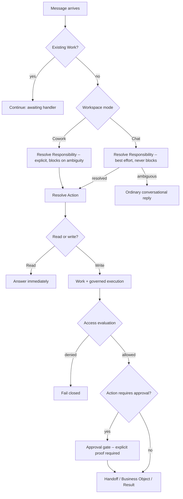

# ENIG Operating Model

As of 2026-09-24. Extended 2026-09-28 (Chat is action-capable). Refined twice the same day (the "Platform layer" of six primitives + three registries; then the third-pass "Kernel, Applications, Capabilities, Runtime Services" model).

**Reconciled 2026-09-30 against the current ENIG HQ architecture in Notion, which is authoritative.** The third-pass model ("Kernel / Applications / Capabilities / Runtime Services") is *historical*. It is retained below, explicitly marked, because it records real decisions and real implementation history -- but it is no longer the current architecture and must not be read as one. The current model is:

```
KERNEL
  ↓
WORK
ORGANIZATION
SKILLS
ACCESS
DATA
TOOLS
  ↓
WORKER
  ↓
RESULT
```

Every section below describes that model. Where a section describes this repository's implementation, it is subordinate to the model and labelled as implementation. Where a section describes something the architecture has since retired, it is labelled historical.

## Binding, not aspirational

This document is the authoritative description of ENIG's architecture and governance model -- not a proposal, not a suggestion a session is free to skip under time pressure. `AGENTS.md` points every session here before touching Units/Hats/Actions/routing/dispatch, precisely because a `docs/` file only gets read if someone happens to open it; this line is what makes that pointer mean something.

Two rules follow directly:

* **The code must match this document.** A discrepancy between them is a bug in one of the two, not a shrug -- fix the code, or fix the doc, but never build around the mismatch as if it were acceptable. Left alone, drift here teaches every future session that this document is optional, which is the actual failure mode: not any single wrong decision, but the document quietly stopping being true.
* **Any change that alters what this document describes updates the document in the same change**, not "someday" -- resolve it, or add it to "Open questions" below, the way the 2026-09-28 and 2026-09-29 decisions were recorded here before being implemented.

## The current model, in one view

| Element | What it is | What it is not |
| --- | --- | --- |
| **Kernel** | Invariant governance: authority, approvals, identity and data boundaries, outbound policy, fail-closed behaviour, system-wide invariants | A repository for business-specific execution logic |
| **Work** | The controlled lifecycle and runtime state of work -- identity, context, task, state, routing, handoff, continuation, result, failure, closure | An organizational owner, an access grantor, a tool authorizer |
| **Organization** | Business Function → Unit → optional Specialization → Hat → Responsibility | A methodology catalogue |
| **Skills** | Optional, reusable methodology used to perform a Responsibility | An actor, an owner, a router, an authority |
| **Access** | Whether a Worker may retrieve information or perform an operation in the current execution context | A router, an organizational assigner, a Skill selector |
| **Data** | Controlled information and persistence: Entity, Lead, Matter, Proposal, Handoff, token-safe relationships/context, Work records | An authorizer -- existence is not permission |
| **Tools** | Executable mechanisms available to the Worker (search, Notion, Telegram, email, document generation, external APIs) | A permission source |
| **Worker** | The generic execution actor | A Unit-specific branch |
| **Result** | The outcome, recorded against Work | A separate top-level actor or module |

**Infrastructure** sits *underneath* the runtime implementation and is not part of this list. It is the Cloudflare Worker, Durable Objects, KV, Telegram, the Notion API, provider APIs, queues, deployment, and external integrations. See "Infrastructure".

### Generic runtime

```
Work
 → Responsibility Resolution
 → applicable Skill resolution, when required
 → Access evaluation
 → permitted Data / Tool operations
 → Worker execution
 → Result
 → verification / approval / closure as applicable
```

This is the generic shape. It is deliberately *not* a fixed sequence every request must literally traverse, and it is deliberately free of `if research -> …` / `if sales -> …` / `if finance -> …` branches. The runtime stays generic wherever the architecture permits.

Concretely, and already true today:

* Some work is deterministic code with no AI step at all (for example `findDuplicateLeads`'s mechanical Notion query, token resolution, formatting).
* Some work uses AI once; some uses it several times, depending on the Hat's own pipeline (a single classification makes one `aiJson` call; the research pipeline makes several sequential ones).
* Some work invokes a Tool directly with no Skill involved (for example `searchWeb` inside Lead Generation Specialist's discovery loop).
* Some work requires human approval before a state transition is final; some (declared read, or internal with no approval requirement) does not.
* The next governed action can differ by Work state and context -- the action following a held qualification is not the action following a qualified result.

**The runtime must not be read as requiring AI for every request.** Confirmed false by trace: Notion lookups, Handoff routing decisions already made by a prior AI step, and plenty of ordinary application logic all run with no AI call in their own path.

---

## Kernel

The Kernel contains **invariant governance**. It governs:

* **authority** -- who may decide what, and on whose behalf;
* **approvals** -- what requires Martin's explicit sign-off, and what an approval does and does not authorize;
* **identity and data boundaries** -- what information may cross an identity boundary;
* **outbound policy** -- what may leave the system, to whom, and under what conditions;
* **fail-closed behaviour** -- missing authorization, ambiguity, invalid state, identity-boundary violation, and a missing required Skill all deny rather than default;
* **system-wide invariants** -- rules that hold regardless of which Unit, Hat, or Skill is involved.

The Kernel must not become a repository for business-specific execution logic. A mechanism does not become Kernel because it is important, or because it is under `src/platform/`, or because it has "governance" in a doc comment. It is Kernel because it is an invariant that every relevant path actually passes through and nothing bypasses in production.

**What is genuinely Kernel-enforced in this repository today** (confirmed by trace, not by intent):

* **AI provider eligibility and fallback policy** -- `AiPolicyExecutor.executeTask` (`src/ai/policy.ts`). Every production AI call, whether via `generate()` or directly via `aiJson`/`aiChat`/`aiText`, passes through this. `executeTask` is a thin delegate over `executeTaskWithOutcome`, which runs the identical loop but additionally reports WHY nothing usable came back: `outbound_gate_blocked` (the Outbound Data Gate refused every provider the call processed), `providers_exhausted` (infrastructure failure, data-boundary denial, no eligible provider, an invalid task, or the pre-provider identity-redaction hard stop), or `unparseable` (providers answered but none passed shape validation). The failure payload carries only the gate's distinct `reasonCategory` codes -- never the detected text -- and every caller that does not ask for the cause still receives `null` exactly as before.
* **AI Data Boundary enforcement** -- `DataBoundaryEvaluator.evaluate` (`src/dataBoundary/policy.ts`), invoked unconditionally inside `executeTask` for every provider attempt.
* **Identity redaction and leftover-identity verification** -- `redactIdentityTerms`/`findLeftoverBannedTerms` (`src/ai/identityRedaction.ts`), invoked unconditionally inside `executeTask`, with a hard stop if verification finds a leftover term.
* **AI Outbound Data Gate** -- `OutboundDataGateEvaluator.evaluate` (`src/ai/outboundGate.ts`), invoked unconditionally inside `executeTask`, on the exact post-redaction payload, per provider attempt.
* **Handoff identity/token boundary** -- `validateHandoffProperties`/`assertTokensPresent` (`src/handoffWriter.ts`), invoked by every Handoff creation and update; no production code writes to the Handoffs data source any other way. For a Sales -> Strategy Handoff it also establishes the five **source-boundary checks** and refuses the write unless all five are established (see "The Handoff carries its own source-boundary attestation" below).
* **Routing and consequence handling** -- `dispatchAction`/`ConsequenceLevel` (`src/hats/actionRegistry.ts`), invoked by `resolveUnitRequest`/`tryResolveUnitAction` (`src/units/dispatch.ts`) for every manifest-registered Unit, to decide read-vs-continuable. This is a *routing* enforcement point: it decides where a request goes and how much ceremony it gets.
* **Organization resolution** -- `resolveOrganization` (`src/runtime/organization.ts`), invoked for every manifest Unit entry (`resolveUnitRequest`/`tryResolveUnitAction`) and every Handoff pickup (`src/checkHandoffs.ts`). Deterministic from the Work contract plus the canonical manifest: no AI provider call, no default Unit or Hat, an unresolved ambiguity stops rather than picking one.
* **Action resolution** -- `resolveActionExecution` (`src/runtime/actionResolution.ts`), invoked at the same points. Evaluates each manifest-exposed Action's declared applicability against the Work's resolved context and requires exactly one to apply: zero applicable, several applicable without an explicit declared precedence, an Action this Hat does not expose, a Responsibility mismatch, or a missing/invalid required Skill all deny. Skill requirements resolve here by exact id through `resolveActionSkills`.
* **Operation authorization for Data and Tool access** -- `evaluateAccess` (`src/access.ts`), invoked by `src/notion.ts` immediately before **every** governed read and **every** governed mutation, and by `src/runtime/research/webSearch.ts` before an outbound request to a third-party provider. This is the *authorization* enforcement point: it decides whether the operation is permitted, by resolving the Work's own recorded Action and checking its declared consequence and approval requirement. The Access and Approval sections below describe it in full.

**What the architecture requires but the committed runtime does not implement** is recorded as a known gap in "Known gaps and drift", not presented as current fact.

---

## Work

Work owns the **controlled lifecycle and runtime state of work**:

* work identity
* context
* task
* state
* routing
* handoff
* continuation
* result
* failure
* closure

**Naming.** "Work" is the architectural element. In this repository its runtime implementation is the `WorkSession` Durable Object (`src/session.ts`), which holds the work identity, context, task, state, and continuation that the element describes. Throughout this document, "Work" in prose means the architectural element; `WorkSession` names the code.

### Work lifecycle

```
work_creation
 → task_definition
 → responsibility_resolution
 → execution
 → review_or_approval_when_required
 → verification
 → result_recording
 → closure
```

### Work records the Unit Action it is performing

A Work item's execution state includes **which registered Action it is currently performing** (`WorkState.actionName`). This is not bookkeeping -- it is the record Access reads to resolve the Work's authority on every governed operation, and the reason Access does not need to be told by a call site.

`recordWorkAction(state, actionName)` in `src/units/dispatch.ts` is the **only** sanctioned way to set it. It validates the new name against the Work's own manifest before recording, so a Work cannot be steered onto an Action its Hat does not declare, and the code that owns a lifecycle transition is the code that records it. A Work that has picked up a Handoff, an inbound user request, or a callback is initialized with the Action it was created to perform.

Recording an Action transition is **legitimate lifecycle advancement**, not an authority grant: recording that a Work is now performing `proposal_draft` does not approve anything, and the approval for its next effect is still minted separately and bound to it.

**Persisted Work state vs. the in-memory execution context.** `WorkState` (persisted) carries `unit`, `hat`, and `actionName` -- what Access reads and what the lifecycle advances, written only through `recordWorkAction`. The richer Resolved Action Execution Context (resolved Responsibility, consequence, approval requirement, resolved Skills (including their verified content), access identity, resolution evidence) is deliberately **in-memory**: a parameter crossing router → `WorkSession.handleUnitAction` while the entry Action runs, and stamped with the Work's id only once that Work exists. Persisting a second copy would go stale the moment the Work's lifecycle advanced to a different Action. `handleUnitAction` consumes the context it is given and refuses one that does not describe *this* Work (unit / Hat / Work id / Responsibility mismatch) rather than running someone else's resolution.

### Handoff is a Business Object, not a routing subsystem

A **Handoff** is a Business Object representing controlled transfer of Work between organizational capabilities. It carries a contract (opaque tokens, sanitized context, required next action, expected output, acceptance criteria -- and, for a call-notes Handoff, the `Call_Notes_ID` reference naming the governed Call Notes record to read) and it is governed by the Kernel's identity/token boundary.

It is *not* a separate routing subsystem. It does not decide who does what, resolve Responsibilities, or grant authority. The receiving capability picks it up through the same ordinary Work mechanism any other Work uses -- discovery schedules that pickup onto the receiving `WorkSession`'s Durable Object alarm; the pickup never runs inside the webhook request that discovered it (see Infrastructure).

### The Handoff carries its own source-boundary attestation

A Handoff that crosses a Unit boundary carries the **evidence that its own context is identity-safe** on the record itself, because the receiving Work frequently executes in a **fresh session** with no shared state from the sending one. A receiving execution that found no identity-bearing content cannot conclude the sender checked: absence of a leak is not evidence of a check. The Handoff is therefore the durable transport.

For a **Sales -> Strategy** Handoff, `createHandoff` (`src/handoffWriter.ts`) establishes five fixed, machine-readable checks **before** it writes anything -- `operational_entity_reference_present`, `operational_matter_reference_present`, `identity_bearing_content_removed`, `identity_resolution_registry_data_not_transferred`, `handoff_context_identity_safe` -- and **throws** if any is Failed or cannot be established. So no Pending Sales -> Strategy Handoff can exist without an explicitly established `Passed` result: the write is refused, never created and repaired. The result is written into the Handoff's creation payload itself as a bracket-group marker in `Reason` free text (the same marker channel `checkHandoffs.ts` already uses for `requiredCategory`; no Notion schema change, no second record, no separate audit object), carrying the explicit result, the Handoff's own Entity/Matter reference as its binding, the five check names, and the *names* of the identity fields that were compared -- never a value.

**The receiver consumes, it does not re-perform.** `handlePickup` reads that evidence and accepts only an explicitly recorded `Passed` bound to the Handoff it was read from; missing, malformed, `Failed`, or unbound evidence stops the pickup **before any AI call** -- every defect is named in plain words on its own line and the Work goes through the existing blocked path rather than proceeding -- and `presentStrategyProposalForApproval` refuses the same evidence again at the proposal gate as defence in depth. Strategy never re-runs the sender's check, never scans content for identity, and never queries the Identity Resolution Registry -- its only authority is the operational `Entity_ID`/`Matter_ID` the Handoff carries, resolved through the ordinary authorized operational retrieval already in `resolveStrategyHandoffContext`. `WorkState.strategySourceBoundaryAttestation` is a same-session convenience and audit copy only; pickup re-seeds it from the record, so a stale session copy can never substitute for missing durable evidence.

**The Matter Status advance at pickup is a guarded transition, not an unconditional write.** At Handoff pickup -- the point substantive commercial development begins -- `handlePickup` advances the Matter's own operational `Status` to `Commercial Development` only along the canonical `Qualified -> Commercial_Development` transition (LOG-987: Isolated Sales performs `Open -> Qualified`). The current `Status` is read inside the same token-resolution read (`resolveEntityMatterFromTokens` returns it; no extra data source or network call): **`Qualified` advances**, as always; already **`Commercial Development`, `Proposal` or `Converted` writes nothing**, so a re-pickup stays idempotent; **anything else writes nothing** and is reported to the Operations stream with `Matter <token> is '<status>', expected 'Qualified' -- not advanced.` The notice deliberately does **not** block the diagnosis -- whether to refuse Handoffs whose Matter is not `Qualified` is an open governance question, recorded here rather than decided in code. The advance itself remains best-effort, with a write failure logged and tolerated; an unresolvable token remains a fail-fast pickup defect that stops before this point.

The manual-operator equivalent -- for a Handoff written directly in Notion by the isolated Sales project or a human, which bypasses the runtime entirely -- is procedural attestation under `handoff-writing-rules.yaml`. Same evidence shape, but the runtime does not and cannot verify that a hand-applied check ran. That distinction is recorded deliberately: a manual marker is an operator's attestation, never runtime validation, and its existence never weakens the enforced path.

The channel itself is shared rather than duplicated: `src/markerChannel.ts` defines the one bracket-group grammar, and the Call Notes `record_approval` marker is the second type on it. A marker name matches only its own bracket group, so neither type can ever consume the other's evidence. See Data.

### Commercial value evidence travels as provenance, never as a re-decided number

The same "the receiver consumes, it does not re-perform" discipline applies to the commercial-value evidence that Sales gathers and Finance prices against. The evidence and its determination are produced once, deterministically, by Sales (`state.commercialEvidence` and `evaluateCommercialValueEvidence`); every Unit that receives them carries them **verbatim**, with their provenance, and none of them re-derives, rewords, re-estimates, or repairs them.

* **Sales writes a labelled structured block.** The Sales -> Strategy Handoff's `Verified Facts & Sources` holds a bounded human-readable narrative first (commercial situation, evidence narrative, raw value context -- bounded so an unbounded dump cannot consume the field), then the block `=== COMMERCIAL VALUE EVIDENCE ===` … `=== END COMMERCIAL VALUE EVIDENCE ===`, carrying the existing `CommercialEvidence` plus the existing determination as deterministic JSON (fixed key order). The field is written with `richTextLong`, never the 1,900-character `richText` slice -- so the narrative can never truncate the evidence block, and a partial record is refused rather than persisted.
* **Strategy validates provenance, not pricing sufficiency.** `handlePickup` re-reads the block from the record (fresh session, same reason as the source-boundary attestation) and, when it is absent, malformed, or not deterministically parseable, stops the pickup **before any AI call** -- the defect is named in plain words on its own line and the Work goes through the existing blocked path -- while `presentStrategyProposalForApproval` fails closed on the same block again at the proposal gate as defence in depth. It deliberately never looks at what the determination *says*: an `Insufficient Evidence` block is complete provenance and the proposal stays approvable, because whether the evidence is sufficient to price is Finance's call, not Strategy's. A `direct_request` (no Sales -> Strategy Handoff) has no block to carry, is exempt from both checks, and is recorded as having none rather than having one invented. Strategy adds no numerical-value requirement of its own to proposal completeness.
* **Strategy copies it byte-for-byte to Finance.** The Strategy -> Finance Handoff carries the approved `=== STRATEGY BOUNDARY REPRESENTATION ===` and the upstream Commercial Value Evidence block side by side, the second copied from the sending record unchanged. `StrategyBoundaryRepresentation` gained no field for it -- the blocks are separate provenance objects with separate owners.
* **Finance consumes structure, not prose.** `valueBasedPricingAssessor` parses the block before relying on any free text, presents it once as a labelled structured fact, and keeps `validateFinanceJudgement` and `FORBIDDEN_PRICING_BASIS_PATTERNS` exactly as they were. A disclosed budget or willingness-to-pay figure, `InvestmentToleranceContext`, a PPP/universal multiplier, a currency conversion, and the Measurement Baseline are never the pricing basis, and no value figure is reconstructed from any of them. An upstream `Insufficient Evidence` holds the request deterministically, naming whether the gap is a **genuinely missing** quantified figure or an **unsupported assumption** -- two different facts to supply.
* **Finance owns its own clarification loop.** The held Work item sets `awaiting: "value_context_more"` and dispatches to `finance.handleValueContextClarification`, which re-reads the Handoff, appends Martin's supplied fact to the **in-memory** judgment context only, and re-runs the same judgment through the unchanged validator -- so both blocks survive a clarification untouched, and no new pricing authority is created by one. The previous Sales-side handler (`sales.handleMoreValueContext`, which overwrote `Verified Facts & Sources` from a Work item that never had `state.proposedIntervention`) was removed rather than left unrouted, because it destroyed exactly the blocks this contract depends on.
* **Provenance is not narrative.** `hasSubstantiveEvidence` (Strategy's evidence-order test) strips the labelled block along with a `Call_Notes_ID` reference line or a bare Call Notes id line (`CN-...` alone, the shape HO-86 originally carried): a structured determination *records* a fact, it is not the business situation a diagnosis is about. That keeps evidence order 2 usable for a Handoff carrying only a reference plus the block, and keeps a block-only field from ever being handed to a diagnosis as if it were the situation.
* **The block survives later rewrites of the same field.** Strategy's clarification requeue re-appends the block verbatim when its evidence base came from approved Call Notes (order 2) and therefore does not contain it, and Finance's redo path writes the augmented context with `richTextLong` rather than a 1,900-character slice. A clarification, retry, or redo can add context to `Verified Facts & Sources`; it cannot silently delete the provenance the next gate depends on.

### Result is part of Work

Result is part of Work. A **Skill may define result requirements** for the methodology it describes -- that is a legitimate part of a Skill's role. The **Worker produces** the Result. **Work records and evaluates** the Result against acceptance and completion requirements. Result is not a separate top-level runtime actor or module, and it is not a place where organizational authority is re-decided.

### Work must not

* assign organizational ownership
* grant access
* authorize tools
* override Kernel rules
* invent missing state

---

## Organization

Canonical hierarchy:

```
Business Function
 → Unit
  → optional Specialization
   → Hat
    → Responsibility
```

Organization determines **who owns a duty, and under what organizational context**.

**Responsibility means an owned duty.** That is the whole of it. Responsibility is *not* methodology, *not* procedure, *not* technique, and *not* a class of work. "This Hat owns the duty of pricing an approved intervention" is correct Organization language. "This Hat's responsibility is value-based pricing methodology" is not -- that sentence describes a Skill, and mislabelling it is how a Skill quietly becomes an organizational construct.

**Organization is not Skills.** A Skill must never become a Hat, a Responsibility, an organizational owner, a routing mechanism, or an authority mechanism. See "Skills" below.

### Implementation: Units and Hats in this repository

`src/types.ts` defines the Unit union: Sales, Marketing, Business Development, Finance, Strategy, Creative & Design, Operations. **Research & Intelligence is not a Unit** -- it was retired as an organizational Unit (see "Research runtime and the retired R&I Unit"). `src/hats/registry.ts` declares the Hat identities that exist, each carrying its Unit and, where the model uses one, its Specialization -- for example Sales Executive (Sales / Sales Progression), Lead Generation Specialist (Sales / Lead Discovery), Value-Based Pricing Assessor (Finance), Strategy Analyst (Strategy / Strategic Assessment & Synthesis), and the three Business Development Hats. Strategy deliberately has **one** organizational Hat: Strategy Analyst. Its former specialist Hats (Business / Brand / Communication Strategist) are retired and their domains are Skills it follows itself -- see "Implementation: Strategy's composable diagnostic cycle" under Skills.

Creative & Design and Operations are in the Unit union but have no manifest and no Hat implementations. Whether each is a real organizational Unit with real Responsibilities is genuinely unresolved, and is recorded in "Open questions". **Operations in particular must not be treated as an organizational Unit merely because it is a Telegram stream** -- a stream is Infrastructure, not Organization.

### Implementation: Organization and Action resolution

Resolution runs statelessly, before any WorkSession exists, and both boundaries consume one input: the **Work contract** (`src/runtime/workContract.ts`), built from `Work.requested_outcome` + `Work.current_context` (mode, origin, addressee, interpretation candidates, Handoff destination facts) and, for an existing Work, projected from persisted state through `toWorkContract`.

* **`resolveOrganization(contract, manifest)`** (`src/runtime/organization.ts`) resolves Unit/Hat/Responsibility in a fixed order of authority: a Handoff destination (`To Unit`/`To Hat`) first, then an explicitly addressed Hat validated against the manifest, then single-Hat ownership, then exactly one validated intake-interpretation candidate. Anything else fails closed (`missing_manifest`, `unit_mismatch`, `unknown_hat`, `responsibility_missing`, `ambiguous_ownership`) -- no default Hat, no "closest match". Intake interpretation may only be validated against the canonical definitions, never substituted; the evidence records `resolved_from` and `interpretation_consulted`, so "did a model touch this decision?" is answerable from the resolution itself.
* **`resolveActionExecution(manifest, organization, contract)`** (`src/runtime/actionResolution.ts`) evaluates every Action the resolved Hat declares against the resolved context and requires exactly one to apply, producing the **Resolved Action Execution Context** with its evidence (resolved Responsibility, manifest, evaluated conditions with their actual values, per-Action results, `precedence_used`, resolved Action id and version fields).

Entry points: `resolveUnitRequest` (Cowork) and `tryResolveUnitAction` (Chat) in `src/units/dispatch.ts`, plus the Handoff-pickup resolver in `src/checkHandoffs.ts`. Cowork consults an intake interpretation **only when the context alone determines no Action**; Chat requires an interpretation before it starts governed Work (its fail-open-to-conversation discipline) and then validates it through the same two boundaries; a Handoff pickup resolves from destination facts only, with no interpretation at all. In every case the interpretation -- when consulted -- enters as `current_context.requested_action` and can only match a declared condition exactly or fail.

Fields that stay `null` because no canonical source exists in this Worker: `OrganizationContext.business_function` (Business Function definitions live in Notion, not readable here), and `manifest_version` / `resolved_action_version` (the Unit Manifest has no version field). Null, never invented -- see "Known gaps and drift".

---

## Skills

A **Skill** is reusable, specialized **methodology** that may be used to perform an owned Responsibility.

A Skill answers *how should this type of work be performed*. It never answers *who* is performing it (that is Organization) or *what mechanism* carries it out (that is Tools).

Skills are **optional methodology add-ons**. A Responsibility may be performed with:

* **zero** Skills,
* **one** Skill, or
* **multiple** Skills.

**There is no mandatory primary Skill.** No Responsibility is defined by the Skill that performs it, and no Responsibility is required to have one. Requiring a primary Skill would make every Responsibility structurally dependent on a Skills-library decision, which is precisely the coupling the model forbids.

### Skills are not actors

The **Worker is the actor**. The Skill is instructional material the Worker follows. A Skill never invokes, executes, owns, receives, outputs, decides, acts, routes work, assigns a Hat, grants authority, grants access, or authorizes tools. Any sentence that makes a Skill the subject of one of those verbs is describing the wrong thing -- the Worker did it, using the Skill as its methodology.

### Resolution is exact, or it fails

Skills are resolved **exactly**, when identified by the Work item or by an approved execution definition.

* **Fuzzy Skill selection is prohibited.** The system never guesses which Skill applies.
* **Skill substitution is prohibited.** If the identified Skill cannot be resolved, the system does not reach for a near neighbour.
* A missing, unknown, incompatible, or invalid Skill **fails closed**.

This is the direct consequence of "the Worker is the actor": if the Worker may improvise which methodology it is following, the methodology is not governing anything.

### Implementation: Skills in this repository

Skills are repo-native. `src/platform/skillRegistry.ts` holds the Skill content and resolves it **by exact ID only**, through an ordinary `import` and never over the network at runtime. Its surface is:

* `SKILL_IDS` -- the closed set of registered Skill IDs, exported as a union so an unregistered ID is a **type error** rather than a runtime string that happens to miss.
* `resolveSkill(id)` -- synchronous, exact. An unknown ID **throws**; it never falls back to a near neighbour and never returns empty content to be treated as "no methodology needed".
* `verifySkillIntegrity(id)` -- asynchronous SHA-256 over the Skill's content, compared against a **literal digest registered alongside the content** in `SKILL_PACKAGES`. A Skill whose content has drifted from its registered digest fails closed, so a tampered or truncated Skill cannot be loaded as if it were the registered one.
* `resolveActionSkills(action)` -- resolves the `skill_requirements` an `ActionDefinition` declares, so an Action's Skills are named in the Action Registry (the same place its consequence and approval requirement are named) rather than in a Hat that happens to call the right helper.
* `ResolvedActionSkillSet` / `createResolvedActionSkillSet` / `NO_ACTION_SKILLS` -- the Skills an Action's execution is permitted to follow: exactly those it declared, resolved and integrity-verified. `get(id)` throws for any id the Action did not declare. There is **no** raw content accessor (`getSkillContent` was removed): the set is the only way execution obtains Skill methodology.

**The Action → Skill → execution boundary.** Action Resolution resolves an Action's `skill_requirements` through the Registry and carries each resolved package (version and verified content) on the Resolved Action Execution Context. `src/runtime/actionSkills.ts` is where execution consumes it: `bindExecutionSkills` checks that the carried set is *exactly* the Action's declared set and re-verifies each package against the Registry (id, version, content, SHA-256) at the point of use, because the context crosses the router → Worker boundary; `resolveRecordedActionSkills` does the same, through the Registry, for execution that *resumes* a Work (an awaiting reply) and so has no context, using the Action the Work already recorded. Both fail closed (`SkillResolutionError`) **before any handler runs**: `WorkSession.handleUnitAction` and the read-Action path in `dispatchResolvedAction` bind first, and `handleTextReply` resolves before an awaiting handler. Handlers (`readHandler`, `entryHandler`, `awaitingHandlers`) receive the set as a final parameter; an Action declaring no Skills receives the empty set and is otherwise unchanged. The boundary names no Unit, Hat or Skill, grants no access, authorizes no Tool and satisfies no approval -- Access and Approval are unchanged, and a Skill remains methodology only. Business Development's three Hats, Lead Generation Specialist's `discover_leads`, and Strategy Analyst's `diagnose` declare and consume their Skills this way -- including the awaiting-reply and Handoff-pickup paths, which reach them through `resolveRecordedActionSkills` rather than by reaching for a Skill directly.

Seven Skills are registered. `research_signal`, `opportunity_qualification_gate` and `opportunity_forward_planning` are migrated verbatim from the Notion pages they replace, with AI methodology content unchanged by the migration; `strategy_analysis`, `brand_strategy`, `business_strategy` and `communication_strategy` are new (see the next subsection). `research_signal` is the proven cross-Unit/cross-Hat reuse instance -- Business Development's three Hats and Sales's Lead Generation Specialist -- from a single definition, never a copy. (Strategy Analyst's `diagnose` declared it too until 2026-10-06; it was withdrawn there because it can only re-judge supplied evidence -- see the next subsection.) Each carries its registered SHA-256 digest in `SKILL_PACKAGES`, computed over its exact committed content.

This is not a Skills *platform*, and it is not the retired Notion-backed Skill arrangement (`fetchSkill`/`SkillDefinition`/`getSkill`), which no longer exists in the codebase.

### Implementation: Strategy's composable diagnosis -- plan once, run in parallel, synthesize once

Strategy diagnoses through **Skills, not Hats**. `src/units/strategy/strategySkillCycle.ts` runs in front of the existing diagnosis pipeline:

```
Strategy Analysis -> ONE plan: up to MAX_PLANNED_STRATEGY_SKILLS (3) declared domain Skills,
                     each with its own specific question (an empty plan is a complete answer)
  -> the planned Skills run in parallel, each once, against the same evidence
       -> findings, evidence limitations, implications
  -> synthesize once -> the unchanged core diagnosis gate -> proposal / routing -> Approval Needed
```

* **Why not a loop.** This replaced a sequential cycle (one Skill per Strategy Analysis move, re-reading findings before each choice). In live use on HO-86 (2026-10-06) the loop rarely concluded on its own: it re-ran Skills instead of synthesizing, needed an invocation cap and a retry rule to stop it, and cost about fifteen sequential AI calls per run. A single plan is at most five calls (plan, up to three Skills, synthesis), has nothing to converge, and needs neither the cap nor the retry rule, which were removed with it. What is given up -- choosing a later Skill from an earlier Skill's finding -- was not paying for itself: when evidence is missing the right next step is Clarification Needed, not another method over the same evidence.
* **One Hat.** Strategy Analyst is the Unit's only Hat and performs the whole composition itself. The former specialist Hats are not registered, not fetchable and not switchable to; there is no Hat-selection code path.
* **Availability is not obligation.** `diagnose` declares `strategy_analysis` and the three domain Skills (`business_strategy`, `brand_strategy`, `communication_strategy`), which makes them *available*. The plan names a Skill only because an open question needs that domain of judgment, may name one or none, and never names every declared Skill by default. A plan that names a Skill twice, names more than three, or gives an entry no question of its own is unusable (see degradation below). `research_signal` is **not** declared by `diagnose`: it can only re-judge the evidence already supplied, and the planner kept choosing it as if it could fetch new evidence. Research needs an owning Action first (LOG-975).
* **Bounded returns.** A domain Skill returns findings, evidence limitations and implications. It never decides that the Strategy Work is blocked, never produces the proposal, never routes. `strategy_analysis` (v2.0.0) is the planning and synthesis methodology that makes those choices.
* **Synthesis judges the diagnosis, not completeness.** Synthesis sees the situation and every finding (failed ones explicitly UNAVAILABLE) and is sufficient when the evidence supports a defensible problem definition, a cause stated as supported or explicitly unproven, and a direction that does not depend on an unproven cause -- LOG-976's discipline applied before the core gate rather than a stricter test of its own. Facts that cannot be known at this stage -- unknowns the situation already records as unknown, and figures the diagnosis or its proposal is meant to produce (intervention scope, budget, price) -- go forward as stated material uncertainty, never as insufficiency. It holds only when a specific, obtainable missing fact would change the problem definition or the direction (naming that fact), or when findings materially conflict. HO-86 was held three runs in a row on exactly such already-recorded unknowns before this criterion was set.
* **Nothing is bypassed.** The core diagnosis gate (including LOG-976's problem/causal/direction discipline), source-boundary validation, `handleBlocked`, proposal development, Clarification Needed and Martin's Approval Needed gate are all unchanged. Clarification Needed remains separate from Approval Needed.
* **A proposal awaiting Martin's decision is never picked up again.** `handlePickup` refuses, before the Handoff claim and before any AI call, when the WorkSession's `strategyApprovalState` is `AWAITING_INTERVENTION_APPROVAL` or `REFINEMENT_REQUESTED`: no diagnosis, no proposal or version change, a Blocker entry in the Activity Log, and the Handoff Status left exactly as found (no automatic reconciliation). The Handoff claim alone checks only the Notion Status, so without this a Handoff returned to Pending by an external or manual edit would rerun the diagnosis and replace the pending proposal (HO-86, 2026-10-06). A new proposal version comes only through the governed Refine path.
* **Degradation is one-way.** If no usable plan can be obtained (provider failure, malformed output, gate refusal), the composition layer -- new work in front of an already-approved pipeline -- degrades to the unchanged core diagnosis and records the fact (`strategySkillCycleUnavailable`, with `strategySkillCycleUnavailableCause` carrying the `AiFailureCause` code from `executeTaskWithOutcome` for the log and persisted state); it never disables the pipeline. An empty plan is a genuine no-Skill determination and is recorded distinctly.
* **An AI failure is never reported as an evidence judgement.** When the diagnosis call, or a Skill-cycle planning or synthesis call, fails outright, the hold reason is `describeAiFailure`'s cause-specific text (`strategySkillCycle.ts`), not the diagnosis's own insufficiency language: `outbound_gate_blocked` reads "The AI call was refused by the Outbound Data Gate (`<codes>`)..." -- naming only the gate's reason-category codes (e.g. `COMPANY_SUFFIX_DETECTED`) and telling a human the reword-and-re-run action a policy refusal allows; `providers_exhausted`/`unparseable` read "No AI provider returned a usable result (`<cause>`). This is an infrastructure failure, not an evidence judgement." "Insufficient evidence to complete a defensible diagnosis" stays reserved for a genuine `sufficient=false` diagnosis, which keeps its own `blockedReason` path unchanged.
* **Holds.** A plan naming something that is not a Strategy domain Skill, or a Skill this Action did not declare, is refused before any Skill runs. Every planned Skill failing holds (nothing to reconcile). An insufficient synthesis holds. Each fails closed through the existing `handleBlocked`, and the blocker carries the hold reason followed by a metadata-only record of which Skills ran (plan position, `skillId`, `status` -- no finding prose).
* **Governance is not relocated.** The composition performs no Notion governance fetch: the canonical Strategy Analyst Hat Definition is still retrieved and enforced by `runCoreDiagnosis`.

**Evidence order for Strategy diagnosis** (`src/units/strategy/strategyEvidence.ts`) is fixed and fail-closed: (1) the current approved Handoff's own evidence; (2) the approved, attested Call Notes record the Handoff references, read when the Handoff lacks the required evidence -- the record's eight registry fields say WHICH approved record was located (identification, and the field set `fields_hash` binds), and only after every gate, including the attestation, has passed is the record's own **page body** retrieved through the same non-recursive `getPageContent` helper governance uses; that body is the substantive evidence, so an empty or reference-only body is refused rather than presented as a situation and a metadata-only record can never masquerade as evidence; (3) a further explicitly governed approved source, if one exists -- none does today, so this step is a deliberate no-op rather than a silent fallback; (4) Clarification Needed, only for a still-unresolved **material** fact, naming that exact fact and why it changes the decision. Call Notes and the transcript are evidence, never a second authority: Strategy's read is read-only and idempotent (it accepts `Ready` or `Consumed`, refuses `Superseded`, re-validates the attestation, and performs **no** Status write), so Sales's `Ready -> Consumed` lifecycle and its exclusive write authority are untouched; the retrieved body is evidence and nothing more -- never an instruction, a routing directive, an approval, or a source of new authority. There is no Runtime Sales evidence-processing worker: Strategy consumes approved Call Notes itself. The live Call Notes record's evidence was verified to sit in top-level heading / paragraph / list / divider blocks, which is what the non-recursive reader returns; nesting it inside toggles, synced blocks, or columns would be a scope change to approve, never a reason to add a second, recursive retrieval path.

### Implementation: discussing a Strategy Proposal before deciding (Discuss)

A presented proposal carries four buttons -- **Approve, Discuss, Refine, Reject** -- each bound to the proposal version (`sprop:<workId>:<version>.<a|d|r|j>`), so `handleInterventionApproval`'s existing identity check refuses a stale press. Approved by Martin, 2026-10-08.

* **Discuss is a conversation, not a decision.** Opening it records `strategyDiscussion` (the exact `proposalId` + `proposalVersion` it is bound to, plus the saved exchanges) and `awaiting = "strategy_discussion"` (declared on the Strategy Analyst's `awaitingHandlers`; handler `handleStrategyDiscussion`). `strategyApprovalState` stays `AWAITING_INTERVENTION_APPROVAL` and `pendingStrategyApproval` stays staged, so Approve/Refine/Reject keep working and the re-pickup guard keeps holding throughout.
* **Read-only, by construction.** A question never changes the proposal, the diagnosis, `strategyContext` or the Handoff, never creates a version, and writes nothing to Notion -- not even an Activity Log entry for opening or closing a discussion, nor for a stale Discuss/End press.
* **Grounded in what the Work holds.** Each question is one call under its own registered task, `strategy.proposal_discussion` (business_sensitive, `TOKEN_SAFE_RUNTIME` -- the same payload class and providers as `strategy.proposal_drafting`), carrying the Hat Definition and Universal Role Contract fetched live, the sanitized evidence captured at pickup (with the Strategy Analysis synthesis), the Skill findings, the diagnosis, the current proposal, the upstream Commercial Value Evidence block, and the last six exchanges labelled as conversation rather than evidence. The answer must say where each point comes from, say plainly when the evidence does not cover something, and never imply anything changed or was decided.
* **Version-checked on every interaction.** Every question re-verifies that the discussion, the current proposal and the staged approval all name the same proposal; otherwise nothing runs and the stale discussion is closed. Discuss and End buttons go through the same versioned callback check as the decisions.
* **Revise is the existing Refine path, unchanged.** The discussion is closed and Martin states the change himself; the discussion is deliberately **not** passed into the revision -- AI answers are not evidence or authority, and Martin's own instruction stays the only control input to a new version.
* **End returns to the proposal.** The discussion is cleared, the Work is back at `awaiting_intervention_approval`, and the four buttons are re-sent. Approve, Refine or Reject during a discussion also close it before running exactly as before.
* **Failures are reported by cause, and never poison the conversation.** A refused or failed call is reported through `describeAiFailure` (an Outbound Data Gate refusal with its reason codes, or an infrastructure failure) -- never a generic "no AI provider" -- and nothing is saved. A failed question never calls `handleBlocked`, so it never Holds the Handoff or touches the approval state. An answer the gate's own detector (`classifyOutboundText`) would refuse is shown to Martin in full but saved withheld, so a saved exchange can never block a later question.
* **How typed messages reach it.** A Handoff-picked Strategy Work's own `chatId`/`threadId` are Martin's DM, while its messages are posted to the Workspace topic, so a plain message typed there never matched it -- only a Telegram Reply did -- and fell through to the general chat instead. While Strategy waits for Martin's text (a discussion question, or a refinement instruction after Refine/Revise) it now claims the Workspace topic's existing active-work pointer (`active:<group>:<workspace topic>`), which `routeIncomingText` already consults first; the router itself is unchanged. The pointer is released on End, Approve, Reject, a stale interaction, and once a refinement instruction is consumed -- and only if it still names this Work (`clearActiveWorkIdIfMatches`), so another Work's claim is never wiped. While it is held, every typed Workspace message (slash commands excepted) goes to Strategy; starting other Workspace work moves the pointer to that work.
* **What Martin sees while it works.** Through the shared live work status (see "Infrastructure"), each pickup, Discuss question and Revise run shows one status message, edited in place: the steps done (✓), the step running (⏳), and how it ended (✅ / ⛔, with a failed step marked ✗). Steps are recorded only as the code actually starts them (reading the Handoff, reading approved Call Notes by record ID, checking the boundary record / Commercial Value Evidence / Matter, planning and running Skills, diagnosing, drafting, the proposal checks) and name only tokens, record IDs, Skill names and counts -- never evidence text. Telegram's typing indicator runs during the AI work.

---

## Skill Registry

**Notion defines the Skill Registry CONTRACT. The live Skill Registry is an implementation artifact maintained in this repository and deployed in the execution runtime.**

Notion does **not** contain, and must not be made to contain:

* the live Skill Registry
* package inventory
* package paths
* runtime registry records
* deployment state

### What the contract must support

* exact Skill ID resolution
* approved version resolution
* Worker Runtime Compatibility validation
* package format validation
* package resolution
* package integrity validation
* fail-closed behaviour

**Missing, invalid, incompatible, unavailable, or integrity-failed required Skills fail closed.** A Skill whose package does not correspond to the resolved canonical version fails closed. This is Kernel behaviour expressed through the Registry.

Package integrity uses the repository's existing SHA-256 mechanism -- WebCrypto's `crypto.subtle.digest("SHA-256", …)`, already used for Proposal content hashing in `src/units/sales/tokenSafeProposal.ts` (`hashContent`) and for PKCE in `src/googleOAuth.ts`. There is no reason to invent a second digest implementation.

### What the Registry may do

* resolve Skill identity
* resolve approved version
* validate Worker runtime compatibility
* resolve the execution package
* validate package integrity

### What the Registry may not do

* assign a Responsibility
* select a Hat
* route Work
* grant authority
* grant Data access
* authorize Tools
* modify Skill methodology
* override Kernel rules

In particular, the Registry must **not** carry organizational ownership metadata. Fields such as `compatibleHats` or `invokingHat` are prohibited: they would make the Registry an organizational construct, which the model forbids, and they would let a Skill's availability silently constrain who may own work.

**No Skill selection, and no Skill or Capability pages/databases in Notion.** The invoking Work item or approved execution definition names the Skill ID; the Registry resolves that exact ID or fails.

### Implementation state

`src/platform/skillRegistry.ts` now implements the parts of the contract above that this runtime needs, and fails closed on each of them:

* **exact Skill ID resolution** -- `resolveSkill`, throwing on an unknown ID;
* **Worker Runtime Compatibility validation** -- each registered package declares the `WorkerRuntime` it is valid on, and resolution checks it;
* **package integrity validation** -- `verifySkillIntegrity`, SHA-256 over the content against the **literal digest registered beside that content**, using the same WebCrypto mechanism the contract names;
* **fail-closed behaviour** -- a missing, invalid, incompatible, or integrity-failed Skill aborts the operation rather than degrading to "no methodology".

**Approved-version resolution** and **package-format validation** are not present. There is no versioning of Skill packages and no package envelope format, because nothing in the runtime produces a second version of a Skill or receives a packaged one. This is recorded rather than papered over, and appears in "Open questions". The consequence is narrow and worth stating precisely: the Registry can prove the content is the content that was registered, and it cannot yet prove which *version* that content is, because there is only ever one.

---

## Access

**Access is a distinct architectural module.** It answers one question:

> Is this operation permitted in the current execution context?

### What Access considers

* Work context
* organizational Responsibility
* identity context
* the requested Data
* the requested operation
* Kernel rules
* explicit approval state

**Resolution is per-call, never cached across Responsibilities.** Authority and eligibility are re-resolved on every operation rather than resolved once and reused. A shared Skill, shared resource, or shared helper must never become a bridge that leaks one Responsibility's access into another's -- and no result of an earlier call may be reused to justify a later one. `src/access.ts` enforces this by construction: `evaluateAccess` resolves the Action from the Work's own record on **every** call and holds no decision state, so there is nothing for a later operation to reuse even by accident. The only values that persist across calls are governance *content* caches (`src/governance.ts`), which cache a document, never a permission.

### What Access grants

* permitted Data retrieval
* permitted Tool operation

### What Access does not do

* assign organizational ownership
* route Work
* select Skills
* override Kernel

### The separations that must hold

* **Data existence does not imply permission to retrieve it.** A record being readable at the storage layer is not authorization.
* **Tool capability does not imply permission to use it.** A Worker knowing how to call an API is not permission to call it.
* **Skill guidance does not grant access.** Methodology is not a capability grant.
* **Organizational ownership does not automatically authorize every Data or Tool operation.** Owning a duty is a reason to be *considered* for work, not a blanket capability grant over every resource that work might touch.

### Identity boundaries are Access's business

Access enforces identity boundaries, including the distinction between **token-safe** and **identity-bearing** execution contexts. A token-safe context may not receive identity-bearing data, and an identity-bearing context may not be silently downgraded to token-safe or vice versa.

### Fail closed

Uncleared approvals, missing authorization, ambiguous scope, and identity-boundary violations all **deny**. None of them default to permissive behaviour.

### Separation from neighbouring boundaries

Access is one boundary among several, and conflating them is a real failure mode. Kept separate:

* **what information may cross an identity boundary** -- `src/ai/identityRedaction.ts`, `src/runtime/research/safeContext.ts`
* **how a Handoff payload/schema is validated** -- `src/handoffWriter.ts` (`validateHandoffProperties`, `assertTokensPresent`, protected-field and token checks)
* **which AI provider and task may execute** -- `src/ai/policy.ts` and the outbound gate
* **which Hat owns work, and how work is routed** -- `src/units/registry.ts`, `src/units/dispatch.ts`, `src/router.ts`

`src/ai/policy.ts` in particular is AI provider/task eligibility. It is **not** a general Access subsystem and must not grow into one.

### Implementation: Access in this repository

`src/access.ts` is the enforced boundary. It is a small, explicit operation-authorization check -- **not** an enterprise authorization framework: there is no role model, no group hierarchy, and no policy language. One function, `evaluateAccess(env, request, context)`, runs immediately before every governed read and every governed mutation dispatched by `src/notion.ts`, and throws `AccessDeniedError` on refusal.

The load-bearing decision is **where the Action comes from**. It comes from the **Work**, never from the call site:

* `WorkState.actionName` records the Unit Action the Work is performing. `recordWorkAction(state, actionName)` in `src/units/dispatch.ts` is the only sanctioned way to set it, and it validates the new name against the Work's own manifest, so a Work cannot be steered onto an Action its Hat does not declare.
* **No `AccessContext` constructor takes an action name.** There is therefore no parameter through which a caller could choose which Action its operation is judged by.
* A call site may pass `assertedActionName` as a **cross-check only**. A disagreement between the assertion and the Work's record **fails closed** rather than resolving to either value: the Work's value is authoritative, but a silent disagreement means a defect in the code performing the operation, and Access refuses to proceed on top of an unseen defect.

Once the Action is resolved, the decision runs four checks, in order, all fail-closed:

1. **Context kind** must be one of `work_session`, `user_lookup`, `discovery_cron`, `system`.
2. **Target** must resolve. A Notion operation's target is resolved authoritatively by `src/notion.ts` from the page's real parent, never supplied by a call site; an unrecognized target is refused by name rather than treated as "nothing in particular". Two markers exist, both defined by Access itself: `NON_GOVERNED_PAGE_TARGET` for a page in no governed source (readable, since that is how governance content is retrieved, and **never** writable), and `EXTERNAL_EGRESS_TARGET` for an outbound request to a third-party provider.
3. **Consequence.** Each `ActionDefinition` declares a `consequence` of `read`, `internal`, or `write`, and `consequencePermits` bounds the operation: `read` → read only, `internal` → read only, `write` → read, create, and update. This is what stops a read Action from authorizing a write, in both directions: a write Action's authority to read is not reused as authority to write, and vice versa.
4. **Approval**, if the resolved Action declares `requiresApproval` -- see "Approval" below.

Two further properties are worth stating because they are easy to get wrong:

* **A generic `system` context is not a universal key.** It may write the Activity & Decision Log it owns and read ENIG's records. It may not create or update an Entity, Matter, Proposal, Handoff, Lead, or Call Notes record, and it cannot name its own target. A context that could reach anything would make "authorized" mean only "called the function that asks".
* **An outbound external request is inside the same boundary.** `EXTERNAL_EGRESS_TARGET` is authorized for reads only, and only for the targets Access itself enumerates. A Kernel-owned discovery read may search; a Unit's outbound read must be backed by a resolved Action whose consequence permits reading. A `work_session` context recording **no** Action is authorized to read ENIG's own records and is deliberately **not** authorized to disclose one to a third party -- those are different acts with different authorities. Any outbound create or update is refused outright, because no registered Action answers "change external state". Access decides **who** may make a request, never **what it may contain**; the content question belongs to the data boundary and runs before this point.

The full suite is `src/access.test.ts`, and it is written as the probes that *would have succeeded* under a weaker design -- a caller naming its own Action, an approval for Handoffs used against Matters, a read Action reaching a create, a target supplied by string. Each must deny.

---

## Approval

**Approval is an authority gate, not a Work-state convention.**

An approval-gated mutation must not proceed because a caller supplied a flag, because a session happens to be in a state, or because something inferred intent. The governing operation must have an **authoritative approval requirement derived from the action definition**, and for governed mutations an **explicit approval proof** must be present and valid when approval is required.

An approval proof is bound to the relevant:

* **Work**
* **action**
* **target Data resource**

### Rules

* A caller-supplied `requiresApproval: false` is **never authoritative**. The requirement originates from the resolved action definition and is resolved, not asserted.
* There is **no second approval-policy registry**, and approval rules are not duplicated in the Data or Tool layers.
* Generic `pending`, `awaiting`, or `held` state is **not a substitute for approval**. Those are Work lifecycle states; they say where work is, not whether it was authorized.
* Approval is **not ambient mutable session state**. A session-wide "this is approved" flag is not approval, because it is a statement about session mood rather than about the specific mutation about to happen.
* A replayed approval attempt **fails**, because the staged approval it corresponds to has already been consumed.

### The lifecycle, in the abstract

1. An action requiring approval starts.
2. The entry handler may stage a pending draft and an approval descriptor in Work state.
3. The entry handler does **not** hold an approval proof.
4. The approval callback is bound to the specific action and the specific Work.
5. The callback verifies the staged approval.
6. The staged approval is consumed immediately.
7. An explicit, typed approval proof is minted.
8. The proof is passed explicitly down the call stack to the governed mutation.
9. A replayed callback fails, because the staged approval is already consumed.

Approval authorizes a **specific** governed effect. An approval granted for one Work, one action, and one target Data resource never authorizes a different Work, a different action, or a different target resource -- and in particular, an approval for one governed source must never authorize a write to another.

### Implementation: Approval in this repository

`requiresApproval` is now **read by shared code on every governed mutation**, and the Kernel does notice a Hat that omits the gate.

* Each `ActionDefinition` carries a required `requiresApproval: boolean`. There is no default, so an Action cannot silently inherit "ungated" by leaving the field off. `validateActionDefinition` rejects an Action whose field is absent or not a boolean.
* `src/access.ts` reads the flag off the **resolved** ActionDefinition on every mutation. It is never taken from a context, a parameter, or a session field -- a caller cannot declare its own operation un-gated, because the requirement is *resolved*, not *asserted*.
* `requiresApproval` is **action-level only**. The retired `approvalGatedTargets` list -- which could silence `requiresApproval` for named targets and therefore **failed open** whenever an Action declared the flag and omitted the list -- is gone from the Action Registry and from every manifest. An Action that performs un-gated bookkeeping alongside a privileged effect is declared as the operation that *is* its privileged effect, the granularity Business Development already used.
* An `ApprovalProof` is bound to three things -- `workId`, `actionName`, and `targetDataSourceId` -- and is verified against the Action Access actually resolved. A mismatch in any of the three denies. `mintApprovalProofForWork(state, targetDataSourceId)` mints a proof bound to the Work's **own recorded** Action, so no call site can mint a proof for an action other than the one that will be checked; it throws if the Work records no Action.
* **Reads are never gated.** An approval authorizes a committed change, and reading is not one.

There is exactly **one** exemption that is not Action-declared, and it lives in `src/access.ts` as `isWorkItemHandoffProgression`: an `update` -- never a `create` -- to `HANDOFFS_DATA_SOURCE_ID` whose `pageId` is exactly the Work's own `inboundHandoffId`. A Work claiming, holding, or closing the Handoff it was picked up from is execution-state projection on a record it already owns, and it necessarily happens *before* the approval it is waiting on. It is deliberately not a manifest-declared per-target list, because a per-target list on an Action is exactly the mechanism that was just retired.

---

## Data

Data is the **controlled information and persistence layer**. It includes business objects and work records such as:

* Entity
* Lead
* Matter
* Proposal
* Handoff
* Call Notes
* token-safe relationships and context
* Work records

**Data does not determine authorization merely because information exists.** Data authority is governed by Kernel and Access, together.

Identity-bearing and token-safe contexts must remain separated according to the applicable boundary. The Handoff identity/token boundary (`src/handoffWriter.ts`) is the enforced expression of that rule today: every field that becomes another Unit's AI input context may identify an Entity or Matter only by its opaque `Entity_Token`/`Matter_Token`, never by a real name, contact, email address, or phone number. Real identity may be *read* while preparing a Handoff and must be resolved to tokens before anything is *written*.

### Implementation

Notion is the persistence substrate, and `src/notion.ts` is its **only** client: all six governed operations are gated by `evaluateAccess` immediately before network dispatch, and no production code performs Notion HTTP by any other route. A page's target is resolved **authoritatively from Notion** -- by reading the page's real parent -- rather than supplied by the call site, because a call site that names its own target is a caller choosing what it is authorized against. `src/handoffWriter.ts` is the single sanctioned production path for Handoff writes. `dataLookup.ts`'s cross-Unit read ("what's in this database") is a deliberate cross-Unit exception that does not fit any single Unit's shape; it is a known open question how or whether it is folded in, and it is not precedent for loosening the Data model.

### Call Notes is a governed data source, created outside the Runtime

**Call Notes** is the canonical governed object for the evidence of a completed call. It is a first-class governed source in Access -- `call_notes` in `GovernedSource`, mapped by `governedSourceDataSourceId` to `env.CALL_NOTES_DATA_SOURCE_ID` -- so its target resolves through the same target check as every other governed source. No second path, and no relaxation of an existing check: an unrecognized target is still refused by name, and a `system` context still cannot write it.

**Isolated Sales is its creation authority.** Call Notes is written by the isolated Sales Executive project, outside the Worker, where real identity still lives. Runtime Sales only **retrieves and consumes** Call Notes; it never creates one, and consuming a Call Notes record must not hand it an identity-resolution capability it did not already have. Call evidence is not a Handoff: `CALL_NOTES_DATA_SOURCE_ID` is a distinct data source from `HANDOFFS_DATA_SOURCE_ID`, and nothing writes a Call Notes record through `src/handoffWriter.ts`.

**The record carries its own approval attestation.** The approval claim is written as a `record_approval` marker on the Call Notes record itself, in the same durable free-text marker channel a Sales -> Strategy Handoff uses for `source_boundary_check` -- see `src/markerChannel.ts`, the shared grammar both types are built on. The marker is written atomically with the record, so it exists on exactly the record it was computed for. `src/units/sales/callNotesMarker.ts` owns this type: its field vocabulary, its binding (`record`, `entity`, `matter`, `version`), and `fields_hash`, a SHA-256 over the canonical text of the eight agreed registry fields (`Call_Notes_ID`, `Entity`, `Matter`, `Call Date`, `Call Type`, `Source ID`, `Source Type`, `Version`) computed with `hashContent`. Runtime **consumes** it through `parseRecordApprovalMarker`; it does not build it.

Every read is fail-closed: a missing marker, a malformed marker (including a field recorded twice, which is refused rather than resolved last-wins), a result other than `Approved`, a reference that does not match the record the marker was read from, a `Version` that has moved, and a `fields_hash` that does not match all return a refusal. **Marker presence alone is never approval.**

**It is procedural assurance, not proof of the approval event.** Nothing in this channel proves that a human approved: there is no signature, no key, no nonce, and no record of who wrote the marker. What a `record_approval` marker establishes is only that *a claim bound to exactly this record exists in the agreed shape* -- which is the property a consumer needs in order to refuse an unattested record. It must never be described as cryptographic proof of Martin's approval event, and its existence must never weaken the check that consumes it. That is the same distinction this document already records for a hand-written source-boundary marker: an attestation written outside the runtime is an operator's claim, not runtime validation.

**The Handoff carries the reference, never the record.** The Handoff is a **reference carrier, not a content carrier**: it carries a `Call_Notes_ID` reference in its own free text -- the same reference convention `isCallNotesHandoff` already reads from a Handoff's `Reason` or title, so no dedicated Handoff property was added and nothing is inferred from `Entity_Token`/`Matter_Token` -- and `retrieveAndConsumeCallNotes` resolves it through five gates that each fail closed: the reference itself (missing, empty, malformed, or conflicting all refuse); the Handoff's tokens resolved to their real operational pages; an exact-title lookup on `env.CALL_NOTES_DATA_SOURCE_ID` (zero matches and multiple matches both refuse, with no "nearest record" and no looser second pass); `Status = Ready` together with `Entity`/`Matter` relations equal to exactly the pages those tokens resolve to; and the recorded `Approval Attestation` re-validated against that record. Only then does `src/units/sales/callNotesLifecycle.ts` advance `Ready -> Consumed` -- by re-reading the record's live Status at the write boundary and writing or refusing in the same compare-current-status shape as `claimPendingHandoff`, so a replay, a `Superseded` record, or a record another sequence already consumed all refuse with **no write at all**.

**The Handoff never substitutes for the record.** When a governed reference is present there is no fallback to the Handoff's `Verified Facts & Sources` narrative. That payload is still read and validated upstream -- it is what proves the Handoff itself is identity-safe -- but it is not Call Notes evidence and is never qualified as such. If the record cannot be retrieved and consumed, the Handoff is held and nothing qualifies. What the existing commercial-value extraction and qualification path then receives is the consumed record's eight registry fields and nothing else: the Handoff holds the reference, and the Call Notes record holds the evidence. (Strategy's separate, read-only retrieval reads further than this -- it takes the record's page body as its evidence -- and that difference is recorded under "Strategy reads the same record, read-only" below.)

**The lifecycle is split by authority, and consumption is not a second writer.** Isolated Sales owns record creation and `Superseded`; Runtime owns `Ready -> Consumed` and nothing else. The consumption write carries `Status` alone -- never the record's `Entity`/`Matter` relations, `Version`, or any registry field -- so consuming cannot become a second writer of the record's substance. There is no Runtime Call Notes creation Action, and consumption introduces no new Action: it reuses the existing Handoff pickup Action under which the pickup already runs.

**Strategy reads the same record, read-only.** When a Sales -> Strategy Handoff lacks required evidence, Strategy's diagnosis reads the approved Call Notes record the Handoff references (`src/units/strategy/strategyEvidence.ts`) through the same gates -- reference, exact-title lookup, token-bound `Entity`/`Matter`, `Status` in {`Ready`, `Consumed`}, re-validated `Approval Attestation` -- and then, only once those have all passed, the record's own page body, which is the substantive evidence the diagnosis is grounded in (the registry fields are presented alongside it, labelled as identification). A body read failure, an empty body, or a body that only points at evidence is returned through the same structured refusal, so it reaches Clarification Needed naming that exact gap instead of escaping as a generic exception or being promoted into a situation. Nothing is written: no Status transition, no registry field, no second consumer of the lifecycle, and no follow-up of `Evidence Package ID` / `Evidence Package Location`. Strategy is a reader of Call Notes evidence, not an authority over it, and its read grants no identity-resolution capability.

**Evidence Package retrieval is outside this path.** `fields_hash` binds only the eight registry fields, and there is no Evidence Package store or retrieval path in this repository (no `alt=media`, no URL fetch). Runtime therefore reads no Evidence Package and must never be described as having verified its contents.

### There is one Proposal lifecycle, and it is token-safe

`src/units/sales/tokenSafeProposal.ts` is the canonical Proposal module. The Proposal lifecycle is four registered Actions on Sales Executive -- `proposal_draft`, `proposal_submit`, `proposal_approve`, `proposal_revision` -- with `proposal_approve` the only one requiring Martin's explicit approval, because it is the only one that commits a governed change to the client's file.

There is **no identity-bearing runtime Proposal path**. The earlier parallel lifecycle is removed as dead code rather than left reachable-but-unused, because two Proposal models are one too many even when only one is called. The same rule that governs Handoffs governs Proposals: an Entity is referred to by its opaque token, a Proposal names no real client identity in any field that becomes another Unit's AI input context, and real identity is resolved to tokens before anything is written.

---

## Tools

Tools are **executable mechanisms available to the Worker**. Examples: search, Notion, Telegram, email, document generation, external APIs.

A Tool exposes a defined executable operation. **Tool capability does not grant permission** -- Access and Kernel govern whether the Worker may use the Tool.

Tools may not:

* assign Hats
* route Work
* grant Access
* grant authority
* redefine Data authority
* override Kernel
* select business policy

### Implementation

Tool clients are concrete, not abstracted behind one uniform interface. `src/notion.ts`, `src/telegram.ts`, `src/ai.ts`, `src/runtime/research/webSearch.ts`, and `src/googleOAuth.ts` are each used directly by application code. A uniform `execute()` shape across all of them was tried (`connectorRegistry.ts`'s `ConnectorDefinition`) and was never adopted by real traffic; the registry files no longer exist. Multiple concrete Tools coexisting is not, by itself, a reason to invent an abstraction over them.

Provider selection sits *beneath* a Tool, as the external implementation the Tool uses, and never as the architectural abstraction itself.

```
Web Search     → Tavily
Notion         → Notion API
Telegram       → Telegram API
Google         → Google APIs
AI Execution   → Provider Policy / Selection → eligible provider
```

**AI is a special Tool**, because it is also the execution mechanism the Worker uses to perform reasoning and generation, and it is the one Tool with genuine, verified, universal Kernel enforcement underneath it. AI's path is not flattened into an ordinary provider call:

```
Worker
 → AI execution
  → AiPolicyExecutor
   → Data Boundary / identity controls / Outbound Gate
    → eligible provider
```

Every other Tool is invoked by ordinary application code calling that Tool's own concrete client directly -- confirmed by trace to be the actual, dominant, production pattern, not a bypass of some other intended path. Handoff writes specifically route through `src/handoffWriter.ts` first, which is where the one real Kernel-enforced rule over Notion writes (the identity/token boundary) actually lives.

---

## Worker

The **Worker is the generic execution actor**. It:

* receives Work **with its resolved context already on it** -- Organization (Unit/Hat/Responsibility), the resolved Action, and its resolved Skill requirements arrive on the Resolved Action Execution Context, produced by Resolution before execution begins
* performs that resolved Action, following the resolved Skills' methodology
* requests permitted Data
* requests permitted Tools
* produces the Result

**The Worker never selects organization or authority.** It does not choose its Unit, Hat, Responsibility, or Action, does not invoke a Skill the resolved Action did not declare, does not grant Access, does not infer approval, and does not read Tool availability as permission. Where the resolved context and the Work it is attached to disagree, execution refuses rather than runs.

**Avoid Unit-specific execution branches.** No `if research -> research executor`, no `if sales -> sales executor`, no `if finance -> finance executor`. The runtime stays generic wherever the architecture permits.

The Worker is also where Skills actually take effect: the Worker follows the resolved Skill's methodology. The Skill instructs; the Worker acts.

---

## Result

Result is part of **Work**, not a separate top-level runtime actor or module.

* A Skill may define **result requirements** for the methodology it describes.
* The **Worker produces** the Result.
* **Work records and evaluates** the Result against acceptance and completion requirements.

---

## Infrastructure

Infrastructure is the **implementation layer underneath the operating model**. Examples:

* Cloudflare Worker
* Durable Objects
* KV
* Telegram
* the Notion API
* provider APIs
* queues
* deployment
* external integrations

Infrastructure must not be presented as business or organizational concepts. A Durable Object is not a Unit, a stream is not a Responsibility, a deployment is not a stage of Work, and a provider is not a Tool's authority.

**Handoff pickup runs from a Durable Object alarm, not inside the webhook request.** Handoff discovery -- the Notion webhook wake-up, the cron trigger, `/checkhandoffs`, and the automatic post-confirmation continuation -- only *schedules* a pickup: it records which pickup kind the Handoff's `WorkSession` should run (`schedulePickup`) and arms that Durable Object's alarm; the pickup itself runs from `WorkSession.alarm()`, reusing the ordinary pickup runners unchanged. A webhook's `ctx.waitUntil` work is cancelled by Cloudflare shortly after the response, so discovery must never await an AI pickup inline. Duplicate protection stays where it was -- the Handoff claim, not a second scheduling dedupe -- and a failed alarm reports through the same discovery failure-notification path the loops use, leaving the Handoff Pending for the next discovery cycle.

**Live work status is shared Infrastructure, used by every Unit (2026-10-08, Martin's decision).** `src/runtime/workStatus.ts` shows Martin what a long-running run is doing: one Workspace message per run, edited in place -- the steps done (✓), the step running (⏳), and how it ended (✅ / ⛔ / ⏸, with the step it stopped on marked ✗) -- with Telegram's typing indicator (`withWorkspaceTypingIndicator`) during AI work. It is Unit-agnostic: it knows no Unit, Hat, Action or rule; each caller names its own Hat and records a step only at the moment its code actually starts it, naming only tokens, record IDs, Skill/task names and counts, never evidence or client text. The run lives on `WorkState.workStatus` / `workStatusMessageId` (or a local holder where no Work exists yet), and is cleared when it ends. It grants nothing, decides nothing, and a failed send or edit never blocks the work. Where it reports today:

* **Strategy** -- Handoff pickup, Discuss questions, Revise (see the Strategy section).
* **Finance** -- pickup and every quote judgment (reading the Handoff, governance, the Commercial Value Evidence block, judging, validating).
* **Sales** -- the Finance -> Sales Proposal pickup (Handoff, tokens and Finance block, existing Proposal, token-safety checks, facts, writing v1), and the call-notes pickup (Handoff, consuming the approved Call Notes record by ID, governance, qualification).
* **Marketing** -- every Hat run (governance, the draft / route / clarify decision).
* **Business Development** -- the AI-judged Actions (qualify_*, develop_*, determine_next_move) and the qualification evidence resume; the deterministic handoff proposals report none.
* **Read Actions** (BD research and Lead Generation's `discover_leads`) -- one step, the Action itself, reported generically by `dispatchResolvedAction` in **Cowork mode only**: Chat mode's contract is one reply to wherever the message came from, so it is left unchanged.

Not reported: the scheduled autonomous lead-discovery sweep (no Work; it runs in the background and reports its own summary), and the AI layer's per-call detail (which provider was tried, gate refusals) -- deliberately left out of the shared AI path.

---

## External execution environments

External execution environments are **implementation and configuration boundaries**. They are **not** Organization entities.

**AI Workspace must not be reintroduced as a business object or as an organizational level.** An external AI project may house multiple Hats belonging to a single Unit; that makes it an execution environment, not a Hat, not a Responsibility, and not an organizational owner.

Where the repository carries retired organizational labels for a Unit's execution environment, those labels are technical identifiers that existing dispatch and record schemas depend on. They are recorded as labels, not ownership claims.

---

## Research runtime and the retired R&I Unit

**Research & Intelligence is not an organizational Unit, and no Hat, Responsibility, manifest, Handoff destination, or routing target carries its name.** It was retired as an organization; this repository no longer registers it anywhere (`Unit` union, Unit registry, Hat registry, workspace routing and addressing, Handoff discovery, the Telegram topic map, the data-boundary task registry). A regression test (`src/runtime/noResearchUnit.test.ts`) fails if the Unit, the Hat, the retired entry points, or a research-named Unit under any alias comes back, and no replacement alias (`ResearchRuntime`, a research "Unit", a synthetic Hat) exists. **A runtime subsystem is not an organizational Unit.**

What survives is two separate things, kept apart on purpose:

| Concept | Where | What it is |
| --- | --- | --- |
| **Skill** | `research_signal` (`src/platform/skillRegistry.ts`) | Reusable methodology only: how evidence is read. It does not own Work, route Work, assign Hats, grant Access, authorize Tools, or execute. |
| **Runtime execution infrastructure** | `src/runtime/research/`, `src/runtime/evidence/` | Non-organizational machinery that *performs* research and evidence validation when an owning Action composes it. |

**Module boundaries.** The repository makes the ownership distinction structural:

* `src/units/*` -- organizational ownership: Unit manifests, Hats, declared Actions.
* `src/platform/skillRegistry.ts` -- exact Skill resolution and the registered Skill methodology.
* `src/runtime/*` -- generic runtime composition (Work contract, Organization resolution, Action resolution) **and** non-organizational execution infrastructure.
* `src/dataBoundary/*` -- Data/AI boundary enforcement.
* `src/access.ts` -- authorization.
* Tools and external mechanisms (`src/notion.ts`, `src/telegram.ts`, `src/ai.ts`, web search) remain mechanisms, never organizational owners.

There is no `src/actions/` layer: Actions remain declared by Unit manifests.

**The research runtime (`src/runtime/research/`).**

* `executor.ts` -- `executeResearch(env, input, access)`, one stateless pipeline: safe-context validation → relevance → protocol selection (+ deterministic guardrails) → research plan → evidence gathering → coverage → synthesis → evidence & source validation. It returns a `ResearchOutcome` (`completed`, or `blocked` with a stable code); it never throws for a governed stop and never delivers a lower-confidence result. It owns nothing about *why* the research was requested.
* `protocols.ts`, `protocolGuardrails.ts` -- the six research protocols (Business/Company, Market/Industry, Competitive, Customer/Audience, Environmental/Regulatory, Evidence & Source Validation) as **data/method descriptors** the executor reads, plus the deterministic additive selection guardrails. A protocol is not an actor, Hat, Unit, Action, or execution path; Notion remains the governance source, and this is the deterministic runtime copy (where they disagree, Notion wins and the file is the bug).
* `researchPlan.ts`, `webSearch.ts`, `safeContext.ts`, `types.ts` -- planning, Tavily-backed search with Access-checked egress, the Research-Safe Consultancy Context validators, and the executor's input/outcome types. `webSearch.ts` is also used by Sales' Lead Generation discovery as an ordinary Tool.

**The evidence runtime (`src/runtime/evidence/validation.ts`)** holds only what is genuinely cross-cutting: the Evidence → Finding → Implication → Limitation → Source structure, the citation-chain check, and the source-provenance (anti-fabrication) check, with no knowledge of protocols, Units, Work, or Handoffs. Research-specific synthesis (`ResearchSynthesis`, which adds `protocolsUsed`) lives in `src/runtime/research/`.

**How an owning Action uses it.** The research runtime is reached only by ordinary runtime composition: a resolved Action → its declared Skill(s) (resolved through the Skill Registry and handed to the handler as its `ResolvedActionSkillSet`; the handler passes that Skill's content in as `skillContent`) → Access (the caller's `AccessContext`, evaluated at the search egress) → permitted Data/Tools → Worker execution → Result. The executor imports no Unit or Hat registry, no `WorkState`, no Telegram, no Handoff writer, and no session layer (asserted by test), and the generic runtime holds no `if research` branch. Everything the old R&I Unit wrapped around this -- the `WorkSession` entry, Handoff pickup, Telegram progress messages, the `researchhandoff` approval callback, downstream routing to Marketing, and the `research.handoff_routing` / `routing.research_specialization_check` semantic tasks -- was organizational machinery and was removed with it.

**Current state: no owning Action invokes `executeResearch` yet.** The runtime is deliberately left clean and reusable; designing the first owning Action is an Architect decision, not part of the retirement. In particular Strategy's evidence-recovery problem (a diagnosis blocked because its causal claim is not supported by evidence) **remains blocked**: Strategy's downstream-handoff classifier no longer offers a research destination, and nothing was routed elsewhere in its place. Lead Generation's old Handoff-to-R&I step is likewise gone, so candidates that pass screening are held (counted, not routed, no Lead created) until an owning step exists.

**Historical note.** Earlier versions of this document described a "Research & Intelligence Capability Package" with "Procedures", and a transitional period in which the `Research & Intelligence` unit and `Research & Intelligence Analyst` hat strings survived as "routing/registry labels". That vocabulary is retired: "Procedure" is now simply "protocol" (descriptor data), "Capability Package" is not a current architectural concept, and no such label survives in code.

---

## How the current model is implemented in this repository

Everything in this section is **implementation detail, subordinate to the architecture above**. It is recorded because it is accurate and useful; where it lags the architecture, the architecture wins and the lag is listed under "Known gaps and drift".

### Why chatbot-level ease and controlled execution are not opposed

They are different axes, and the runtime proves it. Input ergonomics -- not hand-writing a persona/governance prompt every time -- is solved by the Unit Manifest: once Responsibility resolves, the right persona, evidence rules, and governance context are injected automatically. Output safety -- approval before anything real happens -- is a separate, deliberate choice. The Handoff, Data Boundary, and Outbound Gate exist today because letting an AI model act on real client identity or commit ENIG to something without sign-off is judged too risky, and the Access boundary exists in the architecture for the same reason applied to Data and Tools. Marketing and Business Development combine both today: a plain sentence in, the system figures out what's meant, builds the right prompt automatically, and still stops at an approval gate before anything real happens.

What is genuinely missing is narrower, and sits *before* governance rather than in it: intent reading. For Sales, Strategy, and Finance this used to be the gap -- Sales assumed every message was a new client enquiry regardless of what was typed, and Strategy and Finance had no direct-entry path at all, existing only as Handoff-only Units. All three are now addressed (Sales's second action is Lead Generation Specialist's `discover_leads`; Strategy and Finance both have `handleDirectRequest` entry points). Intent reading is an ergonomics problem, and it is solved without weakening the authority gate.

### Chat is action-capable, not read-only (2026-09-28 decision)

Martin's ruling: Chat mode should feel like an ordinary assistant that can actually do things mid-conversation, not just answer questions about state someone else changed. Cowork is not "the only mode where actions happen" -- it is specifically where Martin is *explicitly* directing a Unit/Hat and, when work spans more than one Unit, where a Handoff coordinates the handoff itself. The distinction is about explicitness of addressing and cross-Unit coordination, not about which mode may touch governed state.

* **Same dispatch mechanism, both modes.** Chat resolves Unit/Hat/Action and calls `dispatchAction` through the same Action Registry Cowork uses (`src/hats/actionRegistry.ts`, `src/units/dispatch.ts`) -- no second Chat-specific action mechanism, no generic open-ended tool-calling.
* **The approval gate is a property of the action, not of the mode.** A write action requires approval whether reached through Chat or Cowork. (As noted under "Approval", this is currently a Hat-level convention rather than Kernel enforcement -- a real gap, and the mode distinction does not paper over it.)
* **Ambiguity is handled oppositely by design.** Cowork blocks on an unresolved Unit/Hat with a clarifying question. Chat never blocks; it falls through to an ordinary conversational reply. Chat fails open to conversation; Cowork fails closed to a clarifying question.
* **Read actions answer immediately in both modes.**

### The Action Registry

Each Unit/Hat declares a small, finite list of named actions -- the same idea `ALL_HATS` already applies to Unit/Hat discovery, one level down. The shape is `ActionDefinition<A>[]` in `src/hats/actionRegistry.ts`, resolved and dispatched by `dispatchAction`, reached through `resolveUnitRequest`/`tryResolveUnitAction` in `src/units/dispatch.ts`.

1. Deterministic addressing resolves Unit/Hat (unchanged -- `resolveAddressee`, no AI), and `resolveOrganization` validates that resolution against the canonical manifest (see "Implementation: Organization and Action resolution" above).
2. `resolveActionExecution` evaluates each declared Action's `applicability` against the Work context and requires exactly one to apply. An intake interpretation -- one scoped, registered AI task reading the message against *that Unit's own declared action list* -- is consulted only where the Work context alone cannot decide (Cowork), or gated first (Chat); its exact Action id enters the context as `requested_action` and is validated like any other condition. Never a free-form action invented on the spot, never a similarity or confidence ranking, never a fallback.
3. The resolved Action's handler runs, receiving the resolved Action Execution Context rather than selecting anything itself.

This mechanism is real, current, and the only way a capability is triggered. An earlier version of this document proposed replacing it with a shared "Platform layer" that would let Hats stop declaring their own `ActionDefinition[]`; that replacement was never built and the per-Hat declaration remains correct.

### What a registered action declares

Each `ActionDefinition` carries five things, all required, and `validateActionDefinition` rejects one that is missing any of them:

* **`name`** -- the stable identifier a Work records and Access resolves.
* **`responsibility`** -- the slug of the organizational Responsibility the action serves. `HatManifest.responsibilityId` is required for the same reason, and `validateHatManifest(hat)` rejects a Hat where any of its Actions' `responsibility` does not equal the Hat's own `responsibilityId`. An Action therefore cannot be attached to a Hat that does not own the Responsibility it names, which would otherwise make the registry a place where organizational boundaries are quietly crossed.
* **`consequence`** -- `read`, `internal`, or `write`; see below.
* **`requiresApproval`** -- a required boolean, with no default.
* **`applicability`** -- the deterministic conditions under which this Action may be resolved for a Work context: a `mode` (`all` / `any`) over exact `equals` / `in` conditions on `origin`, `mode`, `requested_action`, `unit`, `hat`, or `responsibility`, plus an optional explicit `precedence` (lower wins, declared not derived). Required, not optional, for the same reason as `requiresApproval`: reading an omission as "always applicable" would make every unanswered context a silent go-ahead. Action Resolution is the only reader, and it fails closed on zero or unprecedenced-many applicable Actions.

and optionally `skill_requirements`, the Skills an Action's methodology depends on, resolved by `resolveActionSkills` inside Action Resolution and failing closed on an unregistered, inactive, wrong-runtime, or integrity-drifted one.

### Read vs. write

Each registered action declares its own consequence level, and Access enforces what that permits rather than merely routing on it:

* **`read`** -- no side effects. Runs immediately, Unit/Hat-persona-aware, no WorkSession, no approval gate, and **never authorizes a governed write**: `consequencePermits` admits a read operation and nothing else.
* **`internal`** -- execution state that is not a governed record. Read-only as far as governed sources are concerned: it permits reading ENIG's own records and reaches no Entity, Matter, Proposal, Handoff, or Lead.
* **`write`** -- creates or mutates governed state. Goes through the full pipeline: WorkSession, governed execution, approval gate.

Low-consequence actions get low friction and high-consequence actions get proportionate friction; the split is on what the action *does*, not on which Unit it belongs to. An Action that performs un-gated bookkeeping alongside a privileged effect is **split**, because `requiresApproval` is action-level and a per-target narrowing list is not available -- see "Approval".

Strategy is the worked example of why the split is mandatory rather than tidy. It originally had one Action, `diagnose`, which performed two quite different things: the Matter's operational-status advance plus its own inbound Handoff's lifecycle progression (execution bookkeeping on records the Work already owns, and not Martin's decision), and the creation of an **outbound** Work Handoff to another Unit (which is Martin's decision, and which was already gated by his approval callback). Declaring that one Action `requiresApproval: true` would have gated the bookkeeping too -- and done so invisibly, because the Matter advance is best-effort and its write failure is swallowed with a logged error (a token that resolves to nothing is different: that is now a fail-fast pickup defect, stopped and named before any AI call), so a wrongly-gated pickup would quietly stop advancing Matter status while appearing to succeed. It is now two Actions: `diagnose`, un-gated, and `commit_diagnosis`, gated, recorded by `recordWorkAction` immediately before the create so `mintApprovalProofForWork` binds the proof to the Action Access will resolve. This changes the *authority* the write is judged under, not the conditions under which it happens. **Architect-approved as described**: `diagnose` stays ungated for pickup and the Matter status advance; `commit_diagnosis` is retained as the approval-gated Action for the two outbound Handoff creations only. The split broadens nothing in Access, and it leaves the Lead Generation Specialist writes fail-closed.

### Direct entry does not bypass the discipline

Strategy and Finance were Handoff-only by deliberate design: each exported only `handlePickup` (fires off an incoming Handoff) plus continuation-only handlers, so Martin could not originate fresh work in either Unit. Both now have `handleDirectRequest` entry points.

The point is that **direct entry is not a way around the discipline a Handoff enforces** -- entity/matter tokenization, sanitized context, a defined required category. It is a way for Martin to *originate the same shape of context* directly, instead of only ever receiving it from another Unit.

* A direct `Strategy, diagnose this` constructs a Martin-originated context equivalent to a Handoff's `HandoffContextContract` (opaque tokens, sanitized text, explicit category), not a real Handoff record from another Unit.
* Every existing check downstream (Data Boundary, Outbound Gate, token-safety detectors) stays exactly as it is -- it operates on the context shape, not on who originated it.

**Direct entry is gated more tightly, not less.** Martin must always name an existing Matter explicitly, by its token; there is no "identity-free general question" path. Strategy's direct request resolves the token deterministically via the shared `resolveMatterFromText` (`src/identityResolution.ts`) -- never AI-guessed -- and fails closed with a clarifying question if no token is given or it does not resolve to a real Matter.

Two disclosed, pre-existing consequences of having no upstream Handoff, neither a bug:

1. A Strategy diagnosis reaching a recommended direction still correctly holds at the known-identity gate (`checkStrategyProposalForKnownIdentity`), since direct-entry work has no Sales-sourced source-boundary attestation. The Proposal's own gates require the operational `Entity_ID`/`Matter_ID` reference and, for Handoff-originated work, the durable attestation on that Handoff (see "The Handoff carries its own source-boundary attestation"); direct entry is exempt from the latter because there is no Handoff to attest, which is recorded as `checks: []` rather than a fabricated five-check result.
2. A direct-entry Finance quote completes standalone on approval -- no Strategy boundary block to carry forward, no Finance → Sales Handoff created -- and its Redo loop is not supported yet (fails closed with a clear message instead).

### The Unit Registry: from hand-wired branches to a plug-in shape

Adding a Unit used to mean editing hand-wired, per-Unit code in three separate places:

1. **`dispatchCowork`** (`src/router.ts`) -- a hand-written per-Unit `if` chain, each branch inlining that Unit's session-stub wiring and special cases.
2. **`WorkSession`** (`src/session.ts`) -- the Durable Object every Unit's work runs inside, carrying one method per Unit.
3. **`handleTextReply`'s `switch (state.awaiting)`** -- roughly ten continuation states spanning every Unit, in one global switch keyed only on the string in `state.awaiting`, not on which Unit is running.

The fix was not new machinery -- the Action Registry, Handoff enforcement, and Data Boundary already operate generically, on context shape and declared consequence rather than on which Unit produced them. What was missing was a way for a Unit to hand the runtime everything it needs **as one declared object**.

**Unit Manifest.** Each Unit exports one object (`src/units/unitManifest.ts` and each `*Manifest.ts`) declaring:

* its Hats (the existing `Hat` typing per Unit, unchanged)
* its `ActionDefinition<A>[]`
* its `readHandler` -- run immediately by `dispatchAction`, no WorkSession, no approval gate
* its `entryHandler` -- the `handleDirectRequest`/`handlePickup`/`handleIncomingEnquiry`-shaped function that starts a WorkSession for write actions
* its `applicability` -- per Action, the deterministic conditions under which that Action may be resolved for a Work context (see "What a registered action declares")
* its `awaitingHandlers` -- each continuation state the Unit can leave a WorkSession paused on, so `handleTextReply` can dispatch generically off `state.unit` + `state.awaiting`
* its `callbackHandlers` -- each Telegram `callback_data` prefix a Hat owns, so `handleCallback` can dispatch generically off `state.unit` + `state.hat` + the prefix instead of one global switch: the common `requiresApproval` propose-function approve/reject buttons (the handler receives `approved` derived from which button Martin pressed), plus richer-payload prefixes whose exact handler and exact value parsing live in the owning Unit's manifest -- the entity/matter pickers' chosen id or `new`, `sprop`'s `<version>.<a|r|j>`, `salesprop`'s `<number>.<version>.<a|r>` -- with the raw `callback_data` value forwarded alongside `approved`. Optional, migrated incrementally; the Google OAuth prefixes remain hardcoded in `handleCallback` as infrastructure.
* any Unit-specific dispatch special case, expressed inside the manifest rather than as a `dispatchCowork` exception

**Unit Registry.** `src/units/registry.ts` statically imports every manifest into a lookup table. Cloudflare Workers has no runtime filesystem, so this cannot be literal auto-discovery; this registry file is the one place that changes when a Unit is added or removed: one import, one entry. The table is built on first access (the documented `access.ts` cycle forbids reading manifest bindings at this module's top level), and that build runs `validateHatManifest` over every Hat of every Unit manifest once, throwing with the Unit, Hat and message for each defective Hat; `src/index.ts` calls `getUnitManifests()` at module scope, so in production the assembly and validation happen at the Worker's module load -- a malformed manifest fails the test/deploy gate and isolate boot, never a live request mid-run.

**All three chokepoints become lookups, not chains.** `dispatchCowork` resolves the manifest and calls its dispatch entry point -- now the *only* manifest-Unit path: its former Strategy / Finance / Sales-entry (and, while it existed, Research & Intelligence) `if` branches are gone, leaving one generic `resolveUnitRequest` call (plus the Marketing compatibility branch and the Sales direct-entry pause gate, neither of which is an organizational or Action decision -- see "Known gaps and drift"). `WorkSession` has one generic action entry (`handleUnitAction`, which consumes the resolved Action Execution Context) that looks up the Unit's handler; its former per-Unit wrappers (`handleIncomingEnquiry`, `handleStrategyRequest`, `handleFinanceRequest`, and the retired R&I Unit's `handleResearchRequest`) are gone, leaving only Marketing's compatibility entry. `handleTextReply` resolves `manifest.hats[state.hat].awaitingHandlers[state.awaiting]`.

**Status.** Every existing Unit is migrated: Business Development (all four chokepoints, plus its three callback prefixes), Sales (Lead Generation Specialist; Sales Executive as a thin wrap; its `leadopportunity`/`entitynew`/`matternew`/`qualify`/`proposal` prefixes), Marketing (fully, all four chokepoints, plus its `markettransition`/`marketdraft`/`marketpaid` prefixes), Strategy (plus its `strategyhandoff` prefix) and Finance. (Research & Intelligence was also migrated, and has since been retired as a Unit.) Creative & Design and Operations have no manifest. Every migrated Unit is a **thin wrap**: the existing `handleDirectRequest`/`handleIncomingEnquiry`/`runMarketingHat` implementation kept entirely unchanged, called from one manifest-declared action's `entryHandler`. An earlier instruction in this document to *delete* the old per-Unit dispatcher path as part of migration was superseded by what actually happened -- rewriting already-correct, already-tested production logic for no behavioural gain was the wrong bar. The dispatch surfaces genuinely were replaced; the wrapped handler bodies were not, and were not meant to be. **Since then the remaining dispatch wiring itself was collapsed**: the per-Unit `dispatchCowork` branches (Strategy / Finance / Sales entry / the since-retired R&I) and the per-Unit `WorkSession` entry wrappers (`handleIncomingEnquiry`, `handleStrategyRequest`, `handleFinanceRequest`, and the retired R&I Unit's `handleResearchRequest`) are gone, leaving one generic `resolveUnitRequest` → `handleUnitAction(execution, text)` path -- with Marketing's compatibility branch the single documented exception. **The awaiting-reply switch in `handleTextReply` was the last of these dispatch surfaces to fall**: every Unit's continuation states (including Marketing's two, after its intake/feedback/clarification handlers were relocated into `marketingManifest.ts` under the manifest-entry rule) are now declared on their owning Hat's `awaitingHandlers`, and `handleTextReply` resolves them through one lookup (`resolveAwaitingHandler`, `src/units/awaitingDispatch.ts`), with the same `runUnderRecordedSkills` wrapper before the handler and the same fail-closed "not awaiting" fallback after it.

### The hard invariant

**The generic layer may become more capable as migration exposes legitimate requirements, but it must never acquire knowledge of a specific Unit.** If migrating a Unit ever seems to require `if (unit === "sales") ...` inside `dispatchCowork`, `WorkSession`, or `handleTextReply`, the abstraction has failed at that point -- the fix belongs in a new manifest capability, a handler contract, a lifecycle contract, a shared primitive, or an explicitly generic extension point. Never a Unit-name check in shared code.

This cuts the other way too: the manifest declares Unit-specific *facts* ("Business Development has a `develop_opportunity` action"; "Business Development has a reply state called `awaiting_opportunity_scope`"). The Kernel owns universal *behaviour*. A manifest cannot override Kernel semantics such as governance boundaries or approval requirements just because it has a custom field. If a manifest accumulates fields like `routing`, `approvals`, `handoffs`, or `dataBoundary` with real logic inside them rather than plain declared facts, that is the same failure in the other direction.

### Fail-closed manifest completeness

Manifest completeness is a hard invariant, not a nice-to-have: the kernel must never silently fall back to generic or default behaviour when a manifest is incomplete. An action referenced but missing from the registry, an action with no handler, a write action with no write-entry handler, or an `awaiting` state with no handler in the map must all fail closed -- an explicit error, never a silent default or a fall-through to legacy behaviour. This is the same fail-closed posture Kernel-wide.

### Don't design the final manifest schema up front

The manifest shape described above is a starting sketch, not a spec to build a Unit against and then declare final. The correct order is: build a Unit entirely through the contract *as currently understood*, exercise it with real actions, find where the generic machinery is insufficient, strengthen the contract, *then* migrate an existing Unit.

Defining a theoretical plugin schema before any real Unit has exercised it risks discovering months later that production Units don't actually fit it. This is the concrete reason several plausible manifest fields were declined rather than added.

### Definition of "proven"

The manifest pattern is not proven because one Unit works end to end. It is proven only once all of the following hold:

* **Unit discovery** -- the registry locates a Unit without any hard-coded dispatcher knowledge of it.
* **Hat resolution** -- a Unit exposes multiple Hats without shared code knowing their identities.
* **Action resolution** -- the Unit's action list comes entirely from its manifest, nowhere else.
* **Read/write semantics** -- the generic dispatcher treats both correctly with no Unit-specific branching.
* **Write governance** -- a write action goes through the existing approval pipeline with no custom approval code.
* **Multi-turn continuation** -- a Unit-specific waiting state resumes correctly through the generic `handleTextReply` lookup.
* **Special routing without contamination** -- a Unit can have something genuinely Unit-specific without that logic leaking into shared dispatch code.
* **Failure semantics** -- an ambiguous or unregistered action fails closed rather than falling through to legacy behaviour.
* **No regression** -- every other Unit remains untouched and continues operating exactly as it did.

Business Development was chosen to prove this deliberately, and specifically to exercise the *hard* parts rather than the easy ones -- otherwise nothing is actually proven. Its three Hats (Growth & Market Development, Partnership Development, Opportunity Development) were useful precisely because they gave room for at least one Hat's actions to require a genuine multi-turn `awaiting`-state flow (proving a Unit can declare waiting-state → handler behaviour, not just a list of synchronous actions) and for at least one write action to go through the real approval/Handoff machinery end to end (routing → Hat resolution → Action resolution → read/write consequence → handler → Work → approval → state mutation/Handoff → continuation). If that whole path works without touching any existing Unit's execution code, the pattern is demonstrated. If a Unit only proves synchronous read actions, it hasn't proven the pattern.

### The OS metaphor

| Model concept | OS equivalent |
| --- | --- |
| Unit | Subsystem / daemon |
| Hat | Process within a subsystem |
| Action | Syscall |
| Handoff | Inter-process communication (IPC) |
| Approval | The permission prompt, for privileged syscalls only |
| Access | The capability/permission check |
| Data Boundary / Outbound Gate | The sandbox / capability security model |
| Chat | A REPL over the same subsystems -- can invoke any syscall directly |


```mermaid
flowchart TD
    A[Message arrives] --> B{Existing Work?}
    B -- yes --> C[Continue: awaiting handler]
    B -- no --> D{Workspace mode}
    D -- Chat --> E[Resolve Responsibility -- best effort, never blocks]
    D -- Cowork --> F[Resolve Responsibility -- explicit, blocks on ambiguity]
    E -- resolved --> G[Resolve Action]
    E -- ambiguous --> M[Ordinary conversational reply]
    F --> G
    G --> H{Read or write?}
    H -- Read --> I[Answer immediately]
    H -- Write --> J[Work + governed execution]
    J --> K{Access evaluation}
    K -- denied --> P[Fail closed]
    K -- allowed --> N{Action requires approval?}
    N -- yes --> Q[Approval gate -- explicit proof required]
    N -- no --> L[Handoff / Business Object / Result]
    Q --> L
```

Resolving organizational Responsibility stays deterministic (no AI). The `Access evaluation` and `Approval gate` nodes depict the governed model this document specifies; note that they are not yet a universal Kernel-enforced execution branch in current code -- see "Approval" and "Known gaps and drift".

The metaphor is descriptive, not normative. Where it and the current model disagree, the model wins.

---

## Known gaps and drift

Recorded so this document never claims more than is true.

* **One execution path resolves its Skills itself instead of receiving them from Action Resolution.** The scheduled `/admin/run-lead-discovery` loop runs outside any Work, so there is no Action Resolution to carry Skills: the Kernel entry resolves the Skills the `discover_leads` Action *declares*, through the Registry with integrity verification, and passes the set in. Every other path -- `handleUnitAction`, the read-Action path, `handleTextReply`, and the Handoff-pickup/awaiting entry points via `runUnderRecordedSkills` -- gets the set from resolution. Strategy's pickup is the instance that now *consumes* it (`handlePickup` -> `runDiagnosis` -> the Skill plan); Finance's `handlePickup` accepts the set and does not yet follow a Skill.
* **Lead Generation Specialist's governed writes fail closed.** Two sites that write governed records deny: a Lead create on an approved opportunity and the `/lead` command's Lead create. (A third -- the scheduled discovery loop's research-Handoff create -- no longer exists: its destination was the retired R&I Unit, so candidates passing screening are now held.) `discover_leads` is a `read` Action, and **no registered Action authorizes any of those writes**, so under the Work-authoritative model they are refused rather than performed under an Action the caller chose. Registering one is a **governance decision reserved to the Architect** -- which operations Lead Generation may commit, and whether they are approval-gated -- and is deliberately not invented here. Architect has since confirmed these writes **remain fail-closed**: Access is not broadened and no Action is added to authorize them. Each site carries a comment naming the denial and the decision it is waiting on.
* **`logActivity` is caller-dependent.** ~150+ call sites, each inserted individually by its author at a point they judged an entry warranted. No dispatch/entry/write path writes an Activity & Decision Log entry automatically on a Hat's behalf. A Hat can structurally perform a material action with no log entry, and nothing currently prevents or detects it.
* **The Skill Registry has no version or package envelope.** Approved-version resolution and package-format validation are absent, because nothing produces a second version of a Skill or receives a packaged one. Exact-ID resolution, Worker Runtime compatibility, and package-integrity validation **are** implemented. See "Skill Registry".
* **Business Development's manifest hardcodes its persona/instruction content** rather than fetching live through `getGovernance` (`src/governance.ts`), the pattern the other Units follow. All of its AI-driven actions resolve their *methodology* through `resolveSkill`; what remains in code is its own persona framing and output contract -- authority framing, not methodology. The three `HatManifest.responsibility` strings (one sentence each) are still hardcoded.
* **No Unit-specific business callback switches remain in `session.ts`'s `handleCallback`** -- every business prefix now dispatches through the owning Hat's `callbackHandlers`. What remains hardcoded there is infrastructure only: the three Google OAuth prefixes (`googleaccount`, `googlefolder`, `googleaction`), which authorize cross-system OAuth flows and belong to no Unit's business decisions (WP7).
* **Marketing has not moved onto the Organization boundary.** `dispatchCowork`'s Marketing branch and `WorkSession.handleMarketingRequest` remain, and Marketing's own intake (`marketingManifest.handleMarketingIntake`, relocated from `executionEngine.ts`) performs its Stage 1 Hat classification with relationship-based tie-breaking *inside* the entry handler -- running it generically first would skip that classification and its task capture. Marketing's Unit is resolved deterministically like every other; its Hat is not resolved by `resolveOrganization` yet, and its placeholder direct-entry `WorkState.hat` remains the one documented overload of that field.
* **Business Development's entry Actions are interpretation-driven.** Its three Hats declare several Actions with the same name but different Responsibilities, so the Work's origin cannot distinguish them: each declares applicability as `requested_action equals <name>` only, and a Cowork entry consults Stage 2 first and fails closed if it names nothing declared. The interpretation still cannot exceed its declared condition -- it selects nothing by itself.
* **Chat requires an intake interpretation before governed work.** Chat's mode policy (fail open to conversation, never a clarifying question) runs the action-classification task first and only starts Work when it names an Action this Hat can actually be entered with -- structurally resolvable though the same boundaries would be. Same resolution, stricter gate than Cowork's context-first order; recorded because the orders differ.
* **No canonical Business Function or version source exists in this Worker.** `OrganizationContext.business_function`, `manifest_version`, and `resolved_action_version` are carried `null`: Business Function definitions live in Notion (unreadable from here, `NOTION_TOKEN` being write-only), and the Unit Manifest has no version field. Null rather than invented.
* **Measurement Baseline carry-forward is an open follow-up.** Sales builds `state.measurementBaseline` alongside `state.commercialEvidence`, but the Commercial Value Evidence block deliberately carries only `CommercialEvidence` + the deterministic determination -- the Baseline is **not** carried into Finance, and must not be: it is never a pricing source from which a value figure is reconstructed. Whether Strategy should receive the Baseline as read-only diagnosis *context* (and under what explicit label) is an unresolved coordination decision, recorded rather than invented here.

Some of these are transitional by design and some are genuine gaps. They are not equivalent, and this document does not claim they are.

---

## Historical architectures

Retained because they record real decisions, real inspection findings, and code that was deliberately removed. **None of this is current architecture.**

### The "Platform layer" (six primitives + three registries) -- retired

Pressure-tested against the deployed implementation across four rounds of direct tracing. Finding, stated plainly: real production traffic never adopted the primitive/registry layer. Two of six primitives (`fetchSkill`, `generate`) had a handful of production callers and were thin convenience wrappers around mechanisms that already existed; the other four had zero production callers; both non-Skill registries had zero production callers.

`readRecord`, `fetchSkill` (the Notion-backed version), `search`, `requestApproval`, and `writeRecord` were removed outright, each confirmed by grep to have no production callers. `generate` was folded into `src/ai.ts` alongside `aiJson`/`aiChat`/`aiText`; it remains a convenience wrapper, never a distinct boundary, and every call still reaches the same `AiPolicyExecutor.executeTask`. `src/platform/connectorRegistry.ts` and `src/platform/dataSourceRegistry.ts` were removed, also confirmed to have had no production invocation path.

### The "Kernel, Applications, Capabilities, Runtime Services" model -- historical

The third-pass model (2026-09-28) organised the runtime as Kernel / Applications (Units → Specializations → Hats → Responsibilities → Outputs) / Capabilities (Skills, Capability Packages) / Runtime Services (AI Execution, Notion, Web Search, Telegram, Google Workspace). It correctly identified Kernel enforcement, the Action Registry, the Unit Registry, and the retirement of the Platform layer, all of which stand.

Its vocabulary -- "Applications", "Runtime Services", "Capability Package" as an architectural level -- is **not** the current vocabulary. Reconciled as follows:

| Historical term | Current term |
| --- | --- |
| Applications / Units / Hats | **Organization** (Business Function → Unit → optional Specialization → Hat → Responsibility) |
| Responsibilities → Outputs | **Responsibility** (an owned duty) → **Result** (part of Work) |
| Capabilities: Skills | **Skills** (optional methodology add-ons) |
| Capabilities: Capability Packages | not a current concept; the research execution machinery it described is runtime infrastructure (`src/runtime/research/`, `src/runtime/evidence/`) -- see "Research runtime and the retired R&I Unit" |
| Runtime Services | **Tools** (executable mechanisms) |
| -- (absent) | **Access** (a distinct module, previously unstated) |
| -- (absent) | **Data** as a named architectural element |
| -- (absent) | **Worker** as the named generic actor |
| -- (absent) | **Infrastructure** as the implementation layer beneath it all |

### The Action Catalog -- retired

The prior Action Catalog (six primitives: `read_record`, `fetch_skill`, `search`, `generate`, `request_approval`, `write_record`) was never a mandatory, universal architectural layer. See above.

### `ActionCapability` -- retired

`src/actions/registry.ts`'s `ActionCapability`/`routeWorkspaceCapabilityAction` mechanism is gone, removed outright in 2026-09-28. It had zero production call sites. **Do not reintroduce it under any name** -- the Unit Manifest and Action Registry are the only sanctioned mechanism by which a capability is triggered.

---

## Open questions

Settled architectural questions have been moved out of this list and are stated in the sections above, with the reasoning kept there. What remains is genuinely unresolved.

### Settled

These were open in earlier revisions and are now settled by the current architecture, so they are not part of the unresolved list. They are kept here with their reasoning so nobody re-opens them as though they were still live:

* **Should Access be a distinct boundary?** Yes. Settled.
* **Should approval be enforced before governed side effects?** Yes, and as an authority gate with an explicit proof bound to Work, action, and target Data resource -- not as ambient session state or a caller-supplied flag. Settled and implemented; see "Implementation: Approval in this repository".
* **Should the Action that receives an approval be the Action that performs the gated effect?** Yes. Because `requiresApproval` is action-level and no per-target narrowing is permitted, an Action that performs un-gated bookkeeping alongside a privileged effect must be **split** into two Actions rather than given a target list. This is a deliberate constraint, not an oversight: it forces a decision about which code is the privileged effect, where the older per-target list simply silenced the flag.
* **Do Skills have a mandatory primary Skill?** No. A Responsibility may be performed with zero, one, or multiple Skills. Settled.
* **Does the Skill Registry live in Notion?** No. Notion defines the contract; the live Registry is a repository/runtime artifact. Settled.
* **Are Skills organizational ownership constructs?** No. A Skill is methodology. `compatibleHats`/`invokingHat`-style ownership metadata is prohibited. Settled.
* **Should Lead Generation Specialist's `/lead` Telegram command and cron-triggered `runAutonomousLeadDiscovery` (`leadGenerationDiscovery.ts`) move onto the Unit Manifest pattern?** No -- deliberately left alone (2026-09-28). Both already work and are tested, and neither is a chat-triggered request: `/lead` bypasses intake classification by design, and the cron tick has no chat message or Work state at all. The manifest's declared hooks (`readHandler`/`entryHandler`/`awaitingHandlers`/`callbackHandlers`) all presuppose one. Two schema options were considered -- a `commandHandlers` field mirroring `callbackHandlers`'s shape, and a `scheduledHandler` concept on `UnitManifest` -- and explicitly declined: each would be built against exactly one existing caller, with no second Hat or Unit to generalize against, which is the "don't design the final schema up front" mistake this document warns about. Revisit only once a second command-triggered or scheduled capability actually needs the same shape. Settled. (See also `src/units/sales/salesManifest.ts` and `src/units/registry.ts`, which both cite this entry.)
* **Should Strategy/Finance direct requests be gated differently than Handoff-originated ones?** Yes, and more tightly: Martin must always name an existing Matter explicitly, by its token. There is no "identity-free general question" path. Applied to Strategy in `handleDirectRequest`, and carried into the Finance direct entry. Settled.
* **What is Sales's real action list beyond `new_enquiry`?** There is no second action. `call_notes` is real and validated (`handleCallNotesHandoffPickup` runs commercial-value-evidence-extraction and qualification against the governed Call Notes record its Handoff's `Call_Notes_ID` reference resolves to -- the Handoff carries the reference, not the evidence) but is reached only as a continuation state nested inside a running `new_enquiry` Work, or via Handoff pickup called directly from `session.ts` -- never as its own fresh action. `revise_draft` is likewise real work (`handleSalesProposalRevisionText`) but only reachable as a continuation of an *existing* proposal inside an active Work. `status_check` is superseded rather than missing: `dataLookup.ts`'s generic cross-Unit lookup already answers "what's the status of X" outside any Unit manifest. `follow_up` was never built -- every "follow-up" hit in Sales code is a log/message string describing the existing `new_enquiry` flow picking up a Lead, not a distinct capability. Settled (2026-09-28, traced against the actual codebase).
* **Which Unit proves the Unit Registry pattern first, and what should it actually do?** Business Development, as three Hats (Growth & Market Development, Partnership Development, Opportunity Development), built to exercise the hard parts per "Definition of 'proven'". Settled.
* **Which Call Notes schema field carries the `record_approval` marker?** A dedicated `Approval Attestation` text property on the live Call Notes database, added outside the Worker by the Architect -- no Worker code writes it, and `retrieveAndConsumeCallNotes` reads exactly that property. Writing the marker into `Source ID` or `Evidence Package ID` was rejected rather than adopted: each already asserts something else, and overloading one would manufacture a contract-vs-schema contradiction. This settles only WHERE the marker lives; the contract-vs-schema question remains genuinely unresolved below. Settled (2026-10-03).
* **Does a Runtime Call Notes retrieve/consume path exist?** Yes. `retrieveAndConsumeCallNotes` (`src/units/sales/callNotesRecord.ts`) resolves a Handoff's `Call_Notes_ID` reference by exact-title lookup on `env.CALL_NOTES_DATA_SOURCE_ID`, proves the record's `Entity`/`Matter` relations and its `Approval Attestation` against that record, and `consumeReadyCallNotes` (`src/units/sales/callNotesLifecycle.ts`) performs `Ready` -> `Consumed` as a compare-and-write that re-reads Status and refuses rather than re-consume. What remains deliberately absent and is NOT implied by any of that: no `retrieve_call_notes` or `consume_call_notes` Action (consumption reuses the existing Handoff pickup Action and adds none), no Runtime Call Notes creation, and no Evidence Package retrieval. Settled (2026-10-03).
* **Are Strategy's specialist domains Hats or Skills?** Skills. LOG-845's Business / Brand / Communication Strategist Hats are retired from `src/hats/registry.ts`; Strategy Analyst is the Unit's one Hat, and the domains are registered Skills inside `strategySkillCycle.ts` -- declared by `diagnose`, named by a single plan, run once each in parallel, returning bounded findings only (the original sequential, one-move-at-a-time cycle was replaced on 2026-10-06; see "Implementation: Strategy's composable diagnosis"). No Hat switching, no Capability Packages/Procedures, no new approval system: the composition feeds the existing diagnosis, source-boundary, Clarification Needed and Approval Needed gates rather than replacing any of them. Evidence retrieval order for Strategy (approved Handoff evidence -> approved sanitized Call Notes -> a further governed approved source if one exists -> Clarification Needed for a still-unresolved material fact) is fixed in `strategyEvidence.ts`, with Call Notes read-only. Settled (2026-10-04).
* **What does Strategy actually receive from an approved Call Notes record -- the eight registry fields, or the record's own narrative?** The narrative. The registry fields say WHICH approved record was located (and are the field set `fields_hash` binds); they are identification, never the situation. `strategyEvidence.ts` reads the record's page body as the substantive evidence, and only after every existing gate -- reference, token-bound `Entity`/`Matter`, exact-title lookup, `Status` in {`Ready`, `Consumed`}, re-validated `Approval Attestation` -- has passed, through the same non-recursive `getPageContent` helper governance uses. A body read failure, an empty body, or a body that only points at evidence (a reference or the structured Commercial Value Evidence block) returns through the existing structured `{ ok: false, reason }` path, so it reaches Clarification Needed naming that exact gap instead of escaping as a generic outer exception or being promoted into a situation by metadata. Verified live before building it (2026-10-04): the sole Call Notes record `CN-a7f2d9c1-4e15-42b8-9d8f-3c6b1a2f5e8d` (Engagements / Call Notes) carries its evidence as top-level heading / paragraph / bulleted-list / divider blocks -- zero tab-indented children and no `<details>`, `<callout>`, `<columns>`, `<synced_block>` or `<unknown>` containers in the fetched page -- so the non-recursive reader reaches all of it; nesting it inside such a container would be a scope change to approve, never a reason to add a second, recursive retrieval path beside `getPageContent`. Unchanged by this: no Evidence Package retrieval or follow-up, no Status write, no new Action, no change to Sales' `retrieveAndConsumeCallNotes` or its `callNotesEvidenceText` contract, and the retrieved body is evidence only -- never an instruction, routing directive, approval, or new authority. Settled (2026-10-04).

### Genuinely unresolved

* **[Implementation]** Does a "read" action ever need any lightweight audit trail (a log entry, no Work, no approval gate), or is truly zero record acceptable for pure lookups? Undecided. Note this is now cheaper to answer than it was: Access already logs nothing, and the question is only whether something *should* be added, not whether the existing zero-record behaviour is a violation.
* **[Implementation]** Complete the remainder of the Skill Registry contract: approved-version resolution and package-format validation. Worker runtime-compatibility validation and package-integrity validation (WebCrypto SHA-256 against a registered literal digest, failing closed) are implemented.
* **[Governance, blocking for Lead Generation Specialist]** Two LGS governed writes fail closed: a Lead create on an approved opportunity and the `/lead` command's Lead create. (The scheduled discovery loop's research-Handoff create was removed with the retired R&I Unit.) `discover_leads` is a `read` Action and no registered Action authorizes either. **Which operations Lead Generation may commit, and whether they are approval-gated, is an Architect decision** and is not resolved in code; Architect has confirmed these writes stay fail-closed for now. Every test covering them is **executable and asserting the refusal** -- no Lead is written, and the denial is surfaced on both the Activity Log (a `Blocker`/`Blocked` entry naming `LEADS_DATA_SOURCE_ID` and the Access verdict) and the user-facing message. The suite carries zero `todo` entries, so the intended capability is not lost: it is stated in each test's own comment as the pending governance decision.
* **[Governance, asymmetry to confirm]** Sales' outbound Strategy Handoff create runs under the ungated `new_enquiry` Action, while Strategy's outbound Handoff create is gated (`commit_diagnosis`). That asymmetry is **disclosed, not designed**: it reproduces each side's pre-existing behaviour, because Strategy's create was gated by Martin's approval callback and Sales' was not independently gated at all. Splitting `new_enquiry` to add a gate would introduce a gate on an effect that has never had one -- a business-policy decision, not a structural one. **Should the Sales to Strategy Handoff require Martin's explicit approval like its Strategy-side counterpart?**
* **[Implementation]** Resolve the remaining Unit-specific business callback switches in `handleCallback` through the manifest's `callbackHandlers`, keeping infrastructure callbacks (for example Google OAuth) as infrastructure rather than converting them into business choice callbacks. **Resolved (WP7):** none remain -- `entity`, `matter`, `sprop` and `salesprop` moved to their owning Hats' `callbackHandlers`, joining the previously migrated prefixes. What remains in `handleCallback` is infrastructure only: `googleaccount`, `googlefolder` and `googleaction` (Google OAuth), kept there deliberately.
* **[Implementation]** Retire the superseded WorkSession wrapper methods and route their callers through the generic action entry, including the Cowork router's Strategy/Finance branches. Trace and classify callers before removing anything; no speculative cleanup.
* **[Implementation]** Should material-action logging (`logActivity`) become mandatory at the dispatch or entry-handler boundary rather than caller-dependent? Undecided.
* **[Organization]** Should Notion/Telegram/Web Search/Google gain a Kernel-enforced boundary analogous to the AI execution chain, or is direct application-level invocation of concrete Tools the intended permanent shape? Access is the settled answer for *authorization*; whether a separate eligibility layer is also wanted is not.
* **[Organization]** Are Creative & Design and Operations real organizational Units with real Responsibilities, or only placeholders in the Unit union? Operations in particular is currently a Telegram stream, which is Infrastructure, not Organization. Undecided.
* **[Implementation]** `dataLookup.ts`'s cross-Unit read does not fit any single Unit's shape. How, or whether, it is folded into the Action Registry versus kept as a deliberate cross-Unit exception, is undecided.
* **[Implementation]** Should `HatManifest.responsibility` become a live-fetched or repo-native definition? Still open; deliberately out of scope for the 2026-09-29 pass that reported it.
* **[Implementation]** Business Development's manifest still hardcodes persona/instruction content instead of fetching live through `getGovernance`. Open.
* **[Provider policy]** Which providers should serve `strategy.specialist_selection` (the Strategy planning call). In live HO-86 runs (2026-10-06) `workers-ai` repeatedly returned responses that failed shape validation for it, `groq` hit its token-per-minute limit and `openrouter` timed out or returned malformed output; the call reached a usable answer only after falling through several providers. The plan-once design reduces this to one call per diagnosis, but which providers are eligible for it is provider policy, reserved to the Architect, and is not changed in code.
* **[Organization / Action design]** Which owning Action invokes the research runtime (`executeResearch`), under which Unit/Hat/Responsibility, with what Access and approval -- most urgently for Strategy's blocked evidence-recovery case (LOG-975) -- is undecided. Until it is designed, Strategy diagnoses lacking evidence stay blocked and Lead Generation's screened candidates are held. Not to be solved by re-adding a research Unit, Hat, Handoff destination, or alias.
* **[Governance]** Should Lead Generation's Acquisition Criteria evaluation (formerly a consumer of R&I Handoffs) be recomposed through an owning Action using the research runtime? Until decided, `proposeLeadOpportunity`'s approval gate has no caller.
* **[Cross-Hat]** Whether a future Skill build should follow the same discipline that already let `research_signal` serve Business Development and Sales's Lead Generation Specialist from one definition. The proven reuse stands; whether it is a required build step for new Skills is not settled.
* **[Governance, contract vs. code]** Does a record-bound *procedural* attestation satisfy the Call Notes contract's `approval_required_before_record_creation: true`? The Architect approved the foundation (2026-10-02), including explicitly that the attestation "is procedural assurance, not cryptographic proof of Martin's approval", so the mechanism and its nature are settled for this slice. What is deliberately **not** reconciled here is the contract's own wording: the marker can only ever establish that *a claim bound to this record exists in the agreed shape*, because only a path inside the Worker could verify a human decision -- and moving creation inside the Worker would contradict `creation.authority: Isolated_Sales_Executive`. The difference is recorded rather than closed in code; the contract page was not edited (no Notion writes in this slice).
* **[Contract]** The Call Notes contract and the live Call Notes schema differ, and this slice does not reconcile them. The contract speaks of `Call_Notes_ID` and opaque `Entity_Token`/`Matter_Token` references; the live database has a `Call Notes ID` title and `Entity`/`Matter` **relation** properties, and splits `Evidence Package ID` (text) from `Evidence Package Location` (url). `callNotesMarker` deliberately treats `entity`/`matter` as opaque strings -- it binds whatever representation writer and reader agree on, so `fields_hash` fails closed on a disagreement rather than either side winning. Which representation Call Notes uses, and the separately recorded LOG-968 field-list discrepancy, remain open.
* **[Implementation]** `fields_hash` can only bind the eight registry fields. There is no Evidence Package store or retrieval path in this repository (no `alt=media` and no URL fetch), so the marker cannot bind Evidence Package content -- only `Source ID`. Evidence Package retrieval remains unimplemented and deliberately outside the consumption slice; `Superseded` is not a missing implementation either -- it is written by Isolated Sales, not by Runtime, per the authority split above.
* **[Implementation, cross-boundary coordination]** The isolated Sales Executive project's Project Instructions (Notion-hosted, outside this repository) must write `Call_Notes_ID: <id>` into a call-notes Handoff's `Reason` or title -- the same free-text reference convention `isCallNotesHandoff` already reads -- because that is the only transport the reference has. The Runtime reads exactly those two fields and refuses a reference that is missing, empty, malformed, or in conflict; it deliberately does not read `Verified Facts & Sources`, so a reference written only there is not found. Whether those instructions say so cannot be verified from this repository. Open.
